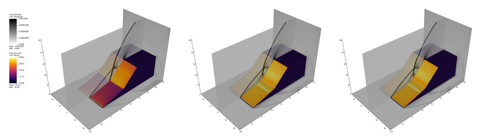

# Supersonic flow over a double compression ramp

Three-dimensional flow of Mach 3 over a double-compression ramp. The ramp angles are 15° followed by 45°. Inflow temperature and pressure are 103 K and 20417 Pa, respectively. Ref [Lee *et al.* (2017) *Shock Waves*](https://link.springer.com/article/10.1007/s00193-016-0630-7).

|                    | Description                           |
|:-------------------|:--------------------------------------|
| EOS                | Fuego                                 |
| Transport model    | Simple                                |
| Chemistry          | air                                   |
| EB                 | Yes                                   |
| Reaction           | No                                    |
| AMR                | Yes                                   |

## Problem geometry
To define the problem geometry, user needs to first declare a class inherited from ```CustomGeometry``` in ```prob.H``` such that it is registered. Then, the build method is defined in ```prob.cpp```. More about the usage of EB2 implicit functions (IF) can be found in [```Submodules/amrex/Src/EB```](../../../Submodules/amrex/Src/EB).

## Different boundary conditions
Figure below compares the results of adiabatic (left), isothermal with inviscid fluxes only (middle, not currently available), and full isothermal (right) boundary conditions.

