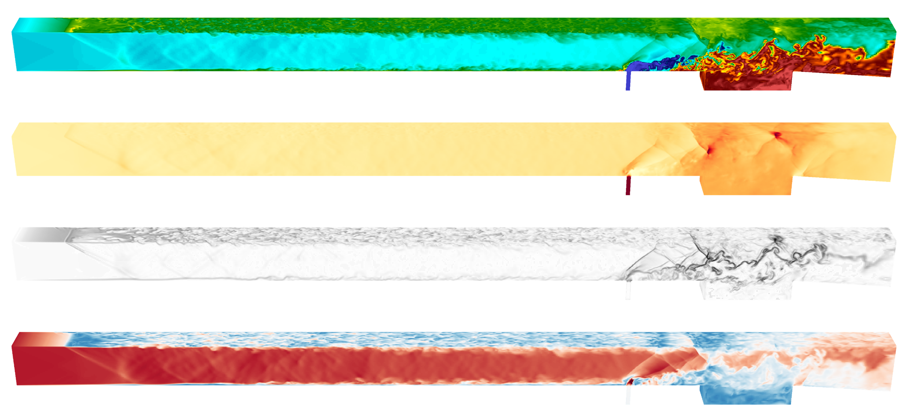

# Cerisse
**A high-order adaptive mesh refinement solver for Large Eddy Simulation of compressible turbulent reactive flows**

Version 1 created by: Enson Un, Salvador Navarro-Martinez


## Getting the code
1. Clone the repository
    ```bash
    git clone git@github.com:salvadornm/cerisse.git
    cd cerisse
    ```
2. Checkout to the `cerisse1` branch
    ```bash    
    git checkout cerisse1
    ```
3. Get all submodules
    ```bash    
    git submodule init
    git submodule update
    ```
4. (Optional) Disable some PelePhysics constraints and aborts
    ```bash
    ./Tools/scripts/pp_modify.sh
    ```

Or download a release from [here](https://github.com/salvadornm/cerisse/releases) 


## Compiling and running
We use GNU Make system for generating executables. 
1. Go to an exec folder, for example,
    ```bash
    cd EB_CNS/Exec/ShockReflect
    ```
2. Compile the SUNDIALS library first, which requires CMake. This only need to be done once per compiler settings combination.
    ```bash
    make TPL
    ```
3. Compile the executable. You may use the `-j` flag to build multiple jobs in parallel.
    ```bash
    make -j8
    ```
4. Run the executable
    ```bash
    mpirun -np 8 ./Cerisse2d.gnu.MPI.ex inputs
    ```

- See `prob_parm.H`, `prob.H`, and `prob.cpp` for the problem definition
- See `inputs` for runtime options
- See `GNUmakefile` for compile-time options
- More information about the solver can be found in [`docs`](docs). [Cerrisse2 docs](hslesdnsrf.gitbook.io/cerisse-docs) may also be useful, but bear in mind that the two solvers are different.