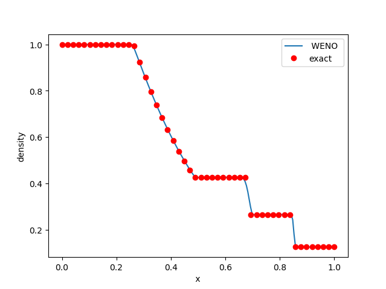

This page explains how to run the code after download, installing
it and run a simple example case

## Instal Pre-requisites

Install auxiliar packages, **AMReX** and **PelePhysics**

```
$ cd cerisse/lib/
$ ./install_script safe
```
It will connect to Github and download the required packages.
`$ ./install git`, will intall latest release commit in the **development** branch
of AMReX

### AMReX

This is the AMR library that controls grdi generation/movement/IO/parallelization, etc.
Is an approx 30 MB download, it wil expand to a folder 27 M , the install safe
option will install version **23.11**


### PelePhysics

This is the library that control chemistry integartion and reading chemistry.
It is an approx 30 MB download, it wil expand to a folder 146 M, the install safe
option will install version **23.03**


### SUNDIALS

This is a libary of differential and algebraic equation solvers used by PelePhysics for CVODE to integrate the chemistry.
To install  any example

```
$ cd tst/test2
$ make SUNDIALS
```

NOTE: fix THIS ? Is SUNDIALS not working ..

This will download and isntall version **6.5**. Sundials cannot be installed before compiling as some options (such as GPU) require re-compiling.

## Quick Example

This quick example shows the workflow

### 1) Go to Problem Folder

In this example, we wil solve  a very coarse clasic Sod Test.


```
$ cd cerisse/tst/test1
```

The directory contains the following files

```bash
$ ls
GNUmakefile	    README.md	inputs		prob.h
Make.package	exact.dat	plot.py
```

A detailed explanation of the files is in tutorial [Tutorial](tutorial.md), but basically `inputs` is your simulation control file
(mesh size, number of steps, etc...), while `prob.h` determines the 
problem to solve.


### 2) Compile code

The compiling stage will create the executable, to compile simply use

```bash
$ make
```

NOTE:  use `$make -j4` if possible, it will compile faster. This step can be very slow, depending on your computer and options, but most of the time it has to be done only once.


Once finished it will create a temporary folder
`tmp_build_dir`  and, if succesful, an executable  named `main1d.gnu.MPI.ex`.
The executable name will change depending on the compiler, parallelization and dimension of the problem.

### 4) Run

To run type (this test runs with one core only)

```bash
$ ./main1d.gnu.MPI.ex inputs
```
It will run very quickly for 200 steps, and the final output should be like this (exact numbers can change machine to machine)


```
[Level 0 step 200] ADVANCE at time 0.199 with dt = 0.001
[Level 0 step 200] Advanced 200 cells
   Total Xmom = 35.999999999999758
   Total Ymom = 0
   Total Zmom = 0
   Total Energy = 274.99999999999903
   Total Density = 112.49999999999953

STEP = 200 TIME = 0.2 DT = 0.001


[STEP 200] Coarse TimeStep time: 9.4e-05
[STEP 200] FAB kilobyte spread across MPI nodes: [44 ... 44]

PLOTFILE: file = ./plot/plt00200
Write plotfile time = 0.000818  seconds

Run Time total        = 0.022978
Run Time init         = 0
Run Time advance      = 0.020111
Unused ParmParse Variables:
  [TOP]::cns.screen_output(nvals = 1)  :: [1]
  [TOP]::amr.ref_ratio(nvals = 3)  :: [2, 2, 2]
  [TOP]::amr.regrid_int(nvals = 3)  :: [2, 2, 2]
  [TOP]::amr.blocking_factor_y(nvals = 3)  :: [8, 8, 8]
  [TOP]::amr.blocking_factor_z(nvals = 3)  :: [8, 8, 8]

AMReX (ae29b6e5b68b-dirty) finalized
```


It will create a new folder `plot`

```bash
$ ls plot
plt00000	plt00100	plt00200
```
Where the directories `plt*` store the data files, every 100 steps, including the initial step. 

### 5) See the Results

The results can be seen by a python script

```
$ python plt.py
```
which should show something like



You need to have the Python module **yt** installed
Check [Tips](tips.md) for installation. For a more in-depth check the [Tutorial](tutorial.md)

