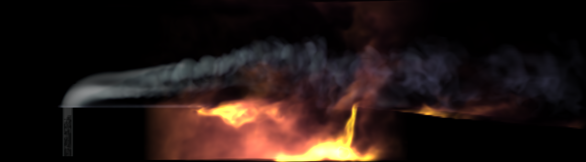

<p align="center">

</p>

[](https://opensource.org/licenses/BSD-3-Clause)


**A research computational solver for Large Eddy Simulation (LES) and Direct Numerical Simulation (DNS) of high-speed compressible turbulent reactive flows.**

The solver employs high-order finite volume methods with adaptive mesh refinement (AMR) and embedded/immersed boundary techniques to capture complex geometries.

WARNING: DOCUMENTATION is not complete yet. Work in progress.


### Applications

The solver is designed for studying high-speed, turbulent reactive flows in a range of advanced engineering and scientific applications. Examples include supersonic and hypersonic combustion in scramjets, rocket engine combustion chambers, detonation and deflagration-to-detonation transition phenomena, gaseous explosion scenarios, gas turbine combustion, thermoacustics, and shock tube experiments. Additionally, it can model external aerothermodynamics in hypersonic vehicles, spacecraft re-entry, and planetary atmospheric entry.
The implementation of non-ideal equations of state further extends its applicability to systems involving cryogenic flows, such as liquid-propellant rocket engines, liquid hydrogen pipelines, and rapid cryogenic cooling processes.


### Philosophy

Cerisse is a research-oriented code, distinct from commercial software like Star-CCM, Fluent, or Converge. Unlike general-purpose solvers such as OpenFOAM, which provide broad support for a wide range of equations, Cerisse is specifically tailored to high-speed turbulent reactive flows. Although it is efficient and fast, it is not exclusively designed for DNS, as a code like PeleC would be for similar applications. However, Cerisse can still be effectively used as a highly scalable DNS/LES production code

The primary goal of Cerisse is to streamline the implementation of new numerical methods, turbulence and combustion models, and solution approaches, allowing users to quickly test these developments. Users can define their problem setup and solution methods within just two files, simplifying customization and experimentation

Cerisse does not rely on a single numerical scheme; instead, users can select from a range of schemes within the finite volume framework, each offering different trade-offs in speed and accuracy. Available options include central-difference, skew-symmetric, WENO, TENO, and KEEP schemes, or users can create custom solvers tailored to their specific needs. The code is structured to facilitate the development of new models and methods within this framework.

Additionally, Cerisse includes advanced LES and combustion models—such as Eulerian Stochastic Fields, PaSR, and Artificial Thickening Flame—representing the latest in turbulence and combustion modeling advancements.


### Implementation

Cerisse is writte in C++, relying heavily use of templates.  The problem definition and solver selction are perfomed by a C++ file. 
This ensures a relatively efficient code (at the expense of compilation time)
with few dependencies. The code only uses what it needs. 
The code runs on Linux and MacOS.

Cerisse uses AMREX libraries [AMREX](https://amrex-codes.github.io/amrex/),
which ensures efefctive parallelization in GPU and CPU,
as well as  [PelePhysics](https://pelephysics.readthedocs.io/en/latest/)
repository for chemistry and transport models. However, simpler (or more complex) Thermodynamics and Transport models can be used and integrated.
Cerisse does not use a *mesh* and complex geometries are represented by incorporating directly the geometry. Results can be visualised by common open post-processing tools or load into python for further analysis.

### Download and Install

The code source code is [GitHub](https://github.com/salvadornm/cerisse)
Check the [QuickStart](quickstart.md) on how to download, installing the and run a simple example case.

### Citation

This open-source software is distributed under the BSD3 license. If you use it in your work, please cite it as

Monal Patel, Enson Un, Navarro-Martinez 'Cerisse', Zenodo 99999 (2024)
[](https://zenodo.org/records/9999999)

Cite as well the **AMReX**
[](https://doi.org/10.21105/joss.01370)

```
@article{AMReX_JOSS,
  doi = {10.21105/joss.01370},
  url = {https://doi.org/10.21105/joss.01370},
  year = {2019},
  month = may,
  publisher = {The Open Journal},
  volume = {4},
  number = {37},
  pages = {1370},
  author = {Weiqun Zhang and Ann Almgren and Vince Beckner and John Bell and Johannes Blaschke and Cy Chan and Marcus Day and Brian Friesen and Kevin Gott and Daniel Graves and Max Katz and Andrew Myers and Tan Nguyen and Andrew Nonaka and Michele Rosso and Samuel Williams and Michael Zingale},
  title = {{AMReX}: a framework for block-structured adaptive mesh refinement},
  journal = {Journal of Open Source Software}
}
```

And if  **PelePhysics** is used, please cite

```
@article{PeleSoftware,
  author = {Marc T. {Henry de Frahan} and Lucas Esclapez and Jon Rood and Nicholas T. Wimer and Paul Mullowney and Bruce A. Perry and Landon Owen and Hariswaran Sitaraman and Shashank Yellapantula and Malik Hassanaly and Mohammad J. Rahimi and Michael J. Martin and Olga A. Doronina and Sreejith N. A. and Martin Rieth and Wenjun Ge and Ramanan Sankaran and Ann S. Almgren and Weiqun Zhang and John B. Bell and Ray Grout and Marc S. Day and Jacqueline H. Chen},
  title = {The Pele Simulation Suite for Reacting Flows at Exascale},
  booktitle = {Proceedings of the 2024 SIAM Conference on Parallel Processing for Scientific Computing},
  journal = {Proceedings of the 2024 SIAM Conference on Parallel Processing for Scientific Computing},
  chapter = {},
  pages = {13-25},
  doi = {10.1137/1.9781611977967.2},
  URL = {https://epubs.siam.org/doi/abs/10.1137/1.9781611977967.2},
  eprint = {https://epubs.siam.org/doi/pdf/10.1137/1.9781611977967.2},
  year = {2024},
  publisher = {Proceedings of the 2024 SIAM Conference on Parallel Processing for Scientific Computing}
}

@article{Hassanaly2024,
  author = {Malik Hassanaly and Nicholas T. Wimer and Anne Felden and Lucas Esclapez and Julia Ream and Marc T. {Henry de Frahan} and Jon Rood and Marc Day},
  title = {Symbolic construction of the chemical Jacobian of quasi-steady state (QSS) chemistries for Exascale computing platforms},
  journal = {Combustion and Flame},
  volume = {270},
  pages = {113740},
  year = {2024},
  issn = {0010-2180},
  doi = {https://doi.org/10.1016/j.combustflame.2024.113740},
  url = {https://www.sciencedirect.com/science/article/pii/S0010218024004498},
}
```


