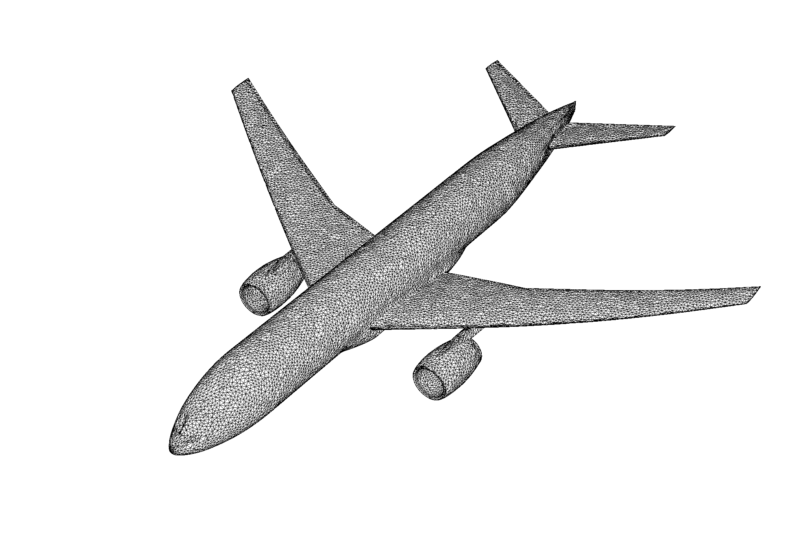

# Boundaries

## Boundary Conditions

There are generally two ways to define boundary conditions in the code:

1. **Through the input**: This involves specifying the boundary conditions for the domain directly in the input file, typically for simpler conditions.
2. **Through the `prob.h` file**: This allows for more customized or complex boundary conditions.

Additionally, boundary conditions can be defined for internal geometries using either **immersed boundaries**, **embedded boundaries**, or both.

#### domain boundary conditions

They are defined in the `input` file and apply to all faces in that direction (see details in input).

```ini
# 0 = Interior                               3 = Symmetry
# 1 = Inflow / UserBC                        4 = SlipWall =3
# 2 = Outflow (First Order Extrapolation)    5 = NoSlipWall (adiabatic)
cns.lo_bc = 1 5 0
cns.hi_bc = 2 5 0
```

#### user-derived boundaries

During run-time, complex boundary conditions can be set-up by defining the `bcnormal` function in `prob.h`

```cpp
bcnormal(const Real x[AMREX_SPACEDIM], Real dratio, const Real s_int[5],
         const Real s_refl[ProbClosures::NCONS], Real s_ext[5], const int idir,
         const int sgn, const Real time, GeometryData const &,
         ProbClosures const &closures, ProbParm const &prob_parm)
         {
            ...
         }
```

This function is called for each face on the boundary. It defines the array `s_ext[5]`, which specifies the values at the ghost points required to build the flux across domain boundaries.

| Option      | Type         | Dimensions | Description                             |
| ----------- | ------------ | :--------: | --------------------------------------- |
| `x`         | Real         |  SPACEDIM  | ghost cell cooordinates                 |
| `dratio`    | Real         |      1     | ghost/first internal distance ratio     |
| `s_int`     | Real         |    NCONS   | flow state inside domain                |
| `s_ext`     | Real         |    NCONS   | flow state to be filled                 |
| `idir`      | int          |      1     | direction (0: x, 1: y, 2: z)            |
| `sign`      | int          |      1     | high or low boundary (1: low, -1: high) |
| `time`      | Real         |      1     | time                                    |
| `geomdata`  | GeometryData |      -     | domain geometry data                    |
| `prob_parm` | ProbParm     |      -     | problem parameter data                  |

For example, a slip wall in the bottom wall (y-direction) would be defined as

```cpp
    if (idir == 1 && sgn == 1) {
        s_ext[URHO] = s_int[URHO];
        s_ext[UMX]  = s_int[UMX];
        s_ext[UMY]  = -s_int[UMY];
        s_ext[UMZ]  = s_int[UMZ];
        s_ext[UET]  = s_int[UET];
    }
```

If the boundary is not defined, the code will use the one specified in the input for that particular face.

NOTE: Boundary conditions are specified for the _conserved_ variables so appropiate conservations may be required.

## Immersed Boundaries

In **Immersed Boundary Methods** (IBM), boundary conditions on the surface are enforced by interpolating the influence of the boundary onto the fluid flow. This is achieved by assigning specific values at _ghost points_ (GP). These values are extrapolated from the surrounding fluid points, taking into account the surface normal and the imposed boundary conditions (see theory). IBM requires installation of CGAL by:

```bash
cd lib/
./install.sh cgal
```

To set-up de IBM, `GNUMakefile`, `input` and `prob` files have to be modified.

### GNUMakefile

```bash
USE_GPIBM=TRUE
```

### input

A STL file name needs to be defined in the input

```
#-------------------------------- IMMERSED BOUNDARY ---------------------------#
ib.filename = sphere_fine_20k.stl
```

<figure><figcaption><p>Example of STL file</p></figcaption></figure>

### prob.h

A IBM header needs to be included in the file.

```cpp
#include <eib.h>
```

Together with the required IBM template&#x20;

```cpp
typedef std::ratio<5,5> d_image;
typedef eib_t<2,1,d_image,ProbClosures> ProbIB;
```

The `std::ratio<5,5> d_image;` defines a rational number 5/5 (with numerator 5 and denominator 5) which in modern C++ is equivalent to:

```cpp
using d_image = std::ratio<5, 5>;
```

The template class **eib\_t** is defined as

```cpp
template <int iorder_tparm, int eorder_tparm, typename cim_tparm, typename cls_t>
```

where `iorder_tparm` is the interpolation order, in the above example  2.\
`eorder_tparm` is the extrapolation order (one in the example)

`cim_tparm` is the interpolation distance factor relative to mesh diagonal, in the above example to 5/5=1 and therefore the distance is the diagonal $$\sqrt{2} h$$ in 2D, see [IBM theory](theory/ibmeb.md#immersed-boundaries).

All information required for the IBM is stored in the class **ProbIB** in `CNS.h`.

#### markers

In the _user\_tagging_ function an new marker arrays is passed (`ibfab` below)

```cpp
void user_tagging(int i, int j, int k, int nt, auto& tagfab, const auto &sdatafab,
                  const Array4<bool>&ibfab, const auto& geomdata,
                  const ProbParm& pparm , int level) {
```

The field variable ibfab (is a boolean) has two values `ibfab(i,j,k,0)` is the **SLD** solid cell marker and `ibfab(i,j,k,1)` the **GP** ghost cell marker. Both markers indicated if the `i,j,k` cell in the domain is a solid or a ghosts. Remember that **GP** cells _are_ **SLD** cells. This array can be used to tag cells for refinement that are close to the IBM boundary, for example

```cpp
    // always refine close to body (at all levels)
    if (ibfab(i,j,k,1)) {
      for (int ii = -1; ii <= 1; ii++) {
        for (int jj = -1; jj <= 1; jj++) {
          for (int kk = -1; kk <= 1; kk++) {
            tagfab(i+ii,j+jj,k+kk) = true;
          }
        }
      }
    }
```

## Embedded Boundaries

The Embedded Boundaries (EB) is native for AMReX see [documentation](https://amrex-codes.github.io/amrex/docs_html/EB_Chapter.html) As a quick summary, the underlying mesh is uniform and block-structured, but the boundary of the irregular-shaped computational domain cuts through the mesh (see[ EBM theory](theory/ibmeb.md#embedded-boundaries)).

To set-up de EB, `GNUMakefile`, `input` and `prob` files have to be modified.

### GNUMakefile

```bash
USE_EB=TRUE
```

### input

In the `input` file, users should specify the geometry of the embedded boundary with `eb2.geom_type`, then supply the required parameters in the format of `eb2.{geom_param}`. (see input for detail). This allow to define completely the geometry.

### prob.h

A new EB header needs to be included

```cpp
#include <ebm.h>
```

and the EB class has to be defined. For example,

```cpp
typedef adiabatic_wall_t<ProbClosures> TypeWall;
typedef ebm_t<TypeWall,ProbClosures> ProbEB;
```

This will create the geometry class that will be read from `input` file.

#### markers

Similar rules as IBM apply for the user tagging, with a boolean marker passed, where `ibfab(i,j,k,0)` is the cell _Covered_ marker (the cell is a solid), while `ibfab(i,j,k,1)` indicates a cell that contains a surface (_Cut_). Note that, unlike IBM, **Cut** cells _are NOT_ **Covered** cells (following AMReX notation).
