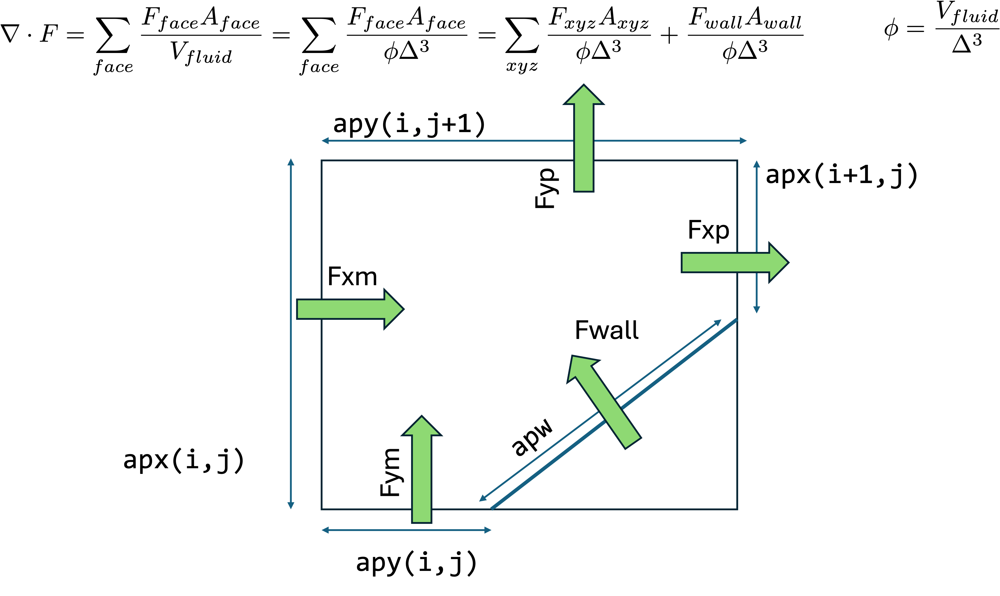

# EBM Solver

This page explains how the [EB method](../theory/ibmeb.md) is implemented in Cerisse and how the flux calculation is modified. Overall Ceirsse uses two boolean arrays (build from AMREX) to modify the numerical solvers

```cpp
        ebMarkers(i, j, k, 0) = flag_arr(i,j,k).isCovered();  
        ebMarkers(i, j, k, 1) = flag_arr(i,j,k).isSingleValued();    
```

The first boolean  `ebMarkers(i, j, k, 0)`  indicates if the cell is solid or not, if **true**, then is a solid cell or internal. The second boolean `ebMarkers(i, j, k, 1)`  if **true**, shows that the cell is partially covered and therefore requires especial treatment of the fluxes.

## Fluxes in EB

This function is called at the end of `compute_rhs` and it computes the fluxes in cells that has an internal solid boundary

```cpp
void inline ebflux(const Geometry& geom, const MFIter& mfi,
                     const Array4<Real>& prims, const Array4<Real>& flx,
                     const Array4<Real>& rhs, const cls_t* cls, int lev) {
```

### Extracting arrays

At the start of this function, pointers to EB arrays are calculated. This 'extracts' local arrays depend on the particular level and box (mfi)

```cpp
  Array4<const Real> vfrac = (*volmf_a[lev]).const_array(mfi);  
  ...
```

This creates a series of variables, such as the volume fraction of fluid in the cell,  tha opoen areas across cell, the normals to the surface in the cells, etc.

### Re-adjust fluxes

The fluxes in the cells adjacent to the solid boundary need to be recomputed and modified, as shown in the Figure.


<figure><figcaption><p>Fluxes in Cut cell, notation as used in the code in <code>ebm.h</code></p></figcaption></figure>

Later a call to the `wall_flux` function (defined in `ebm/walltypes.h`), which need the primitive values at the wall (as a first-order approximation the values at the cell centre) and return the flux at the wall `flux_wall` which is added to the RHS.

```cpp
  wallmodel::wall_flux(geom,i,j,k,norm_wall,prim_wall,flux_wall,cls); 
  for (int n = 0; n < cls_t::NCONS; n++) {
    rhs(i,j,k,n) += flux_wall[n]*vfracinv*bcarea(i,j,k,0)*dxinv[0];
  }
```

Wall types are defined in PROB, akin to other process (see page RED). The `wall_flux` function appears in different classes: `adiabatic_wall`, `isothermal_wall` and `user_wall`

### Wall Types

_**Adiabatic Wall**_

In a slip wall condition, the normal velocity at the wall must be zero to prevent penetration. For inviscid flow, the wall flux is given by the following expression (in 2D, with a similar form in 3D):

$$
F_{wall} = \left( 0, p_{wall} \cdot n_x, p_{wall} \cdot n_y, 0, ... \right)
$$

where the pressure at wall can be extrapolated from interior points. As a first approximation, is the same as cell centre. This is a second-order approximation in walls aligned with the mesh (as pressure gradient is 0 at the wall in normal direction). On a non-slip wall the velocity at the wall is zero, and the inviscid flux is the same.

In a viscous flow, viscous fluxes have to be added

$$
F_{wall} = F_{wall}^I + \underline{\underline{\tau}} \cdot \vec{n}
$$

In adiabatic wall, heat fluxes are zero and diffusion fluxes at the wall are 0 and only velocity gradients in the normal direction are retained. The velocity derivatives are estimated using node points and distance to the wall from the centroid.

$$
\frac{\partial u }{\partial \eta } \approx \frac{u_{ijk}}{d}
$$

Neglecting velcoity derivatives in the tangential direction, the viscous stress projection in Cartesian coordinates is:

$$
F_x =  \mu \left(  (1+n_x^2) \frac{\partial u }{\partial \eta}  + n_x n_y \frac{\partial v }{\partial \eta} \right)
$$

$$
F_y =  \mu \left( -  n_x n_y \frac{\partial u }{\partial \eta} +  (1+n_y^2) \frac{\partial v }{\partial \eta}   \right)
$$

_**Isothermal Wall**_

Similar at the adiabatic wall, plus additional terms in the energy equation due to heat flux, neglecting temperature derivatives in tangential direction.

$$
q_x = - \kappa n_y  \frac{\partial T }{\partial \eta}
$$

$$
q_y =   \kappa n_x  \frac{\partial T }{\partial \eta}
$$

where

$$
\frac{\partial T }{\partial \eta } \approx \frac{T_{ijk}- T_{wall}}{d}
$$

_**Supersonic Inflow**_

Requires inflow properties
