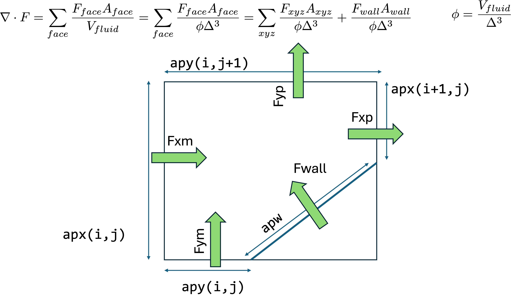
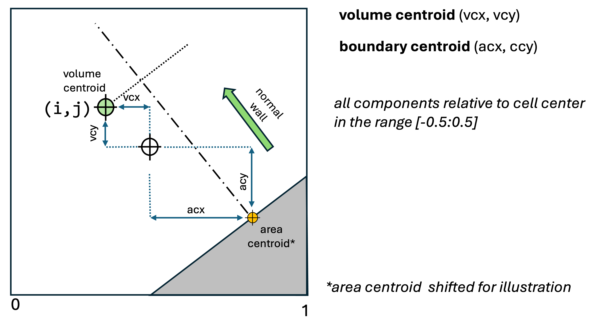

# EBM Solver

This page explains how the [EB method](../theory/ibmeb.md) is implemented in Cerisse and how the flux calculation is modified. Overall Ceirsse uses two boolean arrays (build from AMREX) to modify the numerical solvers

```cpp
        ebMarkers(i, j, k, 0) = flag_arr(i,j,k).isCovered();  
        ebMarkers(i, j, k, 1) = flag_arr(i,j,k).isSingleValued();    
```

The first boolean `ebMarkers(i, j, k, 0)` indicates if the cell is solid or not, if **true**, then is a solid cell or internal. The second boolean `ebMarkers(i, j, k, 1)` if **true**, shows that the cell is partially covered and therefore requires especial treatment of the fluxes.

## Fluxes in EB

This function is called at the end of `compute_rhs` and it computes the fluxes in cells that has an internal solid boundary

```cpp
void inline ebflux(const Geometry& geom, const MFIter& mfi,
                     const Array4<Real>& prims, const Array4<Real>& flx,
                     const Array4<Real>& rhs, const cls_t* cls, int lev) {
```

### Extracting arrays

At the outset of this function, we extract pointers to Embedded Boundary (EB) data arrays pertinent to a specific refinement level (`lev`) and computational tile, represented by the MFIter iterator `mfi`. This extraction is accomplished using the `const_array(mfi)` method, which provides a read-only Array4 view into the data:

```cpp
  Array4<const Real> vfrac = (*volmf_a[lev]).const_array(mfi);  
  ...
```

This line retrieves the volume fraction (`vfrac`) of fluid within each cell. The Array4 class in AMReX offers a multidimensional, non-owning view into the underlying data, facilitating efficient access patterns, especially within GPU kernels.\
Beyond `vfrac`, similar constructs are employed to access other EB-related geometric quantities:

### Re-adjust fluxes

The fluxes in the cells adjacent to the solid boundary need to be recomputed and modified, as shown in the Figure.

<figure><figcaption><p>Fluxes in Cut cell, notation as used in the code in <code>ebm.h</code></p></figcaption></figure>

Later a call to the `wall_flux` function (defined in `ebm/walltypes.h`), which need the primitive values at the wall (as a first-order approximation the values at the cell centre) and return the flux at the wall `flux_wall` which is added to the RHS.

```cpp
  wallmodel::wall_flux(geom,i,j,k,norm_wall,prim_wall,flux_wall,cls); 

  ...

  for (int n = 0; n < cls_t::NCONS; n++) {
    rhs(i,j,k,n) += flux_wall[n]*vfracinv*bcarea(i,j,k,0)*dxinv[0];
  }
```

Wall types are defined in **PROB**, akin to other process (see page RED). The `wall_flux` function appears in different classes: `adiabatic_wall`, `isothermal_wall` and `user_wall`.

The viscous fluxes are computed separately in a dedicated function, `wall_flux`, which also uses the `prims` array to compute derivatives.

```cpp
  wallmodel::wall_flux_diff(geom,i,j,k,dis,norm_wall,prims,prim_wall,flux_wall,cls);
```

Computing the viscous part is controlled by the variable`param::solve_diffwall` which is passed in the param.

For example, in the `ebm/cylnder_visc` example, wall conditions are written as (in `prob.h`)

```cpp
struct wall_param {
  public:
  static constexpr Real Twall = 300;                // wall temperature (if isothermal used)
  static constexpr bool solve_diffwall = true;      // solve viscous effects at walls
};
```

and then the wall is set-up as

```cpp
typedef isothermal_wall_t<wall_param,ProbClosures> TypeWall; 
typedef ebm_t<TypeWall,wall_param,ProbClosures> ProbEB;
```

### Wall Types

_**Adiabatic Wall**_

In a slip wall condition, the normal velocity at the wall must be zero to prevent penetration. For inviscid flow, the wall flux is given by the following expression (in 2D, with a similar form in 3D):

$$
F_{wall} = \left( 0, p_{wall} \cdot n_x, p_{wall} \cdot n_y, 0, ... \right)
$$

where the pressure at wall can be extrapolated from interior points. As a first approximation, is the same as cell centre. This is a second-order approximation in walls aligned with the mesh (as pressure gradient is 0 at the wall in normal direction). On a non-slip wall the velocity at the wall is zero, and the inviscid flux is the same.

In a viscous flow, viscous fluxes have to be added

$$
F_{wall} = F_{wall}^I + \underline{\underline{\tau}} \cdot \vec{n}
$$

In adiabatic wall, heat fluxes are zero and diffusion fluxes at the wall are 0 and only velocity gradients in the normal direction are retained. The velocity derivatives are estimated using node points and distance to the wall from the centroid.

$$
\frac{\partial u }{\partial \eta } \approx \frac{u_{ijk}}{d}
$$

Neglecting velocity derivatives in the tangential direction, the projection of the viscous stress in Cartesian coordinates is given by:

$$
F_x =  \mu \left(  \alpha_1 \frac{\partial u }{\partial \eta}  + \beta_1 \frac{\partial v }{\partial \eta} \right)
$$

$$
F_y =  \mu \left( \beta_1 \frac{\partial u }{\partial \eta} +  \alpha_2 \frac{\partial v }{\partial \eta}   \right)
$$

Where the coefficients are

$$
\alpha_1 = \frac{4}{3} n_x^2 + n_y^2
$$

$$
\alpha_2 =  n_x^2 + \frac{4}{3} n_y^2
$$

$$
\beta_1 =  \frac{1}{3}  n_x n_y
$$

The expression is similar in 3D and not written here for brevity.

_**Isothermal Wall**_

Similar at the adiabatic wall, plus additional terms in the energy equation due to heat flux, neglecting temperature derivatives in tangential direction.

$$
q_x = - \kappa n_y  \frac{\partial T }{\partial \eta}
$$

$$
q_y =   \kappa n_x  \frac{\partial T }{\partial \eta}
$$

where

$$
\frac{\partial T }{\partial \eta } \approx \frac{T_{ijk}- T_{wall}}{d}
$$

The geometric qauntities are build based on the Figure

<figure><figcaption></figcaption></figure>

### User-wall

Both wall functions can be user-specific in prob.h by defining a user class

```cpp
class user_wall_t
{
public:

static void inline wall_flux(const auto &geomdata, int i, int j, int k, const Real norm[AMREX_SPACEDIM], 
      amrex::GpuArray<amrex::Real, cls_t::NPRIM>& prims, amrex::GpuArray<amrex::Real, cls_t::NCONS>& fluxw,const cls_t* cls) { 
        ... // user specific code to fill flux     
      }
}
```

that contains a `wall_flux` function to define a specific wall flux. That (for example) depend on cell-position (which can be extracted by cell position `i,j,k`)

## Redistribution


TODO

