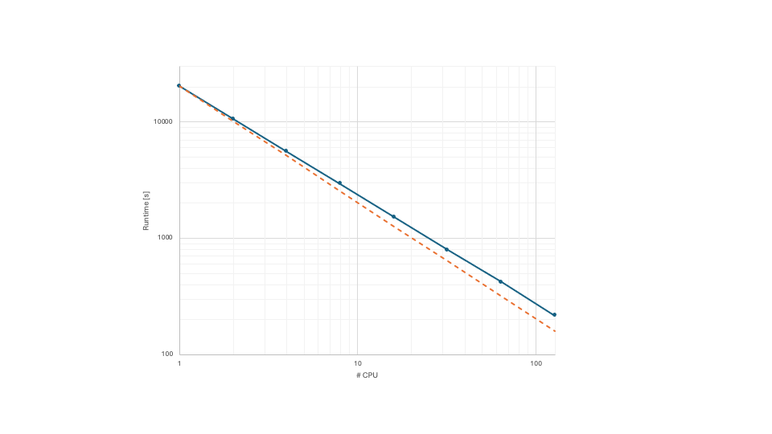

# Performance


Work in progress (results from **cerisse1**)


## Strong scaling CX2 single-node 

*Strong scaling* refers to how the solution time decreases as more cores
are used for a fixed total problem size.

*Architecture*
Single node AMD Rome EPYC 7742 up to 128 cores
*Software Modules*

| #  | Module                                      |
|:--:|:--------------------------------------------|
| 1  | tools/prod                                  |
| 2  | GCCcore/13.3.0                              |
| 3  | zlib/1.3.1-GCCcore-13.3.0                   |
| 4  | binutils/2.42-GCCcore-13.3.0                |
| 5  | intel-compilers/2024.2.0                    |
| 6  | numactl/2.0.18-GCCcore-13.3.0               |
| 7  | UCX/1.16.0-GCCcore-13.3.0                   |
| 8  | impi/2021.13.0-intel-compilers-2024.2.0     |
| 9  | iimpi/2024a                                 |

The test case is a TGV\
128 x 128 x 128, Mach=1.25, Re=1600, with fix CFL=0.3 using TENO5

<figure><figcaption>
Strong scaling test on a single node up to 128 cores
</figcaption></figure>

### Performance Table

| # CPU | Runtime Advance \[s] | Speedup | Efficiency |   Min |   Avg |   Max | % Advance | % Load-Imbalance |
| :---: | -------------------: | ------: | ---------: | ----: | ----: | ----: | --------: | ---------------: |
|   1   |             20297.25 |   1.000 |      1.000 | 19310 | 19310 | 19310 |    95.14% |            0.00% |
|   2   |             10571.57 |   1.920 |      0.960 |  9776 |  9779 |  9782 |    92.53% |            0.06% |
|   4   |              5562.19 |   3.649 |      0.912 |  4900 |  4922 |  4947 |    88.94% |            0.95% |
|   8   |              2946.20 |   6.889 |      0.861 |  2468 |  2470 |  2474 |    83.97% |            0.24% |
|   16  |              1521.85 |  13.337 |      0.834 |  1223 |  1231 |  1234 |    81.09% |            0.89% |
|   32  |               792.86 |  25.600 |      0.800 | 629.3 | 638.0 | 641.7 |    80.94% |            1.94% |
|   64  |               416.84 |  48.693 |      0.761 | 316.4 | 328.8 | 334.7 |    80.29% |            5.57% |
|  128  |               216.65 |  93.688 |      0.732 | 165.7 | 167.0 | 175.7 |    81.10% |            5.99% |

## Strong scaling CX2 multi-node 

*Architecture*
AMD Rome 
*Software Modules*

| #  | Module                                               |
|----|------------------------------------------------------|
| 1  | tools/prod                                           |
| 2  | GCCcore/9.3.0                                  |
| 3  | zlib/1.2.11-GCCcore-9.3.0                    |
| 4  | binutils/2.34-GCCcore-9.3.0                    |
| 5  | iccifort/2020.1.217                            |
| 6  | numactl/2.0.13-GCCcore-9.3.0                   |
| 7  | UCX/1.8.0-GCCcore-9.3.0                       |
| 8  | impi/2019.7.217-iccifort-2020.1.217            |
| 9  | iimpi/2020a                                          |

### Performance Table

| # CPU | Runtime Advance \[s] | Speedup | Efficiency |   Min |   Avg |   Max | % Advance | % Load-Imbalance |
| :---: | -------------------: | ------: | ---------: | ----: | ----: | ----: | --------: | ---------------: |
|   128   |            4145.96 |   1.000 |      1.000 |  2808 |  2865 |  3099 |    74.75% |           10.16% |
|   256   |            1443.20 |   2.873 |      1.436 |  9776 |  9779 |  9782 |    79.06% |            6.06% |
|   384   |           1573.697 |   2.634 |      0.878 |  512  |   690 |   833 |    52.95% |           46.44% |
|   512   |            724.026 |   5.726 |      1.432 |  523  |   534 |   543 |    75.01% |            3.74% |

## Weak scaling ARCHER2

In *Weak scaling* the problem size and the number of cores increases. so that each cores handles the same amount of work.

The test case is a TGV\
 Mach=1.25, Re=1600, with fix CFL=0.3 using TENO5.
The initial mesh 256 x 256 x 256, doubling  the cell count every time the number of cores is doubled.

*Architecture*
Dual AMD EPYC 7742 64-core 2.25GHz processors

*Software Modules*
`PrgEnv-gnu` environment, check [ARCHER2 documentation](https://docs.archer2.ac.uk/user-guide/dev-environment/)

| # Cores (Nodes) | Runtime Advance [s] | Efficiency |   Min |   Avg |   Max | % Advance | % Load-Imbalance |
|:---------------:|--------------------:|-----------:|------:|------:|------:|----------:|-----------------:|
| 128 (1)         |                7747 |      1.000 |  6404 |  6433 |  6511 |     84.05% |            1.66% |
| 256 (2)         |                7783 |      0.995 |  6390 |  6416 |  6507 |     83.61% |            1.82% |
| 512 (4)         |                7818 |      0.991 |  6370 |  6393 |  6511 |     83.28% |            2.21% |
| 1024 (8)        |                7882 |      0.983 |  6349 |  6371 |  6593 |     83.65% |            3.83% |

