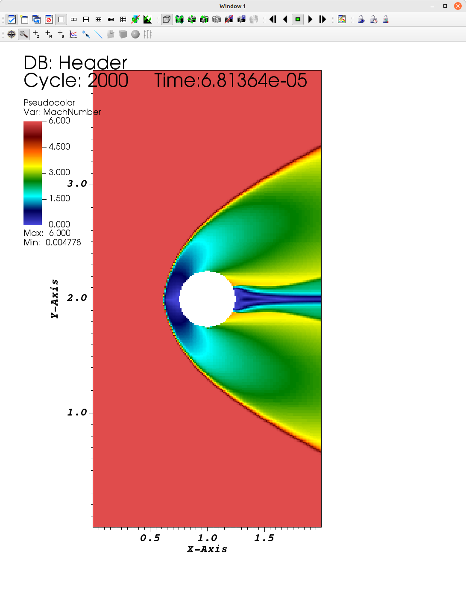
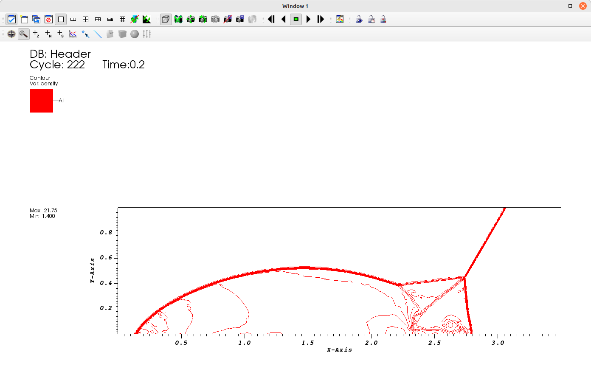

# Examples

The following examples are under `Examples/`

These case codes are stand-alone examples that demonstrate how to use different parts of the AMReX functionality, see [AMRex Tutorials](https://amrex-codes.github.io/amrex/tutorials_html/)
These examples can change over time as new functionalities are added. They are different than those in [Tests](test.md), which are more resilient and can be ued as regressions test.


## Test2-Convective Vortex

This is the classical two-dimensional convective vortex test case from Onera, which consists
of an ideal gas under M=0.1, with periodic boundary conditions

tested | grid | comment
:----------- |:-------------:| -----------:
gcc 11.3       | **64x64**(2 levels)        |  Euler, TENO5 4500 steps, AMR,  2 cores

After compiling
```
$ mpirun -np 2 Cerisse2d.gnu.MPI.ex input64
```
It should run very fast (10-30 secs, depending on machine), only one period.
The results can be seen by
```
$ python plt.py
```
This assumes **yt** has been installed (check [Tips](tips.md)).


In Visit, the vorticty and mesh looks like:


## Test3-Forward Step

A Mach 3 supersonic flow over a forward-facing step. The domain consists of an inlet section followed by a forward-facing step of 20% the height of the section.
It is solved using a Godunov first order scheme.


Tested | grid | comment
:----------- |:-------------:| -----------:
gcc 11.3       | **120x40**(3 levels)        |  Euler, Godunov,  2000 steps, AMR+EB,  2 cores

In Visit, the denisty looks like:


**NOTE**
Velocity in an Euler simulation shows a recirculation clsoe to surface, which is
not present without EB. Maybe a numerical issue related to boundary treatement 


## Test4- Cylinder under hypersonic flow 

A cylinder under Mach=6, conditions are similar to 20 km altitude. Created from files of 
Test3.


Tested |      grid | comment
:----------- |:-------------:| -----------:
gcc 11.3       | **40x80**(3 levels)        |  Euler, Godunov,  2000 steps, AMR+EB,  2 cores

In Visit, the Mach looks like:



**NOTE**
Some high velocity occasionaly close to surface.
The will start with `AMReX EB: Iter. 1 fixed 6 small cells` as some cells are too small.


## Test5- Shock Reflection 

A Mach 10 shock wave incident at 30 degrees. The initial conditions are given in [Berger & Colella (1989)](https://doi.org/10.1016/0021-9991(89)90035-1). The top boundary condition varies with time to follow the shock. The shock speed is given by 
$$
u_s = M c_s
$$
where $$M$$ and $$c_s$$ are Mach number and unshocked speed of sound, respectively. This version uses a tilted domain without EB.

Tested       |          grid | comment
:----------- |:-------------:| -----------:
gcc 11.3       | **56x16**(3 levels)        |  Euler, TENO,  222 steps (t=0.2), AMR,  2 cores

In Visit, the density iso-contours looks like:




### Test5b- Shock Reflection (EB)

Same as previous, but using EB

Tested       |          grid | comment
:----------- |:-------------:| -----------:
gcc 11.3       | **56x16**(3 levels)        |  Euler, TENO,  222 steps (t=0.2), AMR-EB,  2 cores


### Test6- MMS (TODO)


## Turbulence


### TGV three dimensional


## Reactive Flow


### Reactive Shock Tube

### Test7- Reactive Mixing Layer


