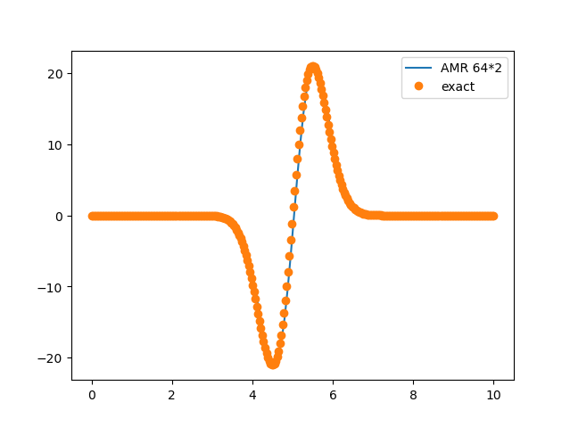
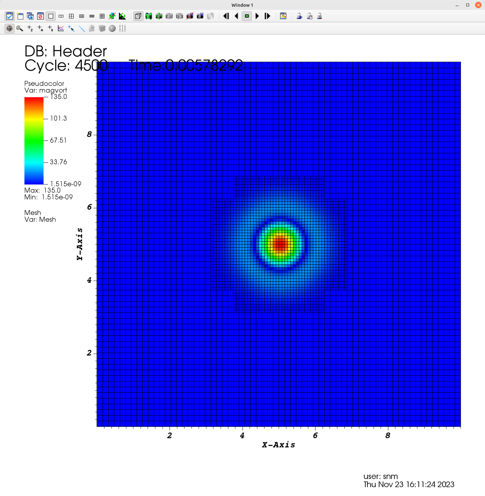

# Examples

Examples are under `Examples/`

Example codes are stand-alone examples that demonstrate how to use different parts of the AMReX functionality, see [AMRex Tutorials](https://amrex-codes.github.io/amrex/tutorials_html/)

The following examples are tested to compile and run


## Test1-Sod1D

tested | grid | comment
:----------- |:-------------:| -----------:
gcc 11.3       | 200        |  92 steps, no-AMR

Classic Riemann Problem

Results

In progress 


## Test2-Convective Vortex

This is the classical convective vortex test case from Onera, which consists
of an ideal gas under M=0.1, with periodic boundary conditions

tested | grid | comment
:----------- |:-------------:| -----------:
gcc 11.3       | 64( 2 levels)        |  4500 steps, AMR,  2 cores

After compiling
```
$ mpirun -np 2 Cerisse2d.gnu.MPI.ex input64
```
It should run very fast (10-30 secs, depending on machine), only one period.
The results can be seen by
```
$ python plt.py
```
This assumes **yt** has been installed (check Tips).





In Visit, the vorticty and mesh look like



### DDT


