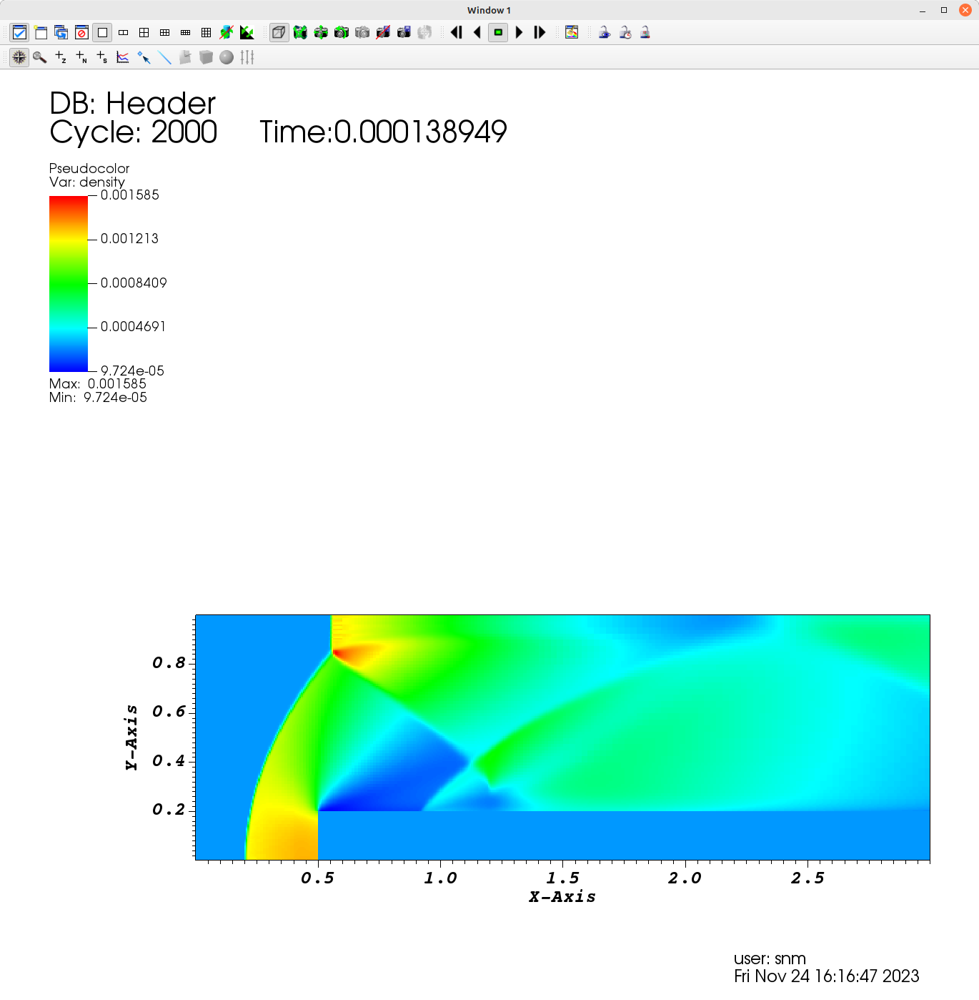

# Examples

Examples are under `Examples/`

Example codes are stand-alone examples that demonstrate how to use different parts of the AMReX functionality, see [AMRex Tutorials](https://amrex-codes.github.io/amrex/tutorials_html/)

The following examples are tested to compile and run


## Test1-Sod1D


Classical Riemann Problem

tested | grid | comment
:----------- |:-------------:| -----------:
gcc 11.3(Linux), gcc 13.1 (Mac)       | 200        |  Euler,  92 steps, no-AMR

Classic Riemann Problem

Results

In progress 


## Test2-Convective Vortex

This is the classical two-dimensional convective vortex test case from Onera, which consists
of an ideal gas under M=0.1, with periodic boundary conditions

tested | grid | comment
:----------- |:-------------:| -----------:
gcc 11.3       | 64x64(2 levels)        |  Euler, TENO5 4500 steps, AMR,  2 cores

After compiling
```
$ mpirun -np 2 Cerisse2d.gnu.MPI.ex input64
```
It should run very fast (10-30 secs, depending on machine), only one period.
The results can be seen by
```
$ python plt.py
```
This assumes **yt** has been installed (check Tips).


In Visit, the vorticty and mesh looks like:


## Test3-Forward Step

A Mach 3 supersonic flow over a forward-facing step. The domain consists of an inlet section followed by a forward-facing step of 20% the height of the section.
It is solved using a Godunov first order scheme.


Tested | grid | comment
:----------- |:-------------:| -----------:
gcc 11.3       | 120x40(3 levels)        |  Euler, Godunov,  2000 steps, AMR+EB,  2 cores

In Visit, the denisty looks like:




**NOTE**
Velocity in an Euler simulation shows a recirculation clsoe to surface, which is
not present without EB. Maybe a numerical issue related to boundary treatement 


### Test4- Cylinder under hypersonic flow (TODO)


### Test5- Shock Reflection (TODO)


### Test6- MMS (TODO)


## Turbulence


### TGV three dimensional


## Reactive Flow


### Reactive Shock Tube

### Test7- Reactive Mixing Layer


