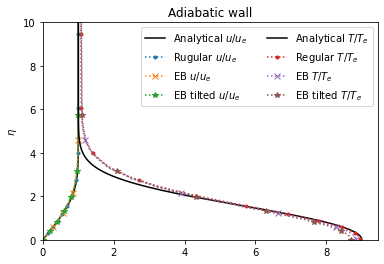
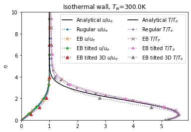

# Hypersonic boundary layer on isothermal wall

This test case is used to verify the viscous/diffusion fluxes implementation. The freestream conditions are $T_\infty = 57.8$ K, $M_\infty = 6.85$, and $Re_L = 5 \times 10^5$. The wall starts from $x = 0.5$ cm with a length $L = 20.5$ cm and temperature $T_w = 300$ K. Viscosity is modelled using the Sutherland's Law, and the Prandtl number is taken as a constant of 0.71.

## Reference temperature method
The numerical results are compared with the empirical solution of [Eckert (1956)](https://doi.org/10.1115/1.4014011) and the experimental work by [Smith (1993)](https://eprints.soton.ac.uk/462338/1/405843.pdf). The reference skin friction coefficient ($C_f^\ast$) and reference Stanton number ($St^\ast$) are expressed as a function of reference Reynolds number based on spanwise position ($Re_x^\ast$). See the [analysis.ipynb](analysis.ipynb) for more information.

## Similarity solution
A more accurate solution to the compressible boundary layer can be sought through asymptotic analysis, similar to Blasius's boundary layer equation for incompressible flows. More details can be found in the python notebook [similarity_solution.ipynb](similarity_solution.ipynb).

## Effect of resolution
The resolvedness of the simulation is quantified by two indicators, the Reynolds number based on mesh size ($Re_{\Delta y}$) and non-dimensional wall distance ($y^+$),
$$Re_{\Delta y} = \frac{\rho_\infty u_\infty \Delta y}{\mu_\infty}, \qquad y^+ = \Delta y \frac{\sqrt{\rho \tau_w}}{\mu}.$$
It is suggested that $Re_{\Delta y} \sim O(1)$ is required for converged aerothermal predictions and $y^+ < 5$ is needed for resolving the viscous sublayer.

## Custom_Chemistry_Model
Since the original PelePhysics ``Null`` mechanism does not have the ``CKCPBS`` required by the Sutherland transport law (it needs $c_p$ to calculate the thermal diffusivity), we need to implement a modified version of the mechanism and link it to the compiler. See [``Null2``](Null2) and [Make.CNS](../Make.CNS) for details.
