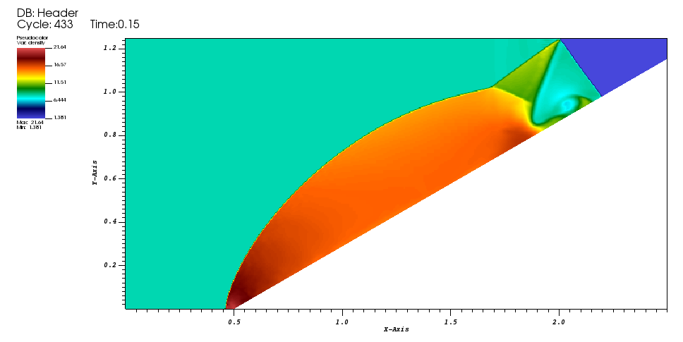

# Double Mach Reflection

A Mach 10 shock wave incident at 30 degrees. See the [ShockReflect](../ShockReflect/README.md) case for more information about the configuration. This version uses EB.

Reference Output:

