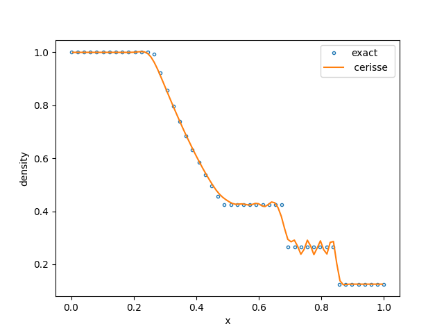
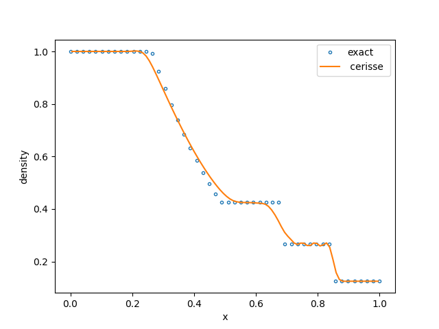
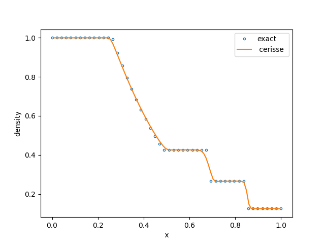
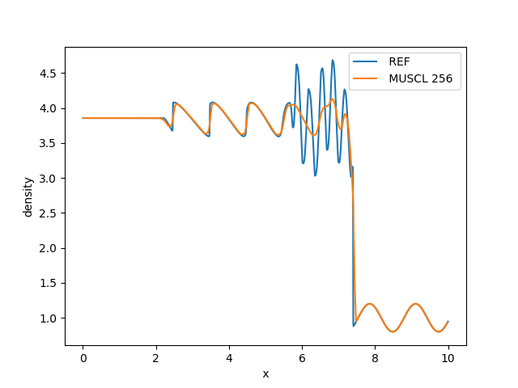
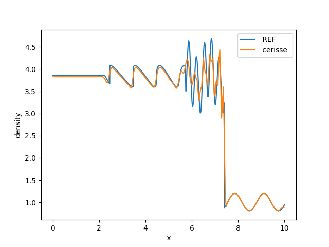
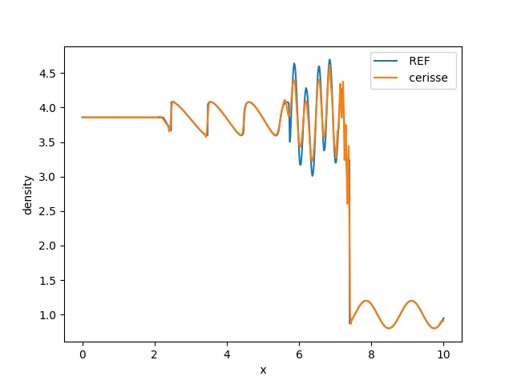

# one dimension

### Sod's Shock Tube

The Sod Shock tube is a classical Riemann problem used to test the accuracy of computational methods, in particular the capacity of numerical methods to handle shocks.

The initial conditions are very simple for this problem: a contact discontinuity separating a gas with different pressure and density, and zero velocity everywhere. In the standard case the density and pressure on the left are unity, The density on the right side of the diaphragm is 0.125 and the pressure is 0.1. More details about this classic case can be obtained from [Laney](https://www.cambridge.org/core/books/computational-gasdynamics/B216E16E4B62AC2C4E1AFD6811AFE0EA) and [Toro](https://link.springer.com/book/10.1007/b79761) books. The solution is plotted at _t=0.2_ The exact solution is calculated using [ToroExact](https://github.com/tahandy/ToroExact)

The example is located in the folder `numerics/riemmann`. After compiling using `make`, to run type

```bash
$ ./main1d.gnu.MPI.ex inputs
```

It should run very fast (less than a second, depending on machine). The results can be seen by

```bash
$ python plot.py
```

Results with some numerical schemes are below, all results with 96 cells:

<figure><figcaption><p>Skew-symmetric 4th order scheme with shock capturing and damping (constants <strong>C2=0.1</strong> and <strong>C4=0.016</strong>) </p></figcaption></figure>

<figure><figcaption><p>Skew-symmetric 4th order scheme with shock capturing and damping (constants <strong>C2=0.5</strong> and <strong>C4=0.016</strong>) </p></figcaption></figure>

<figure><figcaption><p>Riemann solver with a 2nd order MUSCL-type reconstruction</p></figcaption></figure>

## Shu-Osher problem

The problem corresponds to an Mach 3 shock propagating into a field with small density disturbances, which can be interpreted as entropy disturbances. The solution is compared against a reference solution obtained using a fine mesh.

The example is located in the folder `numerics/shu`. After compiling using `make` to run type

```bash
$ ./main1d.gnu.MPI.ex inputs_shu
```

Results can be seen using

```bash
$ python plot.py
```

The table belows shows an approximate relative cost (gcc version 11, 1 core, CFL fix 0.3)

| Run                      | Mesh | Run Time |
| ------------------------ | ---- | -------- |
| Reference MUSCL          | 8912 | 49.337   |
| MUSCL                    | 256  | 0.098    |
| Skew 4 _Cs=0.1 Cd=0.016_ | 256  | 0.08     |

Results with some numerical schemes are below

<figure><figcaption><p>Riemann solver with a 2nd order MUSCL-type reconstruction with <strong>256</strong> cells</p></figcaption></figure>

<figure><figcaption><p>Skew-symmetric 4th order scheme with shock capturing and damping (constants <strong>C2=0.1</strong> and <strong>C4=0.016</strong>) with <strong>256</strong> cells</p></figcaption></figure>

<figure><figcaption><p>Skew-symmetric 4th order scheme with shock capturing and damping (constants C2=0.1 and C4=0.016) with <strong>512</strong> cells</p></figcaption></figure>

