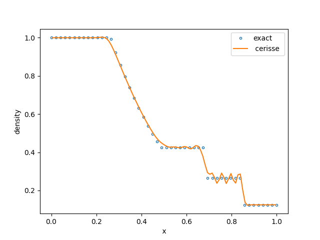
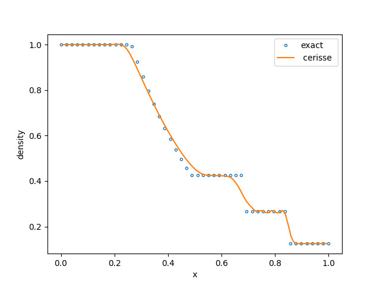
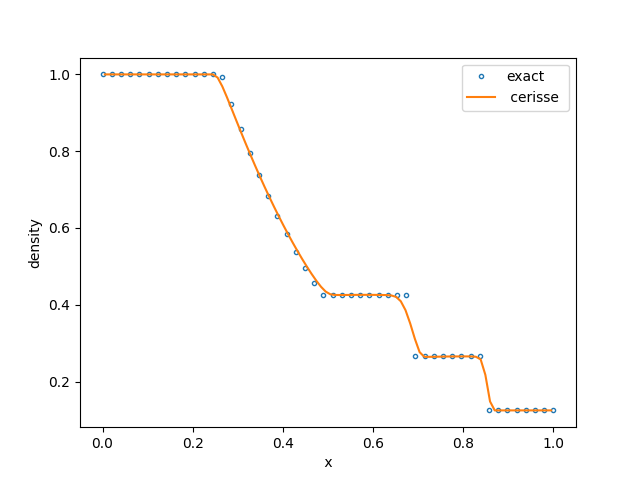
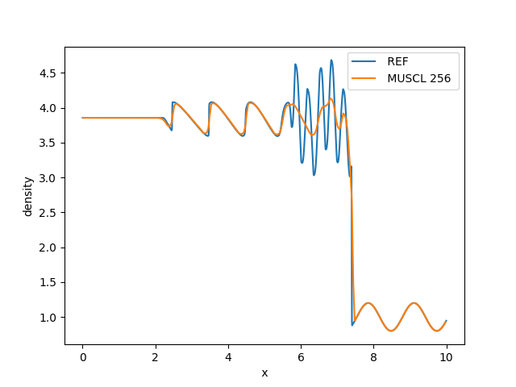
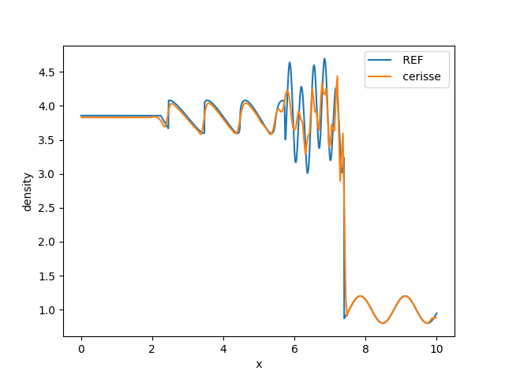
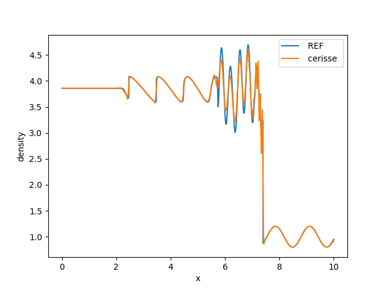
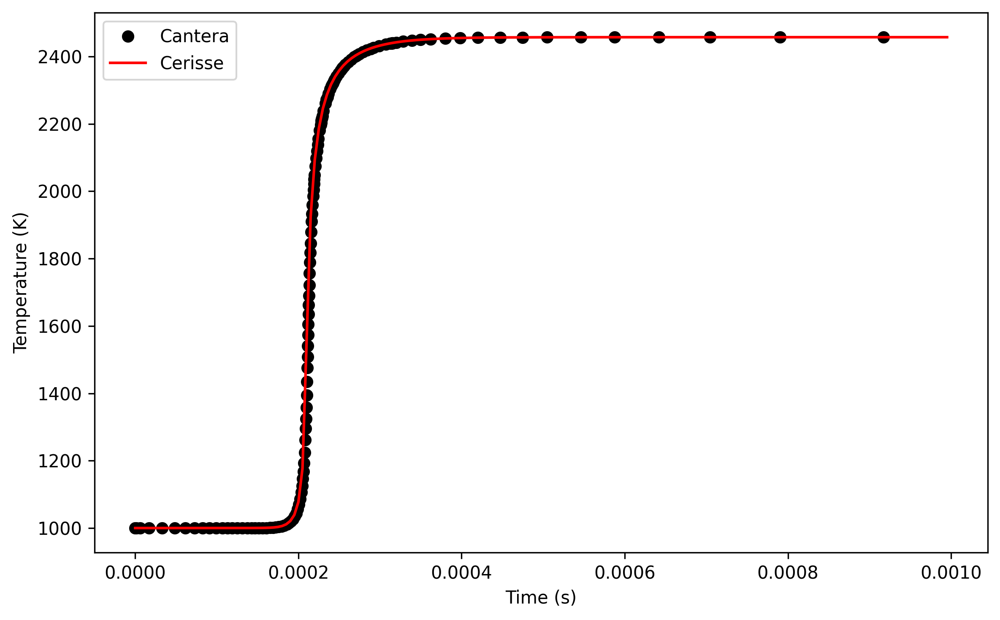

# 1-D

## Sod's Shock Tube

The Sod Shock tube is a classical Riemann problem used to test the accuracy of computational methods, in particular the capacity of numerical methods to handle shocks.

The initial conditions are very simple for this problem: a contact discontinuity separating a gas with different pressure and density, and zero velocity everywhere. In the standard case the density and pressure on the left are unity, The density on the right side of the diaphragm is 0.125 and the pressure is 0.1. More details about this classic case can be obtained from [Laney](https://www.cambridge.org/core/books/computational-gasdynamics/B216E16E4B62AC2C4E1AFD6811AFE0EA) and [Toro](https://link.springer.com/book/10.1007/b79761) books. The solution is plotted at _t=0.2_ The exact solution is calculated using [ToroExact](https://github.com/tahandy/ToroExact)

The example is located in the folder `numerics/riemmann`. After compiling using `make`, to run type

```bash
$ ./main1d.gnu.MPI.ex inputs
```

It should run very fast (less than a second, depending on machine). The results can be seen by

```bash
$ python plot.py
```

Results with some numerical schemes are below, all results with 96 cells:

<figure><figcaption><p>Skew-symmetric 4th order scheme with shock capturing and damping (constants <strong>C2=0.1</strong> and <strong>C4=0.016</strong>)</p></figcaption></figure>

<figure><figcaption><p>Skew-symmetric 4th order scheme with shock capturing and damping (constants <strong>C2=0.5</strong> and <strong>C4=0.016</strong>)</p></figcaption></figure>

<figure><figcaption><p>Riemann solver with a 2nd order MUSCL-type reconstruction</p></figcaption></figure>

## Shu-Osher problem

The problem corresponds to an Mach 3 shock propagating into a field with small density disturbances, which can be interpreted as entropy disturbances. The solution is compared against a reference solution obtained using a fine mesh.

The example is located in the folder `numerics/shu`. After compiling using `make` to run type

```bash
$ ./main1d.gnu.MPI.ex inputs_shu
```

Results can be seen using

```bash
$ python plot.py
```

The table belows shows an approximate relative cost (gcc version 11, 1 core, CFL fix 0.3)

| Run                      | Mesh | Run Time |
| ------------------------ | ---- | -------- |
| Reference MUSCL          | 8912 | 49.337   |
| MUSCL                    | 256  | 0.098    |
| Skew 4 _Cs=0.1 Cd=0.016_ | 256  | 0.08     |

Results with some numerical schemes are below

<figure><figcaption><p>Riemann solver with a 2nd order MUSCL-type reconstruction with <strong>256</strong> cells</p></figcaption></figure>

<figure><figcaption><p>Skew-symmetric 4th order scheme with shock capturing and damping (constants <strong>C2=0.1</strong> and <strong>C4=0.016</strong>) with <strong>256</strong> cells</p></figcaption></figure>

<figure><figcaption><p>Skew-symmetric 4th order scheme with shock capturing and damping (constants C2=0.1 and C4=0.016) with <strong>512</strong> cells</p></figcaption></figure>

## Constant Volume reactor

This problem represents a homogeneous zero-dimensional reactor and serves as a benchmark for comparison with Cantera. It simulates a hydrogen/air mixture at an equivalence ratio of 0.5, with an initial temperature of 1000 K and atmospheric pressure.

Since the volume remains constant, the density does as well. As the temperature increases, the pressure rises accordingly.

The results are compared with Cantera using the class cantera.Reactor. The Cantera results are generated using `tools/combustion/autoignition.py`.

To compile, run: `make TPL` followed by `make`

The GNUMakefile options are

```
# PelePhysics
EOS_MODEL := FUEGO
TRANSPORT_MODEL := SIMPLE
CHEMISTRY_MODEL := LiDryer
USE_PELEPHYSICS = TRUE
```

and the [Li and Dryer](https://doi.org/10.1002/kin.20026) hydrogen mechanism is used. Additional options the input file are

```
cns.reactor_type = "ReactorCvode"
cvode.solve_type =  "fixed_point"
ode.clean_init_massfrac = 1
```

which indicates that CVODE (see  [Chemistry Set-up](chemistry.md#chemistry-integration) for details) is used

```bash
$ ./main1d.gnu.MPI.ex inputs
```

Results can be seen using

```bash
$ python plot.py
```

which generates the image

<figure><figcaption><p>Autoignition of a hydrogen/air mixture using the Li and Dryer mechanism. Cerisse uses a  constant time step of <strong>dt=1e-7</strong></p></figcaption></figure>

## MMS 

In the Method of Manufactured Solutions (MMS), you construct an artificial, known (manufactured) solution to the equations and then derive the corresponding forcing terms that make this manufactured solution an exact solution to the modified equations. This helps test if the solver is implemented correctly and order of convergence.
There are several examples, locates under `exm/mms`

### Steady Euler

Located in `exm/mms/euler1d`. The selected solution is steady and does not depend on time.

$$
\rho = 1 + 0.2 \sin(2 \pi x)
$$

$$
u = 1
$$

$$
p = 1 + 0.3 \cos(2 \pi x)
$$


The respective forcing source terms are:

*Density equation*

$$
f_\rho = 0.4 \pi \cos{\left(2 \pi x \right)}
$$

*Momentum equation*
$$
f_{\rho u}  =- 0.6 \pi \sin{\left(2 \pi x \right)} + 0.4 \pi \cos{\left(2 \pi x \right)}
$$

*Energy*

$$
f_{\rho e}  = - 2.1 \pi \sin{\left(2 \pi x \right)} + 0.2 \pi \cos{\left(2 \pi x \right)}
$$

The expressions can be obtained with `python generate_force.py`, which computes the
analytic derivatives using [sympy](https://www.sympy.org/en/index.html)
for symbolic mathematics.

The numerical solution is compared after a single time step using a small CFL number of 0.01 to minimize temporal errors. Since the exact solution is time-independent, any observed error arises solely from the spatial discretization.

The \( L_2 \) error in the density field is used to assess the accuracy of each scheme.

A local script, `checkorder.sh`, is provided to automate the generation of solution directories and convergence plots. It runs simulations on meshes with 16, 32, 64, and 128 grid points.

To compare the numerical and exact solutions for a specific resolution (e.g., from `plot16`), run:

`python check_solution.py plot16`


PLOT HERE


The order of 14 different numerical schemes in Cerisse is shown in Table 1


| Scheme     | Order  | Absolute L2 Error (coarse)     |
|------------|--------|-------------------------------|
| Riemann    | 2.466  | 3.58660e-05                   |
| Skew 2     | 2.998  | 5.90192e-06                   |
| Skew 4     | 4.995  | 1.80107e-07                   |
| Skew 6     | -      | (under construction)          |
| Rusanov    | 2.000  | 9.92539e-05                   |
| Central 2  | 2.998  | 5.90192e-06                   |
| Central 4  | 4.995  | 1.80107e-07                   |
| Central 6  | 6.987  | 5.88292e-09 *(NOTE)*          |
| WenoZ5 5   | 6.125  | 1.17584e-07                   |
| TENO 5     | 6.007  | 8.01648e-08                   |
| TENO 6     | 6.987  | 5.88292e-09 *(NOTE)*          |
| KEEP 2     | 2.998  | 5.90192e-06                   |
| KEEP 4     | 4.995  | 1.80107e-07                   |
| KEEP 6     | 6.987  | 5.88292e-09 *(NOTE)*          |


When the forcing term is not included, the convergence rate appears to be first-order. This is because only a single time step is executed, and the time step size \( \Delta t \) is proportional to \( \Delta x \) due to a constant CFL condition. As a rough approximation, the observed order matches the values listed in **Table -1**.

The manufactured solution is smooth, so the numerical results closely match theoretical predictions. Similarly, the `skew4` and `keep4` schemes produce equivalent results, as expected.

> **Note**: Using 256 grid points may drive the error below machine precision, which prevents the script `checkorder.py` from computing a meaningful convergence order. For this reason, the `plot256` directory should be removed from the analysis.
