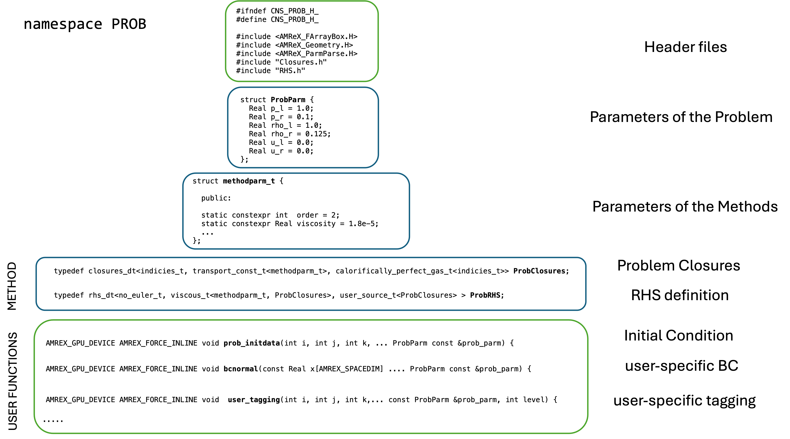

# PROB

The `prob.h` file creates the namespace **PROB**, that defines th eprobelm to be solved and the methods to do it. file form one of the examples as a starting point

<figure><figcaption></figcaption></figure>

## Problem parameters

The code requires a **ProbParm** structure, which is passed to user deifned functions and allows to centralised one place where varibles are stored.

```cpp
struct ProbParm {
  Real p_l = 1.0;
  Real p_r = 0.1;
  Real rho_l = 1.0;
  Real rho_r = 0.125;
  Real u_l = 0.0;
  Real u_r = 0.0;
};
```



The file uses thet AMReX type Real instead of  floats, which can be single or double precision. Check `GNU_Makefile`for set-up  [makefile.md](makefile.md "mention")


### Global Constants

In some cases in convenient to defined a a few global constants , such as

```cpp
static constexpr Real Reynolds = 3000.0;  
```

These arte defined as `static constexpr`, so they are evaluated at compile time, making it efficient for use in other compile-time expressions. Global constant can be used in the method and the ProbParm strcuture and also in the parmeters to methods (see below), unlike the ProbParm strycture which is used in user functions.

NOTE: By default Cerisse uses SI units (unlike PeleC) or no-units, include the file "Constants.h" to acesse conversion factors (CGS to SI and viceversa) as well as universal constants with appropiate precision.

## Themodynamic and Transport Closures

The namespace PROB needs to define the **closures\_dt** template, which creates the physical "closures" of the problems, that means which themrodynamics model is used as well as transport properties

For example:

```cpp
typedef closures_dt<indicies_t, visc_suth_t, cond_suth_t,
                    calorifically_perfect_gas_t<indicies_t>> ProbClosures;
```

The line above selects a problem that uses the structure `indicies_t`, which variables to solve(and how are they stored) how many to solve. The above also selects the Sutherland viscosity model `visc_suth_t` and condictivity model `cond_suth_t`. As well as use a perdect ideal gas as thermodynamics model. All this is wrapped in the class \`\`\`ProbClosures\`\`, which will then pass to the equations. Some of the tranpsort model required input from the user, which can use default values (or probelem specific)

Options in _**closures\_dt**_, all units in SI (October 2024)

| Closure                       | Options      |                                                defaults                                                | Description                                                       |
| ----------------------------- | ------------ | :----------------------------------------------------------------------------------------------------: | ----------------------------------------------------------------- |
| `visc_suth_t`                 | no           | <p><br><span class="math">\mu =1.458\cdot 10^{-6}</span> at  <br><span class="math">T=110.4</span></p> | Sutherland Viscosity                                              |
| `cond_suth_t`                 | no           | <p><br><span class="math">\lambda =2.495 \cdot 10^{-3}</span>  at  <span class="math">T=194</span></p> | Sutherland Conductivity                                           |
| `visc_const_t`                | viscosity    |                                      $$\mu= 1.85  \cdot 10^{-5}$$                                      | Constant Viscosity                                                |
| `cond_const_t`                | conductivity |                                           $$\lambda = 0.0262$$                                         | Constant Conductivity                                             |
| `transport_const_t`           | viscosity    |                          $$\mu = 1.85 \cdot 10^{-5}$$ and $$\lambda = 0.0262$$                         | Constant Viscosity and Conductivity[^1]                           |
| `calorifically_perfect_gas_t` | no           |                               $$\gamma =1.4$$  $$M=28.96 \cdot  10^{-3}$$                              | perfect gas[^2]                                                   |
| `multispecies_perfect_gas_t`  | no           |                                               PelePhysics                                              | Used for **PelePhsics** options (no necesary mixture perfect gas) |

### Passing Arguments

Oprions and parameters can be passed to the closures by creating a small structure `methodparm_t` before the assembly of **closures\_dt**, so all parameters are changed directly in `prob.h`. For example:

```cpp
struct methodparm_t {

  public:

  static constexpr Real viscosity   = 2.85e-5; 
  
};
typedef closures_dt<indicies_t, visc_const_t<methodparm_t>, cond_const_t<defaultparm_t>,
                    calorifically_perfect_gas_t<indicies_t>> ProbClosures;
```

The problem will use a vicosity of **2.85e-5** and a conductivity of **0.0262** (default values using the structure **defaultparm\_t** ).



To use the default values, the line `#include <NumParam.h>` has to be included in the headers


## Numerical Method and Equations

The namespace PROB needs to define as well the **rhs\_dt** template, which defines which tre,s in the equatison to solve and how. In general

$$
\frac{\partial U}{\partial t} = \mbox{RHS}(U) = \mbox{Euler} + \mbox{Diffusive} + \mbox{Source}
$$

where the RHS includes the inviscid (Euler) terms viscous (for Navier-Stokes) and source terms. The C++ templete follows:

```cpp
template <typename euler, typename diffusive, typename source>
```

Splitting the RHS into Euler terms, diffusive (or viscous) terms and source terms, which need to be defined For example, the line below

```cpp
typedef rhs_dt<skew_t<methodparm_t, ProbClosures>, no_diffusive_t, no_source_t > ProbRHS;
```

will solve

$$
\frac{\partial U}{\partial t} = F(U)
$$

corresponding to the Euler equations, with skew-symmetric numerical scheme (with order defined in `methodparm_t`, similar to **closures\_dt** .

**euler** options in _**rhs\_dt**_ (October 2024)

<table><thead><tr><th width="208">euler</th><th width="90">Options</th><th width="87" align="center">IBM</th><th width="152" align="center">defaults</th><th>Description</th></tr></thead><tbody><tr><td><code>riemann_t</code></td><td>no</td><td align="center">no</td><td align="center">-</td><td>Second TVD - HLLC Riemann solver</td></tr><tr><td><code>skew_t</code></td><td>yes</td><td align="center">yes</td><td align="center">4th order, no dissipation</td><td>2/4/6 order Skew-symmetric scheme</td></tr><tr><td><code>keep_euler_t</code></td><td>yes</td><td align="center">no</td><td align="center">no default</td><td>2/4/6 order KEEP scheme</td></tr><tr><td><code>weno_t</code></td><td>yes</td><td align="center">no</td><td align="center">no default</td><td>WENO or TENO 5th order scheme</td></tr><tr><td><code>rusanov_t</code></td><td>no</td><td align="center">yes</td><td align="center">-</td><td>Rusanov 2nd order scheme</td></tr><tr><td><code>no_euler_t</code></td><td>no</td><td align="center">yes</td><td align="center">-</td><td>0 (not solving Euler)</td></tr></tbody></table>



Not all options available yet !!


**diffusive** options in _**rhs\_dt**_ (October 2024)

<table><thead><tr><th width="207">diffusive</th><th width="88">Options</th><th width="81" align="center">IBM</th><th align="center">defaults</th><th>Description</th></tr></thead><tbody><tr><td><code>diffusiveheat_t</code></td><td>yes</td><td align="center">no</td><td align="center">4th order</td><td>2/4/6 central scheme only heat</td></tr><tr><td><code>skew_t</code></td><td>yes</td><td align="center">yes</td><td align="center">4th order</td><td>2/4/6 central scheme</td></tr><tr><td><code>no_diffusive_t</code></td><td>no</td><td align="center">yes</td><td align="center">0</td><td>0 (not diffusive part)</td></tr></tbody></table>

**source** options in _**rhs\_dt**_ (October 2024)

<table><thead><tr><th width="201">diffusive</th><th width="84">Options</th><th width="51" align="center">IBM</th><th align="center">defaults</th><th>Description</th></tr></thead><tbody><tr><td><code>reactor_t</code></td><td>yes</td><td align="center">yes</td><td align="center">-</td><td>PelePhysics chemcail raection</td></tr><tr><td><code>user_source_t</code></td><td>no</td><td align="center">yes</td><td align="center">-</td><td>user-given source term</td></tr><tr><td><code>no_source_t</code></td><td>no</td><td align="center">yes</td><td align="center">0</td><td>0 (no source term part)</td></tr></tbody></table>

## Initial Condition

The **prob\_initdata** function, this is function is called for every `i,j,k` cell

```cpp
// initial condition
AMREX_GPU_DEVICE AMREX_FORCE_INLINE void
prob_initdata(int i, int j, int k, Array4<Real> const &state,
              GeometryData const &geomdata, ProbClosures const &cls,
              ProbParm const &prob_parm) {
```

In most examples, a few auxiliar definitions follow that extract the size the domain and allow to define the spatial coordinate _x_ (and _y_ and _z_) of the cell

```cpp
  const Real *prob_lo = geomdata.ProbLo();
  const Real *prob_hi = geomdata.ProbHi();
  const Real *dx = geomdata.CellSize();
  Real x = prob_lo[0] + (i + Real(0.5)) * dx[0];
```

This allow to define, for example, different condtion depending on the _x_ coordinate. The structure `prob_parm`of type **ProbParm** is used to recall problem parameters

```cpp
  Real Pt, rhot, uxt;
  if (x < prob_hi[0] / 2) {
    Pt = prob_parm.p_l;
    rhot = prob_parm.rho_l;
    uxt = prob_parm.u_l;
  } else {
    Pt = prob_parm.p_r;
    rhot = prob_parm.rho_r;
    uxt = prob_parm.u_r;
  }
  Real et = Pt / (cls.gamma - Real(1.0));
```

The function needs to fille the `state` array, where the conservative variables exist. The index **URHO**, **UMX** are defined in the template `indicies_t` and are accessed through the class as `cls.URHO` and so on.

```cpp
  state(i, j, k, cls.URHO) = rhot;
  state(i, j, k, cls.UMX)  = rhot * uxt;
  state(i, j, k, cls.UMY)  = Real(0.0);
  state(i, j, k, cls.UMZ)  = Real(0.0);
  state(i, j, k, cls.UET)  = et + Real(0.5) * rhot * uxt * uxt;
}
```

Since this is pure C++ code, it allows for the construction of complex initial conditions. PelePhysics can also be utilized to incorporate chemistry profiles, such as those for 1D premixed flames.

NOTE: indicies is common, an dit allocates spaces for so in 1D `state(i,j,k,cls.UMY)=0`, `state(i,j,k,cls.UMZ)=0` and in 2D UMZ=0

## Source

Source term

## Boundary Condition

The `prob.h` can be used to implement user-specific boundary conditions (transient, turbulent, etc). To do that, a local template is defined

## Other

The names follow in the **cons\_var\_names** array

```cpp
inline Vector<std::string> cons_vars_names={"Xmom","Ymom","Zmom","Energy","Energy"};
```

The type of variables, keep as it is, scalar ser 0 and vectors are given by their components

```cpp
inline Vector<int> cons_vars_type={1,2,3,0,0};
```

Data missed from input file

```cpp
void inline inputs() {
  ParmParse pp;

  pp.add("cns.order_rk", 3);   // -2, 1, 2 or 3"
  pp.add("cns.stages_rk", 3);  // 1, 2 or 3
}
```

[^1]: 'You can use `transport_cons_t` instead of both `visc_cons_t` and `cond_const`'

[^2]: 'This can be also reproduced by using PelePhysics options in GNUMakefile'
