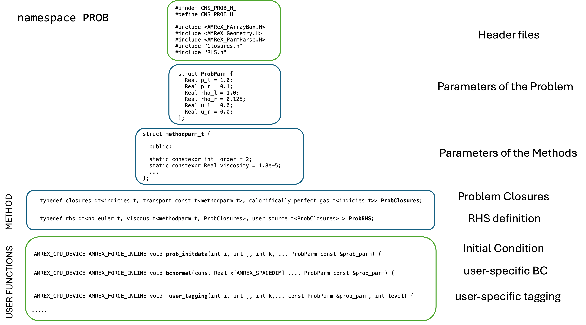

# PROB

The `prob.h` file defines the **`PROB`** namespace, which contains the problem-specific configuration, physical models, parameters, and methods required to set up and solve a given simulation case.\
Use the [examples](https://github.com/salvadornm/cerisse/tree/cerisse2/exm) as a starting point

<figure><figcaption></figcaption></figure>

## Problem parameters

The code requires a **ProbParm** structure, which is passed to user deifned functions and allows to centralised one place where varibles are stored.

```cpp
struct ProbParm {
  Real p_l = 1.0;
  Real p_r = 0.1;
  Real rho_l = 1.0;
  Real rho_r = 0.125;
  Real u_l = 0.0;
  Real u_r = 0.0;
};
```


The file uses thet AMReX type Real instead of floats, which can be single or double precision. Check `GNU_Makefile`for set-up [makefile.md](makefile.md "mention")


### Global Constants

In some cases in convenient to defined a a few global constants , such as

```cpp
static constexpr Real Reynolds = 3000.0;  
```

These constants are defined as `static constexpr`, allowing them to be evaluated at compile time. This makes them efficient for use in other compile-time expressions. Global constants can be utilized within methods, the **ProbParm** structure, and as parameters to methods Unlike the **ProbParm** structure, global constants are directly accessible in all user-defined functions.


By default Cerisse uses SI units (unlike PeleC) or no-units, include the file header `Constants.h` to access conversion factors (CGS to SI and viceversa) as well as universal constants with appropiate precision.


## Themodynamic and Transport Closures

The `PROB` namespace must define the `closures_dt` template, which specifies the physical _closures_ used by the problem. These closures determine the thermodynamic model, transport properties, and the set of governing variables used by the solver.

For example:

```cpp
typedef closures_dt<indicies_t, visc_suth_t, cond_suth_t,
                    calorifically_perfect_gas_t<indicies_t> > ProbClosures;
```

This definition creates the `ProbClosures` type used by the solver equations.

In this example:

* `indicies_t` defines the problem variable layout, including which equations are solved, variable indexing, and storage conventions.
* `visc_suth_t` selects the **Sutherland viscosity model**.
* `cond_suth_t` selects the **Sutherland thermal conductivity model**.
* `calorifically_perfect_gas_t<indicies_t>` selects a **calorifically perfect ideal gas** thermodynamic model.

These components are combined into the `ProbClosures` class, which encapsulates the physical models passed to the governing equations.

Some transport and thermodynamic models require additional user-defined parameters. These may either use default values or be overridden with problem-specific settings.

Available options for **`closures_dt`** are listed below. All quantities are expressed in SI units.

<table><thead><tr><th width="236.10546875">Closure</th><th width="122.94140625">Options</th><th width="176.984375" align="center">defaults</th><th>Description</th></tr></thead><tbody><tr><td><code>indicies_t</code></td><td>no</td><td align="center">-</td><td>defines the <strong>variable indexing</strong> used by the solver. It specifies the layout of conserved variables, primitive variables transport coefficients, and compile-time constants such as the number of equations, ghost cells,</td></tr><tr><td><code>indicies_stat_t</code></td><td>no</td><td align="center">-</td><td><code>indicies_stat_t</code> extends <code>indicies_t</code> to define the indexing and storage layout for statistical quantities. It adds compile-time constants specifying which flow statistics are recorded (and the total number of statistical variables)</td></tr><tr><td><code>visc_suth_t</code></td><td>no</td><td align="center"><br><span class="math">\mu =1.458\cdot 10^{-6}</span> at<br><span class="math">T=110.4</span></td><td>Sutherland Viscosity</td></tr><tr><td><code>cond_suth_t</code></td><td>no</td><td align="center"><br><span class="math">\lambda =2.495 \cdot 10^{-3}</span> at <span class="math">T=194</span></td><td>Sutherland Conductivity</td></tr><tr><td><code>visc_const_t</code></td><td>viscosity</td><td align="center"><span class="math">\mu= 1.85 \cdot 10^{-5}</span></td><td>Constant Viscosity</td></tr><tr><td><code>cond_const_t</code></td><td>conductivity</td><td align="center"><span class="math">\lambda = 0.0262</span></td><td>Constant Conductivity</td></tr><tr><td><code>transport_const_t</code></td><td>viscosity/<br>conductivity</td><td align="center"><span class="math">\mu = 1.85 \cdot 10^{-5}</span> and <span class="math">\lambda = 0.0262</span></td><td>Constant Viscosity and <a data-footnote-ref href="#user-content-fn-1">Conductivity</a></td></tr><tr><td><code>transport_Pele_t</code></td><td>indicies_t</td><td align="center">-</td><td>Used for <strong>PelePhysics</strong> </td></tr><tr><td><code>calorifically_perfect_gas_t</code></td><td>indicies_t</td><td align="center">-</td><td>Perfect gas</td></tr><tr><td><code>multispecies_pele_gas_t</code></td><td>indicies_t</td><td align="center">-</td><td>Used for <strong>PelePhysics</strong> </td></tr><tr><td><code>Smagorinsgky_t</code></td><td>parm, indicies_t</td><td align="center">check <a href="options.md#smagorinsky_t-wale_t">LES options</a></td><td>classical <strong>Smagorinsky subgrid-scale LES model</strong>, which represents unresolved turbulence through an eddy viscosity proportional to the local strain rate magnitude and the square of the filter width</td></tr><tr><td><code>WALE_t</code></td><td>parm, indicies_t</td><td align="center">check <a href="options.md#smagorinsky_t-wale_t">LES options</a></td><td>implements the <strong>Wall-Adapting Local Eddy-viscosity (WALE)</strong> LES model. It computes a subgrid eddy viscosity from local velocity-gradient invariants</td></tr><tr><td><code>TFM_t</code></td><td>parm, indicies_t<br><br>(parm will be ignored)</td><td align="center">check <a href="options.md#tfm_t">TFM options</a><br>-can be defined input, it requires other options</td><td>implements the <strong>Thickened Flame Model (TFM)</strong> / <strong>Artificially Thickened Flame (ATF)</strong> approach for LES combustion. It applies a dynamic flame sensor, flame thickening, and wrinkling-based efficiency correction.</td></tr><tr><td><code>PaSR_t</code></td><td>parm, indicies_t</td><td align="center">check <a href="options.md#pasr">PaSR options</a><br>-can be defined input, it requires other options</td><td>implements the <strong>Partially Stirred Reactor (PaSR)</strong> combustion model, which accounts for turbulence–chemistry interaction by limiting reaction rates according to the relative mixing and chemical time scales, representing finite-rate chemistry in partially mixed turbulent flows.</td></tr></tbody></table>

### Passing Arguments

Oprions and parameters can be passed to the closures by creating a small structure `methodparm_t` before the assembly of **`closures_dt`**, so all parameters are changed directly in `prob.h`. For example:

```cpp
struct methodparm_t {

  public:

  static constexpr Real viscosity   = 2.85e-5; 
  
};
typedef closures_dt<indicies_t, visc_const_t<methodparm_t>, cond_const_t<defaultparm_t>,
                    calorifically_perfect_gas_t<indicies_t>> ProbClosures;
```

The problem will use a viscosity of **2.85e-5** and a conductivity of **0.0262** (default values using the structure **defaultparm\_t** ). Check [Options](options.md)  for detailed description on arguments.


To use the default values, the line `#include <NumParam.h>` has to be included in the headers


Another  example is

```cpp
typedef closures_dt<indicies_stat_t, transport_Pele_t , multispecies_pele_gas_t<indicies_t>,
                    WALE_t<LESparm,indicies_t>, TFM_t<LESparm,indicies_t>>ProbClosures;
```

Here, `ProbClosures` defines a case using:

* `indicies_stat_t`: variable/statistics indexing layout
* `transport_Pele_t`: PelePhysics transport properties
* `multispecies_pele_gas_t<indicies_t>`: multispecies thermodynamics/chemistry through PelePhysics
* `WALE_t<LESparm, indicies_t>`: WALE subgrid-scale LES model
* `TFM_t<LESparm, indicies_t>`: thickened-flame combustion model

In practice, **`closures_dt`** bundles these selected models into a single type, `ProbClosures`, which is then passed to the governing equations so the solver knows which variables, transport laws, thermodynamics, LES model, and combustion closure to use.

## Numerical Method and Equations

The namespace PROB needs to define as well the **rhs\_dt** template, which defines which tre,s in the equatison to solve and how. In general

$$
\frac{\partial U}{\partial t} = \mbox{RHS}(U) = \mbox{Euler} + \mbox{Diffusive} + \mbox{Source}
$$

where the RHS includes the inviscid (Euler) terms viscous (for Navier-Stokes) and source terms. The C++ template follows:

```cpp
template <typename euler, typename diffusive, typename source>
```

Splitting the RHS into Euler terms, diffusive (or viscous) terms and source terms, which need to be defined For example, the line below

```cpp
typedef rhs_dt<skew_t<methodparm_t, ProbClosures>, no_diffusive_t, no_source_t > ProbRHS;
```

will solve

$$
\frac{\partial U}{\partial t} = F(U)
$$

corresponding to the Euler equations, with skew-symmetric numerical scheme (with order defined in `methodparm_t`, similar to **closures\_dt**  (see  [Options](options.md)). Available options in _**rhs\_dt**_ are:

<table><thead><tr><th width="208">euler</th><th width="90">Options</th><th width="87" align="center">IBM</th><th width="152" align="center">defaults</th><th>Description</th></tr></thead><tbody><tr><td><code>riemann_t</code></td><td>no</td><td align="center">no</td><td align="center">-</td><td><a href="theory/equations/numerical-methods.md#riemann-solver-with-muscl">Second TVD - HLLC Riemann solver</a></td></tr><tr><td><code>skew_t</code></td><td>yes</td><td align="center">yes</td><td align="center">4th order, no dissipation</td><td><a href="theory/equations/numerical-methods.md#skew-symmetric">2/4/6 order Skew-symmetric scheme</a></td></tr><tr><td><code>keep_euler_t</code></td><td>yes</td><td align="center">no</td><td align="center">no default</td><td><a href="theory/equations/numerical-methods.md#keep">2/4/6 order KEEP scheme</a></td></tr><tr><td><code>weno_t</code></td><td>yes</td><td align="center">no</td><td align="center">no default</td><td><a href="theory/equations/numerical-methods.md#weno">WENO</a> or <a href="theory/equations/numerical-methods.md#teno">TENO</a> 5th order scheme</td></tr><tr><td><code>rusanov_t</code></td><td>no</td><td align="center">yes</td><td align="center">-</td><td><a href="theory/equations/numerical-methods.md#rusanov-scheme">Rusanov 2nd order scheme</a></td></tr><tr><td><code>no_euler_t</code></td><td>no</td><td align="center">yes</td><td align="center">-</td><td>0 (not solving Euler)</td></tr></tbody></table>


Not all options available yet !!


**diffusive** options in _**rhs\_dt**_ (October 2024)

<table><thead><tr><th width="207">diffusive</th><th width="88">Options</th><th width="81" align="center">IBM</th><th align="center">defaults</th><th>Description</th></tr></thead><tbody><tr><td><code>diffusiveheat_t</code></td><td>yes</td><td align="center">no</td><td align="center">4th order</td><td>2/4/6 central scheme only heat</td></tr><tr><td><code>skew_t</code></td><td>yes</td><td align="center">yes</td><td align="center">4th order</td><td>2/4/6 central scheme</td></tr><tr><td><code>no_diffusive_t</code></td><td>no</td><td align="center">yes</td><td align="center">0</td><td>0 (not diffusive part)</td></tr></tbody></table>

**source** options in _**rhs\_dt**_ (October 2024)

<table><thead><tr><th width="201">diffusive</th><th width="84">Options</th><th width="81.1328125" align="center">IBM</th><th align="center">defaults</th><th>Description</th></tr></thead><tbody><tr><td><code>reactor_t</code></td><td>yes</td><td align="center">yes</td><td align="center">-</td><td>PelePhysics chemcail raection</td></tr><tr><td><code>user_source_t</code></td><td>no</td><td align="center">yes</td><td align="center">-</td><td>user-given source term</td></tr><tr><td><code>no_source_t</code></td><td>no</td><td align="center">yes</td><td align="center">0</td><td>0 (no source term part)</td></tr></tbody></table>

## Initial Conditions

The **prob\_initdata** function is called for every `i,j,k` cell

```cpp
// initial condition
AMREX_GPU_DEVICE AMREX_FORCE_INLINE void
prob_initdata(int i, int j, int k, Array4<Real> const &state,
              GeometryData const &geomdata, ProbClosures const &cls,
              ProbParm const &prob_parm) {
```

In most examples, a few auxiliar definitions follow that extract the size the domain and allow to define the spatial coordinate _x_ (and _y_ and _z_) of the cell

```cpp
  const Real *prob_lo = geomdata.ProbLo();
  const Real *prob_hi = geomdata.ProbHi();
  const Real *dx = geomdata.CellSize();
  Real x = prob_lo[0] + (i + Real(0.5)) * dx[0];
```

This allow to define, for example, different condition depending on the _x_ coordinate. The structure `prob_parm`of type **ProbParm** is used to recall generic problem parameters

```cpp
  Real Pt, rhot, uxt;
  if (x < prob_hi[0] / 2) {
    Pt = prob_parm.p_l;
    rhot = prob_parm.rho_l;
    uxt = prob_parm.u_l;
  } else {
    Pt = prob_parm.p_r;
    rhot = prob_parm.rho_r;
    uxt = prob_parm.u_r;
  }
  Real et = Pt / (cls.gamma - Real(1.0));
```

The function needs to fille the `state` array, where the conservative variables exist. The index **URHO**, **UMX** are defined in the template `indicies_t` and are accessed through the class as `cls.URHO` and so on.

```cpp
  state(i, j, k, cls.URHO) = rhot;
  state(i, j, k, cls.UMX)  = rhot * uxt;
  state(i, j, k, cls.UMY)  = Real(0.0);
  state(i, j, k, cls.UMZ)  = Real(0.0);
  state(i, j, k, cls.UET)  = et + Real(0.5) * rhot * uxt * uxt;
}
```

Since this is pure C++ code, it allows for the construction of complex initial conditions. Additionally the **Utility** class (see below) can be used to incorporate chemistry profiles, turbulent inflows, etc.


The most common variable labels are in the template `indicies_t`. **Cerisse** expects 3D labels **UMY** and **UMZ** even in 1 or 2D. In 1D `state(i,j,k,cls.UMY)=0` amd `state(i,j,k,cls.UMZ)=0` and in 2D `state(i,j,k,cls.UMZ)=0`.


## Source

A user-specific source term can be created by defining a template

```cpp
template <typename cls_t > class user_source_t;
```

```cpp
template <typename cls_t>
class user_source_t {
  public:
  void inline src(const amrex::MFIter &mfi,
                  const amrex::Array4<const amrex::Real> &prims,
                  const amrex::Array4<amrex::Real> &rhs, const cls_t *cls_d,
                  amrex::Real dt){
    const Box bx = mfi.tilebox();
    ProbParm const prob_parm;
    amrex::ParallelFor(bx,
      [=] AMREX_GPU_DEVICE (int i, int j, int k) noexcept
      {
      const auto& cls = *cls_d;
      //  Pressure Source           
      rhs(i,j,k,cls.UMX) += prob_parm.dpdx;  
      });
  };
};
```

## Boundary Condition

The `prob.h` can be used to implement user-specific boundary conditions (transient, turbulent, etc). To do that, a local template is defined (see boundaries tab for detail).

## Utility

The utility class can be used to incorporate chemistry profiles, turbulent inflows etc, in the initial and boundary conditions. It inspired in the Utility options in [PelePhysics](https://pelephysics.readthedocs.io/en/latest/Utility.html)  and is a placeholder for complex interactions not specified in this fie, such as  new data read from files. **Utility** can access data from `input` and external files.  Conditions and parameters  defined in PROB are known at compile time.\
To use the Utility requires an additional line in `GNU_Makefile` and to change the `prob_initdata` to allow an additional argument

```cpp
AMREX_GPU_DEVICE AMREX_FORCE_INLINE void prob_initdata(
    int i, int j, int k, Array4<Real> const &state,
    GeometryData const &geomdata, ProbClosures const &cls,
    ProbParm const &prob_parm, Utility* util = nullptr) {
```

This class allows access to multiples functions, for example PMF in **PelePhysics.**

## Other (optional)

The names follow in the **cons\_var\_names** array

```cpp
inline Vector<std::string> cons_vars_names={"Xmom","Ymom","Zmom","Energy","Energy"};
```

The type of variables, keep as it is, scalars are 0 and vectors are given by their components

```cpp
inline Vector<int> cons_vars_type={1,2,3,0,0};
```

Data missed from input file

```cpp
void inline inputs() {
  ParmParse pp;

  pp.add("cns.order_rk", 3);   // -2, 1, 2 or 3"
  pp.add("cns.stages_rk", 3);  // 1, 2 or 3
}
```

[^1]: 'You can use `transport_cons_t` instead of both `visc_cons_t` and `cond_const`'
