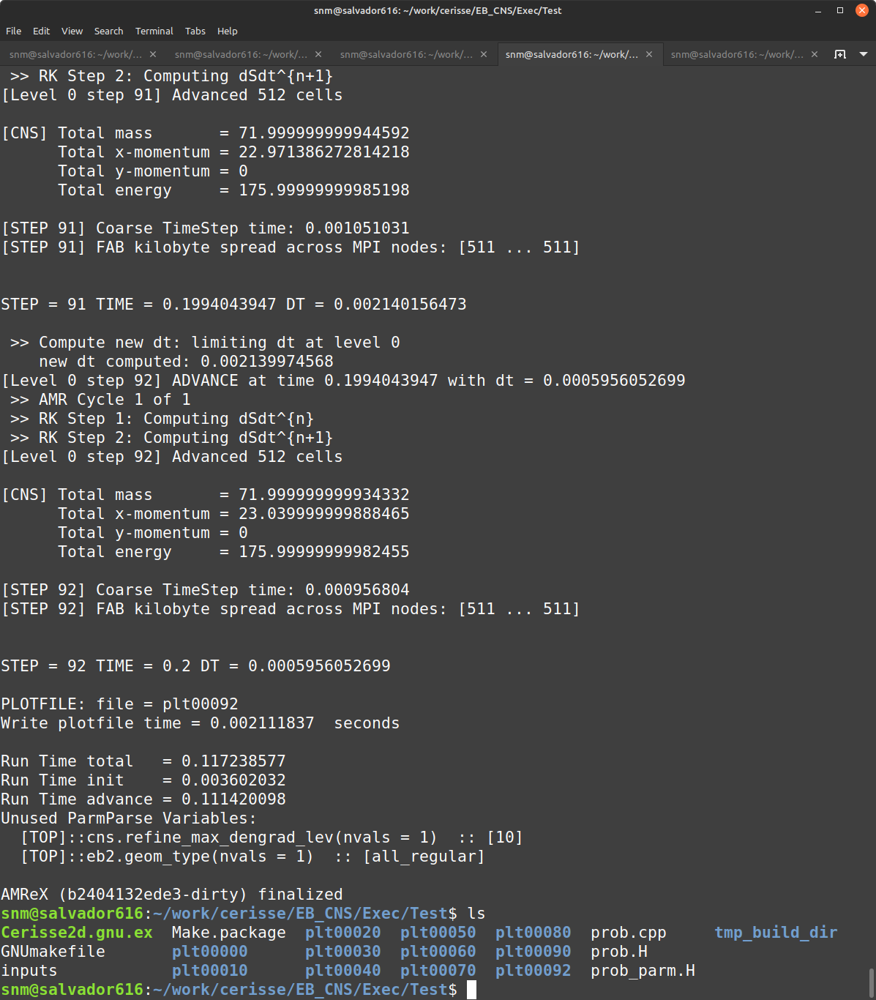
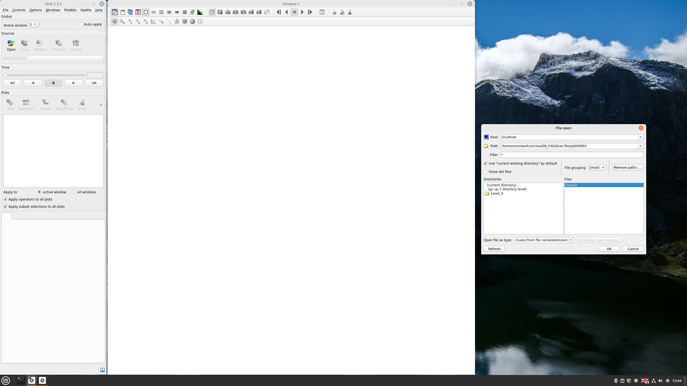
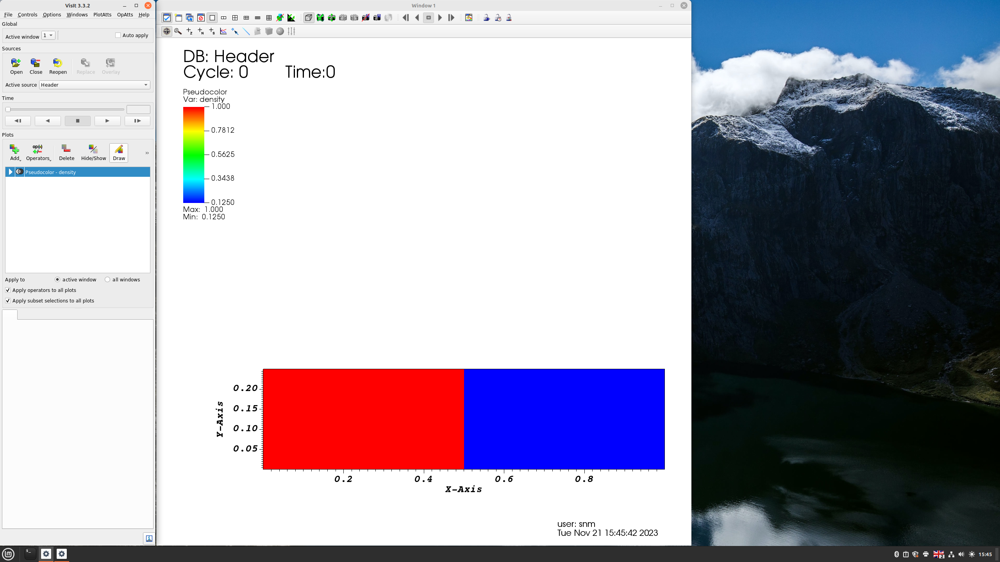

# Tutorial

This page explains how to run the code after download


## Instal Pre-requisites

Install auxiliar packages 

```
$ cd cerisse/Submodules/
$ ./install safe
```
It will connect to Github and download the required packages.
`$ ./install git`, will intall latest release commit in the **development** branch
of AMReX


### AMReX

This is the AMR library that controls grdi generation/movement/IO/parallelization, etc.
Is an approx 30 MB download, it wil expand to a folder 27 M , the install safe
option will install version **23.11**


### PelePhysics

This is the library that control chemistry
Is an approx 30 MB download, it wil expand to a folder 146 M, the install safe
option will install version **23.03**


## Tutorial 1

### 1) Go to Problem Folder

Go to Exec folder and pick one example. In this Tutorial  we we will work with
Test, which is a very corase clasic Sod Test in 1 direction, although we will run it in 2 dimensions
to see the results.


```
$ cd cerisse/EB_CNS/Exec/Test
```

The directory wil lconatin the following files

```bash
$ ls
GNUmakefile  inputs  Make.package  prob.cpp  prob.H  prob_parm.H
```

A detail explanation of the files is in the Run tab, but basically inpt is your simulation comntrol files
(mesh size, number of steps, etc..), while `prob.*` files determine the problem to solve.

### 2) Install SUNDIALS

SUNDIALS - a SUite of Nonlinear and DIfferential/ALgebraic equation Solvers.

controlled by AMREX Options so it can be targeted. Do it once unless toying with chemistry.
It is a 30 M install done within PelePhysics. It has only to be done once.

```
$ make SUNDIALS
```

NOTE This is not needed anymore

### 3) Compile code

To compile use

```bash
$ make
```

(use `$make -j4`` if possible)

It will take a while the first time, once finished it will create a temporary directory 
`$ tmp_build_dir` 

and (if succeful) an executable will be created named
`Cerisse2d.gnu.ex`
the name will change depending on the compiler and problem dimension

### 4) Run

To run type

```bash
$ ./Cerisse2d.gnu.ex inputs
```
It will run very quickly for 92 steps, and the output should be like this



It will create files

```bash
$ ls
Cerisse2d.gnu.ex  Make.package  plt00020  plt00050  plt00080  prob.cpp     tmp_build_dir
GNUmakefile       plt00000      plt00030  plt00060  plt00090  prob.H
inputs            plt00010      plt00040  plt00070  plt00092  prob_parm.H
```
Where the directories `plt*` store the data files, every 10 steps, plus the last time step. 

### 5) See the Results

In this example, we will use Visit (recall that Visit cannot be used in 1D).
To load the data, open header files of a particular directory



If the instant 0 is open, the results for density will look like 



Alternatively you can use the script **cerisse**, to open all directories at the same time (to make an animation for example). See  [Tips](tips.md) to set-up the script.

``` bash
$ cerisse visit
```

