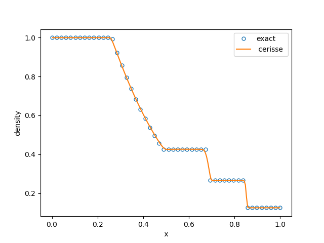

# QuickStart

## Installation

### Download code

The code can be obtained by downloading the latest release from GitHub in [RELEASES](https://github.com/salvadornm/cerisse/releases) . \
Similarly, from the CLI in Linux/MacOs, a specific Cerisse version (for example **v2.0.0-beta**) can be downloaded using:

```bash
wget https://github.com/salvadornm/cerisse/archive/refs/tags/v2.0.0-beta.zip
```

The source code and example cases are available as a `.zip` archive (**\~40 MB)**. After extracting `v2.0.0-beta.zip`, a directory named `cerisse-2.0.0-beta` will be created, occupying approximately 150 MB. \
Alternatively, the code can be obtained by cloning the Git repository, which creates a `cerisse` directory (\~430 MB). This option is recommended for users who plan to modify the source code or contribute to development.

```bash
git clone https://github.com/salvadornm/cerisse.git 
```

Or using the GitHub CLI

```bash
gh repo clone salvadornm/cerisse
```

### Pre-requisites

1. **C++ compiler** A compiler with C++20 standard is required. Examples include **gcc version 8** and above  and **Clang  version  10** and above (both compilers may need `-std=c++20` flag)
2. **GNU Makefile** It will usually be installed by default in most systems (MacOS/Linux)
3. **MPI libraries** (optional) required for parallel simulations. Similarly CUDA/OpenMPI may be required for more advanced parallelization strategies.
4. **cmake** (optional) required for some installation options, mostly related to GPU and chemistry. Easy to install, version required **>3.2**
5. **AMReX** AMR libraries [AMREX](https://amrex-codes.github.io/amrex/) This is the AMR library that controls grid generation/IO/parallelization. Required for the code, see [Installation AMREX and PelePhysics](quickstart.md#installation-amrex-and-pelephysics)
6. **PelePhysics** (optional)  Is a repository of physics databases [PelePhysics](https://github.com/AMReX-Combustion/PelePhysics) It is required for complex chemistry and transport properties. Includig stiff chemcial sytems integration. It also has, spray , soot and radiation modules as well as many support utilities for Pele suite of codes that can also be used in Cerisse. To install see [Installation AMREX and PelePhysics](quickstart.md#installation-amrex-and-pelephysics) If the chemistry solvers are used, the **SUNDIALS** library will need to be installed as well [Installation SUNDIALS](quickstart.md#installation-sundials)
7. **CGAL** (optional) This is the Computational Geometry Algorithms Library [CGAL](https://www.cgal.org), required to do the needed geometric computation in the case of [immersed boundaries](theory/ibmeb.md#immersed-boundaries). To install see [Installation CGAL](quickstart.md#installation-cgal)
8. **Visualization** Cerisse/AMREx/PeleC format is supported by [VisIt](https://visit-dav.github.io/visit-website/), [Paraview](https://www.paraview.org), [yt](https://yt-project.org) (allows Python) and check for more options [AMReX Visualization](https://amrex-codes.github.io/amrex/docs_html/Visualization.html)


There is a bash script in `bin/checkreq.sh` that will check if basic requirements are met in your local machine.


#### Installation AMREX and PelePhysics

To install the required  packages, **AMReX** and **PelePhysics** (for chemical reactions)

```bash
$ cd cerisse/lib/
$ ./install.sh safe
```

The installation script connects to GitHub and downloads the required external dependencies.

Running `./install.sh git` installs the latest commit from the development branch of AMReX.\
Running `./install.sh safe` installs tested stable versions: **AMReX 25.09** and **PelePhysics 25.04**.

The exact package versions and available installation options can be checked with: `./install help`\
Download sizes are modest (approximately **27 MB for AMReX** and **30 MB for PelePhysics**), so installation is typically fast on a standard internet connection.

All downloaded dependencies and installation files are stored under `cerisse/lib`.

#### Installation CGAL

There are two ways to  install CGAL libraries that are required  for complex boundaries using IBM. \
In **Linux systems**&#x20;

```bash
$ cd cerisse/lib/
$ ./install.sh cgal download
$ ./install.sh cgal install
```

The `download` option will download the files, while `install` will install the **CGAL** version **6.0.1** as well as [**BOOST**](https://www.boost.org/)  version **1.81.0**. All installation files will live under `cerisse/lib`.

Alternatively, **Boost** and **CGAL** may already be available on your system. For example, on macOS they can be installed using Homebrew:

```bash
$ brew install boost
$ brew install cgal
```

A key requirement is that **Boost and CGAL must be built with a compiler compatible with the one used to compile Cerisse**. For example, installing CGAL via Homebrew on macOS typically uses the default **Clang** toolchain, so Cerisse should also be compiled with Clang to avoid compatibility issues.

These libraries also depend on **GMP (GNU Multiple Precision Arithmetic Library)**, which is often present and can be installed with:

**macOS**

```bash
$ brew install gmp
```

**Ubuntu / Debian**

```bash
$ sudo apt install libgmp-dev
```

On HPC systems, CGAL installation may require a custom build and manual installation to match the system compiler, MPI environment, and available modules.

#### Installation SUNDIALS

**SUNDIALS** is a library of differential and algebraic equation solvers used by PelePhysics, specifically through **CVODE**, for chemical kinetics integration.

To install SUNDIALS:

```bash
$ cd cerisse/lib./install.sh sundials
```

This downloads and installs **SUNDIALS v7.5** if it is not already present.

SUNDIALS cannot always be fully configured in advance, since some build options (for example, **GPU support**) depend on the specific test case or compilation settings being used.

Before compiling a test case that requires SUNDIALS, run the following from the test directory:

```bash
$ make TPL
```

This ensures that SUNDIALS is configured and built with the appropriate options for that case.

All downloaded sources and installation files are stored under `cerisse/lib`.

## Quick Example

This quick example shows the workflow of Cerisse in a simple example

#### 1) Go to problem folder

In this example, Cerisse will solve a very coarse classic one-dimensional [Sod shock tube Test](https://en.wikipedia.org/wiki/Sod_shock_tube).

```bash
$ cd cerisse/tst/test1
```

The directory contains the following files

```bash
$ ls
exact.dat	GNUmakefile	inputs	prob.h   plot.py
```

A detailed explanation of the files is in the  [Tutorial](tutorial.md), but basically `inputs` is the simulation control file (mesh size, number of steps, etc...), while `prob.h` determines the problem to solve.

#### 2) Compile code

The compiling stage will create the executable, to compile use:

```bash
$ make
```


Utilize `$make -j4` if feasible, as it will expedite the compilation process. This step may be time-consuming, especially during the initial execution, depending on your system and configuration options. However, in most cases, this step needs to be done only once .


After compilation, the code will create a temporary folder `tmp_build_dir` and, if succesful, an executable named `main1d.gnu.MPI.ex` The executable name will change depending on the compiler, parallelization and dimension of the problem.

#### 3) Run

To run type (using one core only)

```bash
$ ./main1d.gnu.MPI.ex inputs
```

It will run very quickly for 200 steps, and the final output should be like this (exact numbers can change machine to machine)

```
STEP = 199 TIME = 0.199 DT = 0.001


[STEP 199] Coarse TimeStep time: 3.5167e-05
[STEP 199] FAB kilobyte spread across MPI nodes: [44 ... 44]

[Level 0 step 200] ADVANCE at time 0.199 with dt = 0.001
[Level 0 step 200] Advanced 200 cells
... Processing time statistics
   Total Xmom = 0.17999999999999927
   Total Ymom = 0
   Total Zmom = 0
   Total Energy = 1.3749999999999958
   Total Density = 0.56249999999999822

STEP = 200 TIME = 0.2 DT = 0.001


[STEP 200] Coarse TimeStep time: 4.2167e-05
[STEP 200] FAB kilobyte spread across MPI nodes: [44 ... 44]

PLOTFILE: file = ./plot/plt00200
Write plotfile time = 0.000290541  seconds

Run Time total        = 0.011724833
Run Time init         = 0.002125083
Run Time advance      = 0.0095345
AMReX (25.09) finalized
```

The solver will create a new folder `plot`

```bash
$ ls plot
plt00000	plt00100	plt00200
```

Where the directories `plt*` store the data files, every 100 steps, including the initial step.

#### 4) Visualize the Results

The results can be seen by the python script

```bash
$ python plot.py
```

which should show something like

<figure><figcaption></figcaption></figure>

You need to have the Python module **yt** installed to visualise this. Refer to the [Tips](tips.md) section for  installation guidance . For a more in-depth walkthrough, see  the [Tutorial](tutorial.md)
