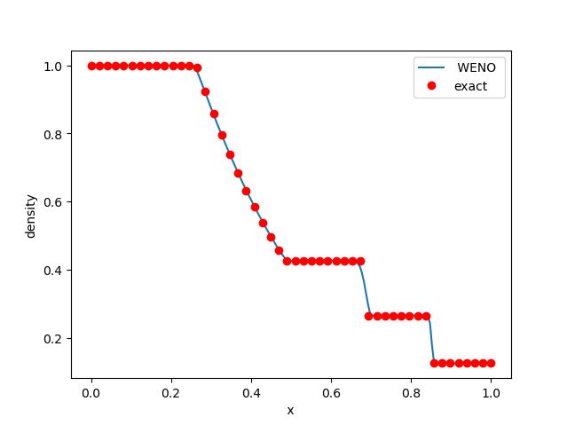

# QuickStart

## Installation

### Download code

The code can be obtained in the usual way

1.  Clone the repository with all submodules

    ```bash
    git clone --recursive git@github.com:salvadornm/cerisse.git
    ```
2.  Or clone the bare repository (and install Submodules later)

    ```bash
    git clone  git@github.com:salvadornm/cerisse.git
    ```
3.  Same using GitHub CLI

    ```bash
    $ gh repo clone salvadornm/cerisse
    ```
4. Or download latest release from Github

### Pre-requisites

1. **C++ compiler** A compiler with C++20 standard is required. Examples include **gcc version 8** and above  and **Clang  version  10** and above (both compilers may need `-std=c++20` flag)
2. **GNU Makefile** It will usually be installed by default in most systems (MacOS/Linux)
3. **MPI libraries** (optional) required for parallel simulations. Similarly CUDA/OpenMPI may be required for more advanced parallelization strategies.
4. **cmake** (optional) required for some installation options, mostly related to GPU and chemistry. Easy to install, version required **>3.2**
5. **AMReX** AMR libraries [AMREX](https://amrex-codes.github.io/amrex/) This is the AMR library that controls grid generation/IO/parallelization. Required for the code, see [Installation AMREX and PelePhysics](quickstart.md#installation-amrex-and-pelephysics)
6. **PelePhysics** (optional)  Is a repository of physics databases [PelePhysics](https://github.com/AMReX-Combustion/PelePhysics) It is required for complex chemistry and transport properties. Includig stiff chemcial sytems integration. It also has, spray , soot and radiation modules as well as many support utilities for Pele suite of codes that can also be used in Cerisse. To install see [Installation AMREX and PelePhysics](quickstart.md#installation-amrex-and-pelephysics) If the chemistry solvers are used, the **SUNDIAL** library will need to be installed as well [Installation SUNDIALS](quickstart.md#installation-sundials)
7. **CGAL** (optional) This is the Computational Geometry Algorithms Library [CGAL](https://www.cgal.org), required to do the needed geometric computation in the case of [immersed boundaries](theory/ibmeb.md#immersed-boundaries). To install see [Installation CGAL](quickstart.md#installation-cgal)
8. **Visualization** Cerisse/AMREx/PeleC format is supported by [VisIt](https://visit-dav.github.io/visit-website/), [Paraview](https://www.paraview.org), [yt](https://yt-project.org) (allows Python) and check for more options [AMReX Visualization](https://amrex-codes.github.io/amrex/docs_html/Visualization.html)

#### Installation AMREX and PelePhysics

To install auxiliar packages, **AMReX** and **PelePhysics**

```bash
$ cd cerisse/lib/
$ ./install.sh safe
```

It will connect to Github and download the required packages. `$ ./install git`, will install latest release commit in the **development** branch of AMReX. The install **safe** option will install versions\
&#x20;**23.11** of **AMReX** and **23.03** of **PelePhysics**. Downloads are fast with 27 and 30 Mb respectively. All installation files will live under `cerisse/lib`


Note that the latest version may not yet be fully compatible.


#### Installation CGAL

There are two ways to  install CGAL libraries. \
In **Linux systems** go to folder

```bash
$ cd cerisse/lib/
$ ./install.sh cgal download
$ ./install.sh cgal install
```

This will install the **CGAL** version **6.0.1** as well as [**BOOST**](https://www.boost.org/)  version **1.81.0**. All installation files will live under `cerisse/lib`.

Alternatively, CGAL may have already been installed in the machine. For example in MacOS  using  [homebrew](https://brew.sh/)

```bash
$ brew install boost
$ brew install cgal
```

The key idea is that the Boost and CGAL libraries must be compatible with the compiler used to build the code. Installing CGAL via Homebrew on macOS defaults to the Clang compiler, so Cerisse should also be compiled using Clang to ensure compatibility.

#### Installation SUNDIALS

SUNDIALS is a libary of differential and algebraic equation solvers used by PelePhysics for CVODE to integrate the chemistry. To install go to an example involving chemistry (for example `tst/test2`) and execute

```bash
$ cd tst/test2
$ make TPL
```

This will download and install version **6.5** if not present. Sundials cannot be installed before compiling as some options (such as GPU) require re-compiling. All sundials files will live under`cerisse/lib`.

## Quick Example

This quick example shows the workflow of Cerisse in a simple example

#### 1) Go to problem folder

In this example, Cerisse will solve a very coarse classic one-dimensional Sod Test.

```
$ cd cerisse/tst/test1
```

The directory contains the following files

```bash
$ ls
exact.dat	GNUmakefile	inputs		prob.h
```

A detailed explanation of the files is in tutorial [Tutorial](tutorial.md), but basically `inputs` is the simulation control file (mesh size, number of steps, etc...), while `prob.h` determines the problem to solve.

#### 2) Compile code

The compiling stage will create the executable, to compile use:

```bash
$ make
```


Utilize `$make -j4` if feasible, as it will expedite the compilation process. This step may be time-consuming, especially during the initial execution, depending on your system and configuration options. However, in most cases, this step needs to be done only once .


After compilation, the code will create a temporary folder `tmp_build_dir` and, if succesful, an executable named `main1d.gnu.MPI.ex` The executable name will change depending on the compiler, parallelization and dimension of the problem.

#### 4) Run

To run type (using one core only)

```bash
$ ./main1d.gnu.MPI.ex inputs
```

It will run very quickly for 200 steps, and the final output should be like this (exact numbers can change machine to machine)

```
[Level 0 step 200] ADVANCE at time 0.199 with dt = 0.001
[Level 0 step 200] Advanced 200 cells
   Total Xmom = 35.999999999999758
   Total Ymom = 0
   Total Zmom = 0
   Total Energy = 274.99999999999903
   Total Density = 112.49999999999953

STEP = 200 TIME = 0.2 DT = 0.001


[STEP 200] Coarse TimeStep time: 9.4e-05
[STEP 200] FAB kilobyte spread across MPI nodes: [44 ... 44]

PLOTFILE: file = ./plot/plt00200
Write plotfile time = 0.000818  seconds

Run Time total        = 0.022978
Run Time init         = 0
Run Time advance      = 0.020111
Unused ParmParse Variables:
  [TOP]::cns.screen_output(nvals = 1)  :: [1]
  [TOP]::amr.ref_ratio(nvals = 3)  :: [2, 2, 2]
  [TOP]::amr.regrid_int(nvals = 3)  :: [2, 2, 2]
  [TOP]::amr.blocking_factor_y(nvals = 3)  :: [8, 8, 8]
  [TOP]::amr.blocking_factor_z(nvals = 3)  :: [8, 8, 8]

AMReX (ae29b6e5b68b-dirty) finalized
```

The solver will create a new folder `plot`

```bash
$ ls plot
plt00000	plt00100	plt00200
```

Where the directories `plt*` store the data files, every 100 steps, including the initial step.

#### 5) See the Results

The results can be seen by a python script

```
$ python plt.py
```

which should show something like



You need to have the Python module **yt** installed to visualise this. Refer to the [Tips](tips.md) section for  installation guidance . For a more in-depth walkthrough, see  the [Tutorial](tutorial.md)
