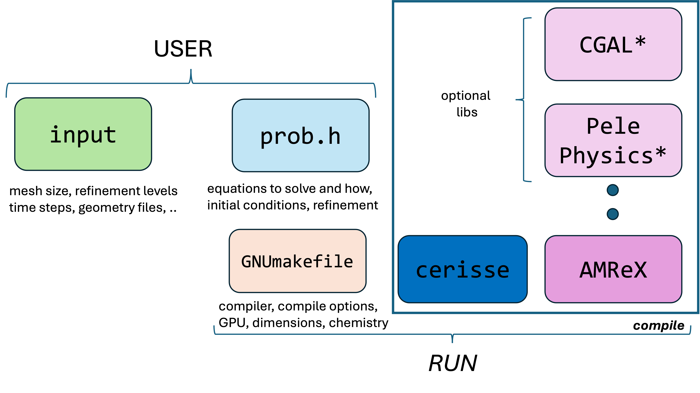

# Overview

Cerisse integrates a collection of C++ source code and libraries (such as AMReX, PelePhysics, etc.) along with the configuration of the problem setup. These pages explain how a case is initialised, detailing what problem will be solved and how.

When creating a new problem, it's best to set up a new directory (e.g., `wrk`) with three files within it.

```bash
$ls wrk
GNUmakefile	inputs		prob.h
```

NOTE: is best to copy them from a similar example and then edit the file, this will ensure consistencty with examples. Nonetheless, the names of the `input` and `prob.h` files can change (but not the `GNUmakefile`). The configuration of the problem is splitted into three files.

<figure><figcaption><p>Overview of the typical file structure</p></figcaption></figure>

## Problem definition

The definition of the problem to be solved is specified in the C++ header file `prob.h` (or similar), where a namespace **PROB** is created. This file establishes the thermodynamic and turbulence closures, as well as the numerical methods used for solving the problem. In general, it defines the equations to be solved, expressed in the form:

$$
\frac{\partial U}{\partial t} = \mbox{RHS}(U)
$$

Here, $$U$$ represents a vector of conserved variables, while $$\mbox{RHS}(U)$$ is a general term that includes contributions from Euler terms, viscous terms, and source terms. Any changes to this file require the code to be recompiled (by running `make`). The tab [PROB](prob.md) explaisn in detail the confiuguration of this file.

## Compiler options

The second part is defiend in the `GNUMakefile` file. The file controls general compiler options, as well as dimensions of the problem, precision and hard-coded chemistry options (if PelePhysics used). Some of these options are pased to _**AMREX**_, to ensure that only the required memory will be used as well as ensure faster run times. This file would probably be changed only once for every new problem. Any changes to this file require the code to be recompiled from scratch (by running `make clean` and then `make` ).

## Control parameters

The third part is the `input` file that covers the size of the problem, gris, time-stepping, output files. This file is assumed to be modifed often and does not require recompiling.
