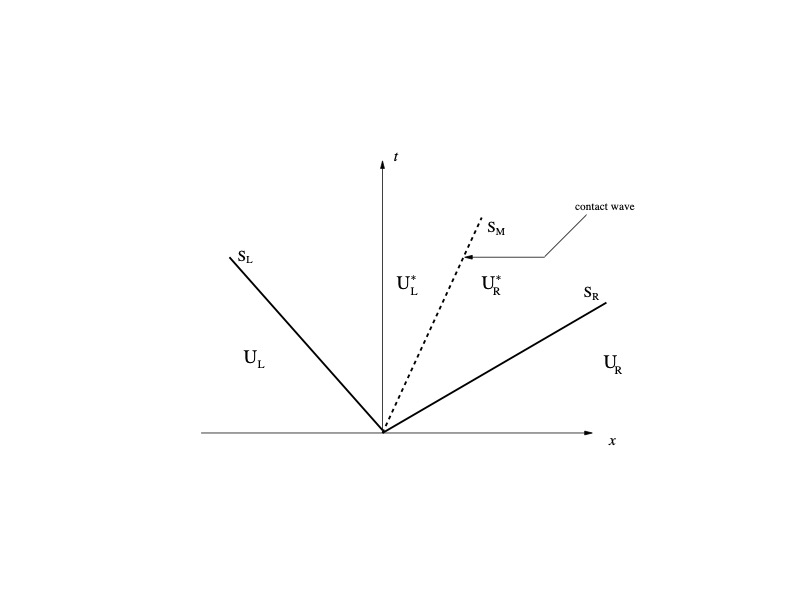

# Numerical Methods

Cerisse has implemented several numerical methods within the finite volume framework. While most of these methods are designed for high-speed flows, not all are limited to such cases. The method discussed here specifically addresses the Euler (convective) term of the equations. In compressible flows, high-frequency noise can accumulate when physical scales are not adequately resolved, especially near discontinuities. To mitigate this, many methods either directly filter or dissipate the noise, or use upwind-type stencils that indirectly introduce dissipation. It is important to note that no perfect numerical scheme exists; a compromise must be made between accuracy, speed, and stability. In the sections below, a brief overview of the rationale behind the numerical methods is provided. This description is not exhaustive, and the reader is encouraged to refer to the original papers for a more comprehensive explanation.

## HLLC Riemann Solver

Cerisse employs the Harten-Lax-van Leer Contact (HLLC) solver, developed by [Toro et al. (1994)](numerical-methods.md#references). The HLLC solver enhances approximate Riemann Solvers by incorporating the intermediate contact wave, a feature that is particularly crucial for accurate modelling in reactive flows applications.

<figure><figcaption>
Scheme of the HLLC Riemann Solver with three waves propagating ar speed SL, SM and SR. Two acoustic waves and one contact. The waves separate four constant states U_L , U_L^\ast, U_R^\ast, U_R
</figcaption></figure>

The value of $$U_{RP}$$ in the interface is defined by

$$
U_{RP}= \left\{ \begin{array}{cl}
        U_L & \mbox{if $S_L >0$} \\
	U_L^{\ast} & \mbox{if $S_L \leq 0 < S_M$}\\
	U_R^{\ast} & \mbox{if $S_M \leq 0  \leq S_R$} \\
	U_R & \mbox{if $S_R < 0$}
           \end{array}
\right.
$$

The corresponding flux $$F_{RP}$$ is just $$F_{RP}=F(U_{RP})$$.

### The Average State

Assuming the sonic waves speeds, $$S_L$$ and $$S_R$$ are known, we need $$S_M$$ to estimate the intermediate average states $$U^\ast$$. The normal velocity and the pressure do not change across a contact discontinuity (mechanical equilbrium) and therefore the normal velocity is the contact wave speed

$$
S_M=u_l^{\ast}=u_r^{\ast}=u^{\ast}
$$

and the pressure

$$
p_l^{\ast}=p_r^{\ast}=p^{\ast}
$$

where $$q = u$$ is the is the velocity _normal_ to the discontinuity. The region between the sonic waves has constant pressure $$p^{\ast}$$ and normal velocity $$u^{\ast}$$. To calculate the value of the contact wave speed, the Euler equations across the Riemann fan should be solved, resulting in

$$
S_M = \frac{\rho_r q_r(S_R - q_r)-\rho_l q_l(S_L - q_l) + p_l - p_r}{\rho_r (S_R - q_r)-\rho_l (S_L - q_l)}
$$

From the contact wave speed, the Rankine-Hugoniot conditions are applied to each acoustic wave to find the average state. In the left wave, the jump relations are:

$$
F_l^\ast - F_l = S_L (U_l^\ast - U_l)
$$

The density of the inytermediate left state is:

$$
\rho_l^\ast = \rho_l \frac{S_L - q_l}{S_L - S_M }
$$

and solutions to the intermediate-left state (in conserved variables)

$$
(\rho u)_l^{\ast} = \frac{(S_L-q_l)\rho u_l +(p^{\ast}- p_l)}{S_L-S_M}
$$

and

$$
e_l^{\ast} = \frac{(S_L-q_l)\rho E_l -p_lq_l+p^{\ast}S_M}{S_L-S_M}
$$

The procedure to compute the intermediate-right state solution is analogous, but applying the Rankine-Hugoniot condition in the right sonic wave, that is interchanging the subscripts $$l$$ or $$L$$ to $$r$$ and $$R$$, respectively. in previous equations. From the two intermediate states the flux may be obtained and replaced in the numerical scheme. The first-order scheme is

$$
F_{i+1/2}= F(U_{RP})
$$

### The Sonic Wave Speed Estimates

To compute the intermediate states the sonic wave speeds ($$S_L,S_R$$) are needed. Following Batten, the wave speeds can be obtained from

$$
S_L = \mbox{min}(q_l - c_l,\tilde{q}-\tilde{c})
$$

and

$$
S_R = \mbox{min}(q_r + c_r,\tilde{q} + \tilde{c})
$$

where $$\tilde{q}=\tilde{u} n_x+\tilde{v} n_y +\tilde{w} n_z$$ and the average state are (same for otehr components)

where $$\tilde{T}$$ is obtained through the average enthalpy

$$
\tilde{u}=\frac{(u_l+r_{\rho} u_r)}{(1+r_{\rho})}
$$

$$
\tilde{H}=\frac{(H_l+r_{\rho} H_r)}{(1+r_{\rho})}
$$

and

$$
\tilde{H}=C_p \tilde{T} + \frac{1}{2} \left( \tilde{u}^2+\tilde{v}^2+\tilde{w}^2 \right)
$$

where $$r_{\rho}$$ is the ratio of densities

$$
r_{\rho}=\sqrt{\rho_r/\rho_l}
$$

### High order extension

The above scheme is formally first-order, a high order extension can be build by using a Total Variation Diminishing (TVD) reconstruction


Under construction


## Rusanov Scheme

The[ Rusanov](numerical-methods.md#references) flux is a simple upwind flux that requires a single wave-speed estimate. In the current implementation, it is very compact and can be used to perform quick tests. The numerical flux function is typically given by:

$$
F_{i+1/2}= \frac{1}{2} \left( F_{i+1} + F_{i} \right) - \frac{1}{2} \left( \left| \lambda_{i+1} \right| + \left| \lambda_i \right| \right) (U_{i+1} - U_i)
$$

where $$\lambda_i$$ ​ is the local characteristic speed at the i-th cell (often taken as the maximum eigenvalue of the Jacobian of the flux function).

## Central differences

The simplest approach is to create a central interpolation based on values of the fluxes
evaluated at cell points

$$
F_{i+1/2}=  \mathcal{L} \left ( .. F_{i-1}, F_{i}, F_{i+1}, F_{i+2} .. \right) = \sum_{k= -H}^{H} F_{i-k} \alpha_{k+H}
$$

where H would be the number of cells in the stencil, which woud correspond to the order.
For example, for a 4th order estimate, H  would be 2 and the formulation would be:

$$
F_{i+1/2}= \alpha_0 F_{i-1} +  \alpha_1 F_{i}  +  \alpha_2 F_{i+1}  +  \alpha_3 F_{i+2} 
$$

where $$F_i \equiv F(U_i))$$.
The interpolation coefficents can be obtained from Taylor series around the cell face $$i+1/2$$,
see below

### Coefficents for interpolation and first derivatives (finite differences)

To obtain the coefficients, we evaluate the function from an expansion around cell face $$i+1/2$$,
which corresponds to $$x=0$$

$$
\phi(x) \approx \phi_{i+1/2}   +  x  f' + \frac{x^2}{2!}  f'' 
+ \frac{x^3}{3!} f''' + \frac{x^4}{4!}  f''''
+ \frac{x^5}{5!} f''''' + \mathcal{O}(x^6)
$$

for simplicity  $$ f' \equiv  {d \phi}/{dx} $$, all derivatives
evaluated at cell face $$i+1/2$$.
For symmetric interpolation of  order 2, we need 2 points sym, for order 4 , 4 points, etc.
Evaliating the above expression at node points:
$$x_{i+1}= \Delta x/2$$, $$x_{i+2}= 3 \Delta x/2$$ and so on.

For example at $$x_{i-2}= -5 \Delta x/2$$, we get
$$
\phi_{i-2} \approx \phi_{i+1/2}   -  \frac{5 \Delta x}{2}  f' + \frac{(5/2 \Delta x) ^2}{2!}  f'' 
- \frac{(5/2 \Delta x)^3}{3!} f''' + \frac{(5/2 \Delta x)^4}{4!}  f''''
- \frac{(5/2 \Delta x)^5}{5!} f''''' +  \mathcal{O}(\Delta x^6)
$$
Rearranging coefficents and remove truncation error for clarity, we obatin
the six points

$$
\phi_{i-2} = \phi_{i+1/2}   -  \frac{5}{2} \Delta x f' + \frac{25}{8}  (\Delta x)^2 f'' 
- \frac{125 }{48} (\Delta x)^3 f''' + \frac{625}{384}  (\Delta x)^4f''''
- \frac{3125}{3840} (\Delta x)^5 f''''' 
$$

$$
\phi_{i-1} = \phi_{i+1/2}   -  \frac{3}{2} \Delta x f' + \frac{9}{8}  (\Delta x)^2 f'' 
- \frac{27}{48} (\Delta x)^3 f''' + \frac{81}{384}  (\Delta x)^4f''''
- \frac{243}{3840} (\Delta x)^5 f''''' 
$$

$$
\phi_{i} = \phi_{i+1/2}   -  \frac{1}{2} \Delta x f' + \frac{1}{8}  (\Delta x)^2 f'' 
- \frac{1}{48} (\Delta x)^3 f''' + \frac{1}{384}  (\Delta x)^4f''''
- \frac{1}{3840} (\Delta x)^5 f''''' 
$$

$$
\phi_{i+1} = \phi_{i+1/2}   +  \frac{1}{2} \Delta x f' + \frac{1}{8}  (\Delta x)^2 f'' 
+ \frac{1}{48} (\Delta x)^3 f''' + \frac{1}{384}  (\Delta x)^4f''''
+ \frac{1}{3840} (\Delta x)^5 f''''' 
$$

$$
\phi_{i+2} = \phi_{i+1/2}   +  \frac{3}{2} \Delta x f' + \frac{9}{8}  (\Delta x)^2 f'' 
+ \frac{27}{48} (\Delta x)^3 f''' + \frac{81}{384}  (\Delta x)^4f''''
+ \frac{243}{3840} (\Delta x)^5 f''''' 
$$

$$
\phi_{i+3} = \phi_{i+1/2}   +  \frac{5}{2} \Delta x f' + \frac{25}{8}  (\Delta x)^2 f'' 
+ \frac{125}{48} (\Delta x)^3 f''' + \frac{625}{384}  (\Delta x)^4f''''
+ \frac{3125}{3840} (\Delta x)^5 f'''''
$$

This can be arranged in a matrix system

$$
A f = \Phi
$$

$$
A = 
\left(
\begin{array}{cccccc}
1 & -5/2 & 25/8 & -125/8 & 625/384 & -3125/3840 \\
1 & -3/2 & 9/8  & -27/48 &  81/384 & -243/3840 \\
1 & -1/2 & 1/8  &  -1/48 &  1/384  &   -1/3840 \\
1 & 1/2  & 1/8  &   1/48 &  1/384  &    1/3840 \\
1 & 3/2  & 9/8  &  27/48 &  81/384 &  243/3840 \\
1 & 5/2  & 25/8 & 125/48 & 625/384 &  3125/3840
\end{array}
\right)
$$

with the unknown array
$$
f=
\left(
\begin{array}{c}
\phi_{i+1/2}        \\
\Delta x f'         \\
(\Delta x)^2 f''    \\
(\Delta x)^3 f'''   \\
(\Delta x)^4 f''''  \\
(\Delta x)^5 f''''' \\
\end{array}
\right)
$$

and the knwon information at nodes

$$
\Phi = 
\left(
\begin{array}{c}
\phi_{i-2}        \\
\phi_{i-1}         \\
\phi_{i}     \\
\phi_{i+1}    \\
\phi_{i+2}   \\
\phi_{i+3}  \\
\end{array}
\right)
$$

We look for a vector of weights $$\underline{\alpha} = (\alpha_0, \alpha_1, ... \alpha_5 ) $$ such that
that $$ \underline{\alpha} \cdot  \Phi^T = f_{desired} $$
provides desired approximation for interpolation $$\phi_{i+1/2}$$ or gradients at the interface.
For example to get the first derivative, all terms 
should cancelled except the terms involving $$\Delta x f' $$ that should be 1, 
$$ f_{desired} =( 0,  1,  0, 0, 0 ) $$

The system to solve is this
$$
\underline{\alpha} A^T = f_{desired}
$$

which can be solved directly (check script `solve.py` in `tools/numerics`) and the 
resultant coefficients are the required coefficents (expressed as fractions).
For example, fourth and six order derivatives evaluated at cell faces are:

$$
\left.{\frac{d\phi}{dx}} \right|_{i+1/2} = \frac{1}{\Delta x } \left( \frac{-1}{24}\phi_{i+2}  + \frac{9}{8} \phi_{i+1} -
 \frac{9}{8} \phi_{i} + \frac{1}{24} \phi_{i-1}\right)  + \mathcal{O}(\Delta x)^4
$$

$$
\left.{\frac{d\phi}{dx}} \right|_{i+1/2} = \frac{1}{\Delta x } \left( 
 \frac{3}{640} \phi_{i+3}   -  \frac{25}{384}\phi_{i+2}  + \frac{75}{64} \phi_{i+1} -
 \frac{75}{64} \phi_{i} .   + \frac{25}{384} \phi_{i-1}  -  \frac{3}{640} \phi_{i-2} \right)    + \mathcal{O}(\Delta x)^6
$$

To obtain symmetrical intetrpolations, set $$f_{desired} = (1,0,0,0,0,0)$$
and we will get

$$
\phi_{i+1/2} =  -  \frac{1}{16}\phi_{i+2}  + \frac{9}{16} \phi_{i+1} +
                   \frac{9}{16} \phi_{i}   - \frac{1}{16} \phi_{i-1}     + \mathcal{O}(\Delta x)^4
$$

$$
\phi_{i+1/2} =  
 \frac{3}{256} \phi_{i+3}   -  \frac{25}{256}\phi_{i+2}  + \frac{75}{128} \phi_{i+1} +
 \frac{75}{128} \phi_{i}    - \frac{25}{256} \phi_{i-1}  +  \frac{3}{256} \phi_{i-2}    + \mathcal{O}(\Delta x)^6
$$

### Coefficents for interpolation and first derivatives (finite volume)

The above coeffiencts are base in a finite difference, where

$$
\phi_{i+1} = \phi(x_{i+1})
$$

However, **cerisse** uses the finite volume approach, where

$$
\hat{\phi}_{i}  = \frac{1}{\Delta x} \int_{x_{i-1/2}}^{x_{i+1/2}} \phi(x) dx
$$

In a finite difference, we will aim for
$$
\phi_{i+1/2}= \alpha_0 \phi_{i-1} +  \alpha_1 \phi_{i}  +  \alpha_2 \phi_{i+1}  +  \alpha_3 \phi_{i+2} 
$$
while in a *finite volume*, the aim would be
$$
\phi_{i+1/2}= \alpha_0 \hat{\phi}_{i-1} +  \alpha_1 \hat{\phi}_{i}  +  \alpha_2 \hat{\phi}_{i+1}  +  \alpha_3 \hat{\phi}_{i+2} 
$$

In a common second order method approach, the coefficents are the same. Howeverm this change in high orders.

To build the matrix of coefficients, we re-use the Taylor expansion of the previous section,
expanding from the face 

$$
\phi(x) \approx \phi_{i+1/2}   +  x  f' + \frac{x^2}{2!}  f'' 
+ \frac{x^3}{3!} f''' + \frac{x^4}{4!}  f''''
+ \frac{x^5}{5!} f''''' + \mathcal{O}(x^6)
$$

We integrate

$$
I = \int \phi(x) dx  = \phi_{i+1/2} x  +  \frac{x^2}{2}  f' + \frac{x^3}{3!}  f'' 
+ \frac{x^4}{4!} f''' + \frac{x^5}{5!}  f''''
+ \frac{x^6}{6!} f''''' 
$$

The finite volume representations (en 1D) are just differences of the above, for example

For example to obtain the value at $$i-2$$, we get

$$
\hat{\phi}_{i-2} = \frac{1}{\Delta x } \left[ I(x_{i-3/2}) - I(x_{i-5/2}) \right]
=\phi_{i+1/2}   +  \frac{1}{2}\left[ (3/2)^2 - (5/2)^2 \right] \Delta x  f' - \frac{1}{3!} \left[ (3/2)^3 - (5/2)^3 \right]  (\Delta x)^2 f'' \\ 
+ \frac{1}{4!} \left[ (3/2)^4 - (5/2)^4 \right] (\Delta x)^3 f''' - \frac{1}{5!} \left[ (3/2)^5 - (5/2)^5 \right]  (\Delta x)^4  f''''
+ \frac{1}{6!}  \left[ (3/2)^6 - (5/2)^6 \right](\Delta x)^5 f'''''
$$

Rearranging coefficents we obtain the six points based on cell values

$$
\hat{\phi}_{i-2} =
\phi_{i+1/2}   - \frac{5}{2}  (\Delta x) f' + \frac{19}{6}  (\Delta x)^2 f'' 
 - \frac{65}{24} (\Delta x)^3 f''' + 
 \frac{211}{120} (\Delta x)^4 f'''' - \frac{665}{720} (\Delta x)^5 f''''' 
$$

$$
\hat{\phi}_{i-1} =
\phi_{i+1/2}   - \frac{3}{2}  (\Delta x) f' + \frac{7}{6}  (\Delta x)^2 f''  
- \frac{15}{24} (\Delta x)^3 f''' +  \frac{31}{120} (\Delta x)^4 f''''
- \frac{63}{720} (\Delta x)^5 f''''' 
$$

$$
\hat{\phi}_{i} =
\phi_{i+1/2}   -  \frac{1}{2}\Delta x  f' + \frac{1}{6}  (\Delta x)^2 f'' 
- \frac{1}{24} (\Delta x)^3 f''' + \frac{1}{120} (\Delta x)^4  f''''
- \frac{1}{720}  (\Delta x)^5 f''''' 
$$

$$
\hat{\phi}_{i+1} =
\phi_{i+1/2}   +  \frac{1}{2}\Delta x  f' + \frac{1}{6}  (\Delta x)^2 f'' 
+ \frac{1}{24} (\Delta x)^3 f''' + \frac{1}{120} (\Delta x)^4  f''''
+ \frac{1}{720}  (\Delta x)^5 f''''' 
$$

$$
\hat{\phi}_{i+2} = \phi_{i+1/2}   + \frac{3}{2}  (\Delta x) f' + \frac{7}{6}  (\Delta x)^2 f''  + \frac{15}{24} (\Delta x)^3 f''' + 
 \frac{31}{120} (\Delta x)^4 f'''' + \frac{63}{720} (\Delta x)^5 f''''' 
$$

$$
\hat{\phi}_{i+3} = \phi_{i+1/2}   + \frac{5}{2}  (\Delta x) f' + \frac{19}{6}  (\Delta x)^2 f''  + \frac{65}{24} (\Delta x)^3 f''' + 
 \frac{211}{120} (\Delta x)^4 f'''' + \frac{665}{720} (\Delta x)^5 f''''' 
$$

Following the same process as with finite difference we obtain the matrix coefficents

$$
A = 
\left(
\begin{array}{cccccc}
1 & -5/2 & 19/6 &  -65/24 & 211/120 & -665/720 \\
1 & -3/2  & 7/6 &  -15/24 &  31/120 &  -63/720 \\
1 & -1/2  & 1/6  &  -1/24 &   1/120 &   -1/720 \\
1 & 1/2   & 1/6  &   1/24 &   1/120 &    1/720 \\
1 & 3/2   & 7/6 &   15/24 &  31/120 &   63/720 \\
1 & 5/2  & 19/6 &   65/24 & 211/120 &  665/720
\end{array}
\right)
$$

and we obtain the coefficients solving the same system  
$$
\underline{\alpha} A^T = f_{desired}
$$
The derivatives in the face are 

$$
\left.{\frac{d\phi}{dx}} \right|_{i+1/2} = \frac{1}{\Delta x } \left( \frac{-1}{12}\hat{\phi}_{i+2}  + \frac{5}{4} \hat{\phi}_{i+1} -
 \frac{5}{4} \hat{\phi}_{i} + \frac{1}{12} \hat{\phi}_{i-1}\right)  + \mathcal{O}(\Delta x)^4
$$

$$
\left.{\frac{d\phi}{dx}} \right|_{i+1/2} = \frac{1}{\Delta x } \left( 
 \frac{1}{90} \hat{\phi}_{i+3}   -  \frac{5}{36}\hat{\phi}_{i+2}  + \frac{49}{36} \hat{\phi}_{i+1} -
 \frac{49}{36} \hat{\phi}_{i}    + \frac{5}{36} \hat{\phi}_{i-1}  -  \frac{1}{90} \hat{\phi}_{i-2} \right)    + \mathcal{O}(\Delta x)^6
$$

Interpolation schemes are similarly found by setting $$f_{desired} = (1,0,0,0,0,0)$$

and we will get

$$
\phi_{i+1/2} =  -  \frac{1}{12}\hat{\phi}_{i+2}  + \frac{7}{12} \hat{\phi}_{i+1} +
                   \frac{7}{12}\hat{\phi}_{i}   - \frac{1}{12} \hat{\phi}_{i-1}     + \mathcal{O}(\Delta x)^4
$$

$$
\phi_{i+1/2} =  
 \frac{1}{60} \hat{\phi}_{i+3}   -  \frac{2}{15} \hat{\phi}_{i+2}  + \frac{37}{60} \hat{\phi}_{i+1} +
 \frac{37}{60} \hat{\phi}_{i}     - \frac{2}{15} \hat{\phi}_{i-1}  + \frac{1}{60} \hat{\phi}_{i-2}    + \mathcal{O}(\Delta x)^6
$$

These formulas are used to evaluate derivatives in the cell faces for viscous terms 
in the direction

### Cross-derivatives

In  the viscous terms, the derivative in the y direction gas to be compute in the x-face 

$$
\left.{\frac{\partial \phi }{\partial y}} \right|_{i+1/2}
$$

To achieve high order, an interpolation is built from node values.
A fourth order interpolation, for example

$$
\left.{\frac{\partial \phi}{\partial y}} \right|_{i+1/2} =
\alpha_0 \left.{\frac{\partial \phi}{\partial y}} \right|_{i-1}
+ \alpha_1 \left.{\frac{\partial \phi}{\partial y}} \right|_{i}
+ \alpha_2  \left.{\frac{\partial \phi}{\partial y}} \right|_{i+2}
\alpha_3  \left.{\frac{\partial \phi}{\partial y}} \right|_{i+2})
$$

The deritatives are obtained by conventional cell-centred central derivatives at $$i-1$$,$$i$$..  etc.
For example for second order, the derivative would be a combination of:

$$
\left.{\frac{\partial \phi}{\partial y}} \right|_{i-1} = \frac{ \phi_{i-1,j+1} - \phi_{i-1,j-1} }{\Delta y}
$$

FIGURE

### Method of Manufactured Solutions

Using the Method of Manufactured Solutions (MMS), it is possible to calculate the convergence of a numerical method implmentation. By introducing a known analytical solution, $$ \phi_e$$ and calculating the corresponding source term, the theoretical convergence can be evaluated within both finite difference and finite volume frameworks.
If the solution is sufficiently smooth, convergence is observed in the finite volume approach even when a quadrature method is not used for flux integration. This is consistent with [Motheau and Wakefield, 1965](numerical-methods.md#references)
The order of convergence remains robust across a wide range of Reynolds numbers, from 0.01 to 100.
As a note, in the finite volume context the analtycal solution and the source term have to be integrated:

$$
\hat{S}_\rho = \frac{1}{V} \int S_\rho dV
$$

As the finite volume solution converges to $$ \hat{\phi} \rightarrow  \hat{\phi}_e$$, otherwise the convergence is limited to second order.

## Skew-symmetric

Numerical errors associated with discretisation can be categorised into truncation and aliasing errors ([Kravchenko and Moin, 1997](numerical-methods.md#references); [Lilly, 1965](numerical-methods.md#references)). The concept of numerical order alone is insufficient to fully characterize performance. Key properties such as dissipation, dispersion, and conservation are strongly influenced by the discretization scheme used for the convective term. To illustrate this, consider a one-dimensional scalar equation and three possible formulations for the nonlinear, hyperbolic term:

$$
\frac{\partial U}{\partial t} + \frac{\partial H U}{\partial x} = 0
$$

$$
H_{div} =\frac{\partial UV }{\partial x}
$$

$$
H_{conv} = U \frac{\partial V }{\partial x} + V \frac{\partial U }{\partial x}
$$

$$
H_{skew} = \frac{1}{2} \left( H_{conv}+ H_{div} \right) = \frac{1}{2} \frac{\partial UV }{\partial x} +\frac{1}{2} \left( U \frac{\partial V }{\partial x} + V \frac{\partial U }{\partial x} \right)
$$

Although the three forms above are equivalent at the continuous level, their discretizations differ significantly in terms of intrinsic properties and performance.

The skew-symmetric form, when used with centered schemes, has been demonstrated to conserve quadratic quantities of interest—such as kinetic energy in the incompressible limit . This conservation is attributed to the reduction of aliasing errors. Furthermore, a Fourier analysis of the three forms reveals that the skew-symmetric formulation possesses superior built-in de-aliasing characteristics [(Blaisdell et al. 1996) ](numerical-methods.md#references).

The method implemented here is the approach of [Ducros et al. (2000)](numerical-methods.md#references) , which capitalises on the built in de-aliasing property of the skew-symmetric operator of centred schemes, while ensuring local conservation by employing the flux-based formulation:

The flux can be derived in a convective an pressure term

$$
F = UV +F_p = F^{adv} + F_p
$$

A second order scheme can be then

$$
F^{adv,skew}_{i+1/2} = \frac{1}{4} \left( U{i} + U_{i+1} \right) \left( V_{i} + V_{i+1} \right)
$$

and a fourth-order formulation scheme, despite its built-in de-aliasing properties, remains a derivative of the family of centered schemes. As such, it can still face stability challenges. Additional strategies to mitigate oscillations and effectively handle shock waves follows

**Artificial dissipation**

A way to stabilise the mechanism is through two terms (following Jameson)

$$
\frac{\partial F}{\partial x} \approx \left .\frac{\partial F}{\partial x} \right |_{num} + \frac{\partial^2 \alpha_2 U}{\partial x^2} + \frac{\partial^4 \alpha_4 U}{\partial x^4}
$$

The second-derivative term is used to capture discontinuities (hereafter _shock_ term) and the fourth-derivative is to control high-frequency noise (_damping_ term). The shock term acts near discontinuities and the damping in smooth parts of the flow. Using the same conservative form as before, the flux is modified by

$$
F^{adv}_{i+1/2} = F^{skew}_{i+1/2} + \left . \alpha_2 \frac{\partial U}{\partial x} \right |_{i+1/2} +\left . \ \alpha_4 \frac{\partial^3 U}{\partial x^3} \right |_{i+1/2}
$$

The terms can be rewritten using differences, the shock term is

$$
\left . \alpha_2 \frac{\partial U}{\partial x} \right |_{i+1/2} \approx \alpha_2 \frac{\Delta U_{i+1/2} }{\Delta x}
$$

where $$\Delta U_{i+1/2} = U_{i+1}-U_i$$. The flux modification is then (grouping constants)

$$
F^{shock}_{i+1/2} = \epsilon_{i+1/2}^{(2)} \left( U_{i+1} - U_i \right)
$$

The damping term is similarly

$$
\left . \alpha_4 \frac{\partial^3 U}{\partial x^3} \right |_{i+1/2} \approx \frac{\alpha_4}{\Delta x} \left . \frac{\partial^2 \Delta U}{\partial x^2} \right |_{i+1/2}
$$

Using central differences for $${\partial^2 \Delta U}/{\partial x^2}$$ as

$$
\frac{\partial^2 \Delta U}{\partial x^2} = \frac{\Delta U_{i+3/2} - 2 \Delta U_{i+1/2} + \Delta U_{i-1/2} }{\Delta x^2} + \mathcal{O}(\Delta x^2)
$$

and replacing the difference, we get

$$
F^{damp}_{i+1/2} = \epsilon_{i+1/2}^{(4)} \left( U\_{i+2} - 3 U_{i+1} + 3 U_i - U_{i-1} \right)
$$

For high-order schemes, the damping term accuracy can be increased by using a high-order central scheme:

$$
\frac{\partial^2 \Delta U}{\partial x^2} = \frac{ -1 /12 \Delta U_{i+5/2} + 4/3 \Delta U_{i+3/2} - 5/2 \Delta U_{i+1/2} + 4/3 \Delta U_{i-1/2} -1/12 \Delta U_{i-3/2} }{\Delta x^2} + \mathcal{O}(\Delta x^4)
$$

the flux is similarly written as

$$
F^{damp}_{i+1/2} = \frac{ \epsilon_{i+1/2}^{(4)} }{12} \left( -U_{i+3} + 17 U_{i+2} - 46 U_{i+1} + 46 U_i - 17 U_{i-1} + U_{i-2} \right)
$$

The parameters $$\epsilon_{i+1/2}^{(2)}$$ and $$\epsilon_{i+1/2}^{(4)}$$ control the second and fourth order dissipation.

$$
\epsilon_{i+1/2}^{(2)}= k^{(2)} | \lambda_{i+1/2} | \psi_{i+1/2}
$$

where $$\psi$$ is the shock/discontinuty detector (with value of 1 close to jumps) and $$\lambda$$ is the eigenvalue

$$
\frac{\partial \rho k }{\partial t} + \frac{\partial \rho k }{\partial x_j} = - u \frac{\partial p }{\partial x_j}
$$

The sensor based on a variable $$\phi$$ is :

$$
\psi_{i} = 2 \frac{|\phi_{i+1} - 2\phi_i + \phi_{i-1} |}{P_{JST} + P_{TVD} + \varepsilon}
$$

where $$\varepsilon$$ is  a small offset to ensure the denominator is never zero, while $$P_{TVD} = |\phi_{i+1} -\phi_{i} | + |\phi_{i} -\phi_{i-1} |$$and $$P_{JST} = \phi_{i+1} - 2\phi_i + \phi_{i-1}$$

The original formulation works with a sensor on pressure. Cerisse implements the improved approach of [Bouheraoua (2014)](numerical-methods.md#references) by including an additional density sensor and coupling the two as :

$$
\psi = \frac{\psi_\rho^2 + \psi_P^2}{\psi_\rho + \psi_P}
$$

### WENO and TENO

**Weighted Essentially Non-Oscillatory** (WENO) methods, introduced by [Liu et al. (1994),](numerical-methods.md#references) employ a nonlinear adaptive procedure to automatically select the locally smoothest stencil. This approach aims to avoid using stencils that cross discontinuities when interpolating the interface flux. The WENO family encompasses various variations, which can be further classified. Despite these differences, all WENO methods share a common feature: the interface flux is expressed as **a linear combination of fluxes derived from the stencils.**

$$
F_{i+1/2} = \sum_k w_k F^{(k)}_{i+2}
$$

Reconstruction in characteristic variables improves performance, as the post-shock oscillations are reduced. WENO is known to be excessively dissipative in smooth parts of the flow

#### TENO

Like WENO, TENO uses multiple **lower-order candidate stencils** to build a **high-order approximation**. But instead of blending them with nonlinear weights, TENO uses a **cutoff function** to **selectively activate only smooth stencils**.

Given a set of candidate stencils, $$k = 0, ... ,r$$   compute the **polynomial reconstruction** on each stencil:\
$$\hat{F}^{(k)}$$ using third order or similar. For each stencil, compute a **smoothness indicator** $$\beta_k$$​ (same as in WENO-JS):

$$
\beta_k = \sum_{l=1}^{r} \int_{x_{i-1}}^{x_{i+1}} \Delta x^{2l-1} \left( \frac{d^l}{dx^l} \hat{F}^{(k)}(x) \right)^2 dx
$$

In practice, the indicators are precomputed using finite difference formulas. For example:

$$
\beta_k = \sum_{m=1}^2 c_m \left( \Delta^m \hat{F}^{(k)} \right)^2
$$

These expressions are designed to measure the oscillation or variation of $$\hat{F}^{(k)}(x)$$, and are minimized when the function is smooth over stencil $$k$$.

TENO introduces a **normalized sensor** $$\tau$$ (like in WENO-Z):

$$
\tau = | \beta_0 - \beta_r |
$$

Then define the exponential cutoff function for each stencil:

$$
\chi_k = \exp\left( - \frac{ \left( {\beta_k}/{\tau + \varepsilon} \right)^q }{\lambda} \right)
$$

**Turn off** stencils with large smoothness indicators (discontinuities), and use **optimal linear weights**  to combine the rest:

$$
\gamma_k =
\begin{cases}
d_k, & \text{if } \chi_k > \delta \\
0,   & \text{otherwise}
\end{cases}
$$

Normalise the weights

$$
\omega_k = \frac{\gamma_k}{\sum_j \gamma_j}
$$

And finally use the same functional form as WENO

$$
F_{i+1/2} = \sum_k w_k F^{(k)}_{i+2}
$$


Under construction


### KEEP

The central KEEP (_non-dissipative and physically-consistent kinetic energy and entropy preserving_) schemes for compressible flows ([Kuya and Kawai 2020](numerical-methods.md#references)) are based on splitting the energy equation.

$$
\frac{\partial E_t }{\partial t} + \frac{\partial (\rho e + \rho k + p) u_j}{\partial x_j} = 0
$$

where $$E_t = \rho e + \rho k$$ is the toral energy (internal plus kinetic energy). In the inviscid limit, from the momentum equation is possible to derive the kinetic energy equation

$$
\frac{\partial \rho k }{\partial t} + \frac{\partial \rho u_j k }{\partial x_j} + u \frac{\partial p }{\partial x_j} = 0
$$

which implies

$$
\frac{\partial \rho e }{\partial t} + \frac{\partial \rho u_j e }{\partial x_j} + p \frac{\partial u_j }{\partial x_j} = 0
$$

using the fundamental equation of thermodynamics in differential form

$$
d e = T d s - \frac{p}{\rho^2} d \rho
$$

it can be shown (see original paper) that if mass is conserved and internal energy follows the above expression, then entropy is conserved

$$
\frac{\partial \rho s }{\partial t} + \frac{\partial \rho u_j s }{\partial x_j} = 0
$$


Under construction


The KEEP scheme still need a shock capturing term.

#### Split terms

Given a function $$f = a b$$, there are two forms to split the derivate

Divergence form of the derivative

$$
\frac{\partial f}{\partial x} = \frac{\partial a b}{\partial x}
$$

Quadratic split

$$
\frac{\partial f}{\partial x} =\
\frac{1}{2}\left( a \frac{\partial b }{\partial x} + b \frac{\partial a }{\partial x} + \frac{\partial a b}{\partial x} \right)
$$

These formulations are analytically equivalent. With a function $$f = a b c$$, there are three forms to split the derivative

Divergence form

$$
\frac{\partial f}{\partial x} = \frac{\partial a b c}{\partial x}
$$

The quadratic form

$$
\frac{\partial f}{\partial x} =\
\frac{1}{2}\left( a \frac{\partial b c}{\partial x} + b c \frac{\partial a }{\partial x} + \frac{\partial abc }{\partial x} \right)
$$

The cubic form

$$
\frac{\partial f}{\partial x} =\
\frac{1}{4}\left( a \frac{\partial b c}{\partial x} + b \frac{\partial a c }{\partial x} + c \frac{\partial a b}{\partial x} + a b \frac{\partial c }{\partial x} + a c \frac{\partial b }{\partial x} + b c \frac{\partial a }{\partial x} +\
\frac{\partial abc }{\partial x} \right)
$$

## Time Marching

### Expict Runge-Kutta RK2

A _Runge-Kutta_ 2-stage, 2nd-order method is a time integration scheme that uses two evaluations (stages) of the right-hand side function (RHS) per timestep and achieves second-order accuracy in time.

$$
U^{n+1/2} = U^n + \frac{\Delta t}{2} RHS(U^n)
$$

$$
U^{n+1} = U^n + \Delta t RHS(U^{n+1/2})
$$

### Strong Stability Preserving Runge-Kutta

The _Strong Stability Preserving Runge-Kutta_ with n-stage and m-order, **SSPRK(n,m)**,   scheme is a time integration method designed to preserve the strong stability properties (e.g., total variation diminishing, monotonicity) of certain spatial discretizations when applied to hyperbolic PDEs

Some spatial discretizations (like TVD schemes) are non-oscillatory and stable under forward Euler time stepping with a small enough timestep. SSP Runge-Kutta schemes extend this stability to higher-order time integrators by writing the method as a convex combination of forward Euler steps.

$$
\begin{aligned}
U^{(0)} &= U^n, \\
U^{(i)} &= \sum_{j=0}^{i-1} \left( \alpha_{i,j} U^{(j)} + \Delta t \, \beta_{i,j} RHS(U^{(j)}) \right), \quad i = 1, 2, \dots, s, \\
U^{n+1} &= U^{(s)}.
\end{aligned}
$$

To ensure strong stability preservation, the method must satisfy:

* $$\alpha_{i,j} \geq 0$$, $$\beta_{i,j} \geq 0$$
* $$\sum_{j=0}^{i-1} \alpha_{i,j} = 1$$ (convex combination)
* Each stage $$U^{(i)}$$ is a convex combination of forward Euler steps

#### References

\[1] Morinishi, Y. (1995). Conservative properties of finite difference schemes for incompressible flow. [Center for Turbulence Research Annual Research Briefs](https://ntrs.nasa.gov/citations/19960022304)

\[2] Blaisdell, G., Spyropoulos, E., and Qin, J. (1996). The effect of the formulation of nonlinear terms on aliasing errors in spectral methods. [Applied Numerical Mathematics, 21(3):207–219](https://doi.org/10.1016/0168-9274\(96\)00005-0)

\[3] Ducros, F., Laporte, F., Soulères, T., Guinot, V., Moinat, P., and Caruelle, B. (2000). High order fluxes for conservative skew-symmetric-like schemes in structured meshes: application to compressible flows. [Journal of Computational Physics, 161(1):114–139](https://doi.org/10.1006/jcph.2000.6492)

\[4] Kravchenko, A. and Moin, P. (1997). On the effect of numerical errors in large eddy simulations of turbulent flows. [Journal of Computational physics, 131(2):310–322](https://doi.org/10.1006/jcph.1996.5597)

\[5] Lilly, D. K. (1965). On the computational stability of numerical solutions of time-dependent non-linear geophysical fluid dynamics problems. [Monthly Weather Review, 93(1):11–25](https://doi.org/10.1175/1520-0493\(1965\)093%3C0011:OTCSON%3E2.3.CO;2)

\[6] Liu, X.-D., Osher, S., and Chan, T. (1994). Weighted essentially non-oscillatory schemes. [Journal of Computational physics, 115(1):200–212](https://doi.org/10.1006/jcph.1994.1187)

\[7] Yuichi Kuya, Soshi Kawai, (2020) A stable and non-dissipative kinetic energy and entropy preserving (KEEP) scheme for non-conforming block boundaries on Cartesian grids, [Computers & Fluids, Volume 200, 104427](https://doi.org/10.1016/j.compfluid.2020.104427)

\[8] Fu, L., Hu, X. Y., and Adams, N. A. (2017). Targeted ENO schemes with tailored resolution property for hyperbolic conservation laws. [Journal of Computational Physics, 349:97–121](https://doi.org/10.1016/j.jcp.2017.07.054)

\[9] Toro, E. F., Spruce, M., and Speares, W. (1994). Restoration of the contact surface in the HLL-Riemann solver. [Shock waves, 4(1):25–34](https://doi.org/10.1007/BF01414629)

\[10] Bouheraoua, L. (2014). Simulation aux grandes échelles et modélisation de la combustion supersonique. [PhD thesis](https://theses.hal.science/tel-01197487v1), Rouen, INSA.

\[11] Shu, C-W. (1988). Total-Variation-Diminishing Time Discretizations. [SIAM Journal of Scientific and Statistical Computing, 9(6):1073-1084](https://epubs.siam.org/doi/abs/10.1137/0909073)

\[12] Rusanov, V. V. E. (1962). The calculation of the interaction of non-stationary shock waves and obstacles. [_USSR Computational Mathematics and Mathematical Physics_, 1(2), 304-320.](https://doi.org/10.1016/0041-5553\(62\)90062-9)

\[13] Motheau E, Wakefield J. (2021). On the numerical accuracy in finite-volume methods to accurately capture turbulence in compressible flows. [_Int J Numer Meth Fluids_, 93, 3020–3033.](https://doi.org/10.1002/fld.5021)

