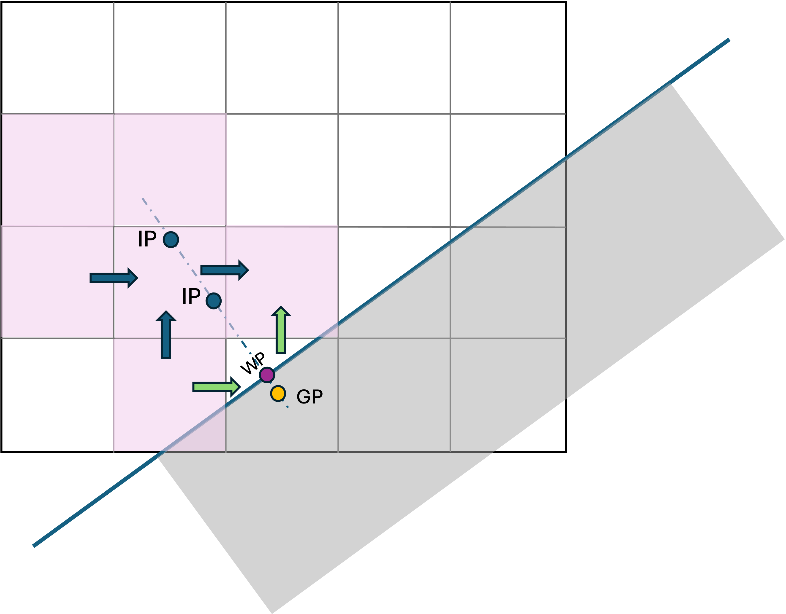
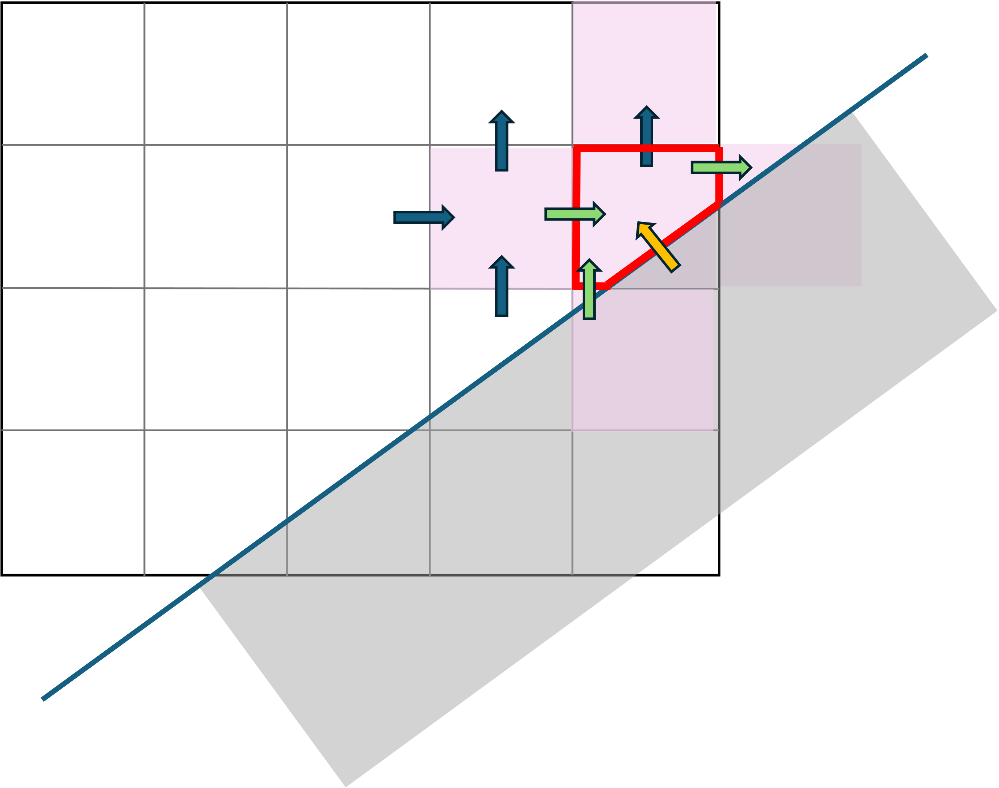

# Solid Boundaries

Embedded/Immersed boundary methods enable the representation of complex geometries on structured grids. Unlike body-fitted approaches, which require intricate coordinate transformations, these methods involve minimal modifications to the flux derivative calculations. Additionally, they are better suited for fluid-structure interaction problems compared to body-fitted methods. Embedded boundary methods are generally categorized into two main types: cut-cell methods (EBM) and ghost-point methods (IBM). Similar to other numerical techniques, each approach has its own advantages and disadvantages.

## Immersed Boundaries

Immersed Boundaries, or **Ghost-Point Immersed Boundary Methods** (GPIBM), originate from finite difference discretization and are not inherently designed to ensure discrete conservation at the embedded boundary. These methods approximate the nearest point to the embedded boundary, known as the ghost point/cell, in a way that ensures the correct boundary flux is satisfied.

<figure><figcaption>
Sketch of IBM methodology. The wall point (WP)  and interpolation points (IP) are used to determine the value at the ghost point (GP). In green f luxes that need to be modify by reducing the order. Shadowed in pink, the  cells that affect the interpolation values to determine GP
</figcaption></figure>

## Embedded Boundaries

Embedded Boundaries, or Cut-Cell Methods, originate from finite volume discretization and are specifically designed to ensure discrete conservation at the embedded boundary. These methods represent the boundary using a piecewise reconstruction within a Cartesian mesh, resulting in a sharp and accurate depiction of the interface. Instead of approximating a cell value, they focus on approximating the surface flux.

<figure><figcaption>
Sketch of EBM methodology. The yellow flux represents the imposed wall flux in the marked cells. Fluxes in green represent the fluxes that need to multiply by a non-standard face area and need to reduce order. Shadowed in pink, the  cells that affect the fluxes and therefore evolution of the cell
</figcaption></figure>

In EB the flux divergence at cell next to the wall (cut-cell) is

$$
\nabla \cdot F = \sum_{k=1}^{Nfaces} \frac{F_k A _k}{V} = 
\frac{F_n A_n - F_s A_s +  F_e A_e - F A_w + F_r A_r -F_l A_l }{ V} + F_{wall}{V}
$$

The volume of the cells is $$V= \phi h^3$$ (assuming isotropic mesh), where $$\phi$$ is the "filled" fraction of the cell. Using that the area of the face is proportional to the mesh size\
$$A_k = f_k h^2$$. Where $$f_k$$ is the ratio of obunsutcred area with the maximum. It will be 1 if the area is unobstructed.

Replacing

$$
\nabla \cdot F = \sum_{k=1}^{2\cdot D} \frac{F_k f _k}{ \phi h} + \frac{F_{wall}}{\phi h}
$$

where the flux at the wall would be defined based on the boundary condition type.

### Small cell problem and Redistribution

In time-explicit methods for advancing hyperbolic conservation laws, a straightforward time discretization leads to a time step restriction of the form (assuming constant spacing):

$$
\Delta t_{max} < \frac{h \phi}{|u+c|_{max}}
$$

which becomes vanishingly small as the volume fraction  in the domain decreases. In EB methods,  small volume fractions are common to capture round or inclined geometries, thus creating a severe time step limitation—known as the "small cell problem (see[ AMReX documentation](https://amrex-codes.github.io/amrex/docs_html/EB.html#small-cell-problem-and-redistribution) for details).

### References

\[1]: Monal Patel, "Hypersonic Flows Around Complex Geometries with Adaptive Mesh Refinement and Immersed Boundary Method" _PhD Thesis_, Imperial College London (2022)
