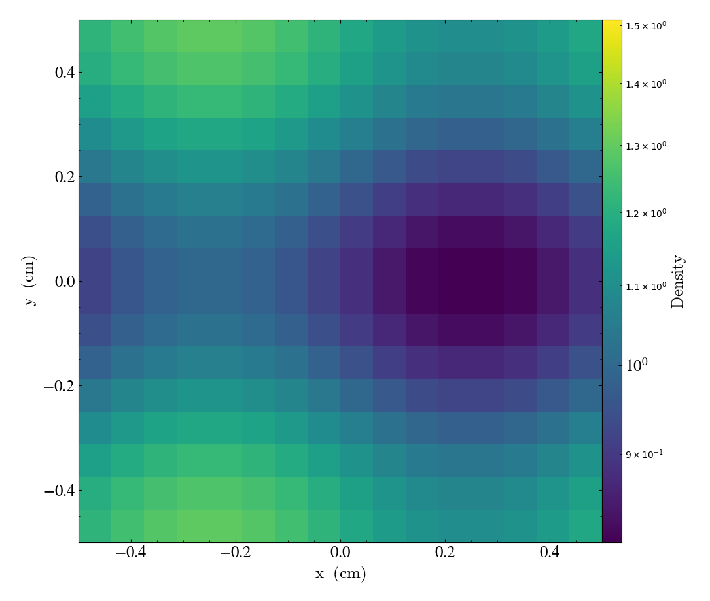
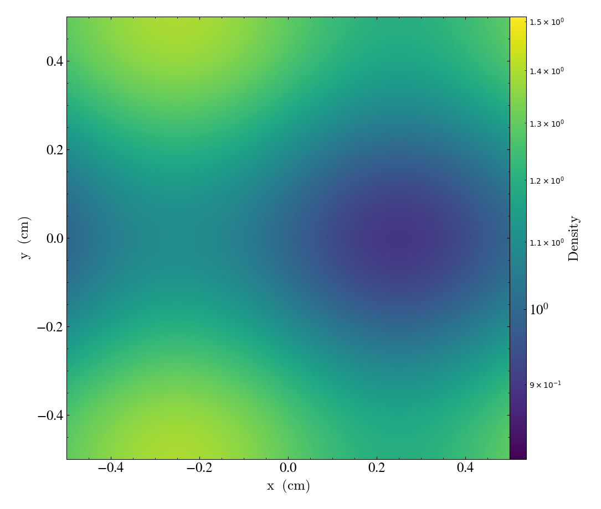
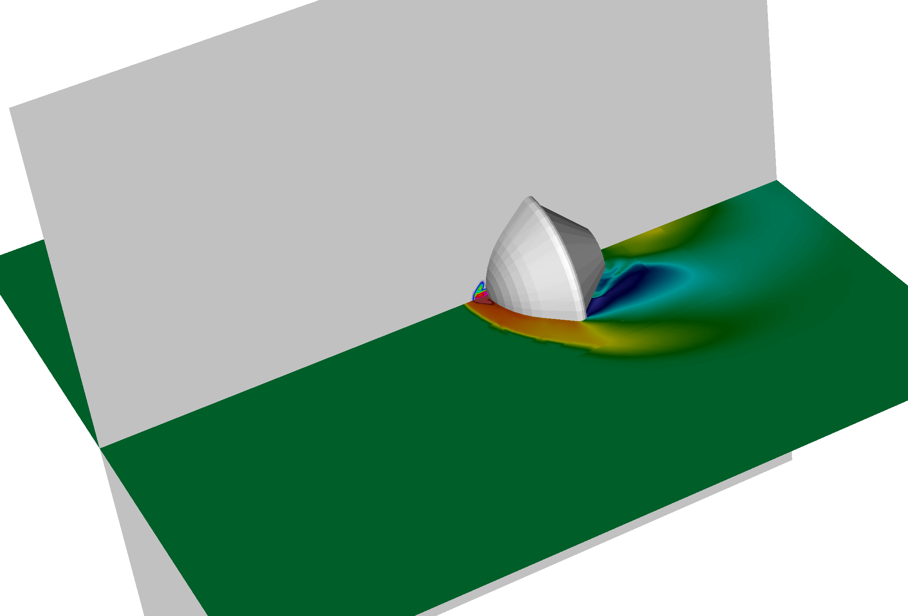
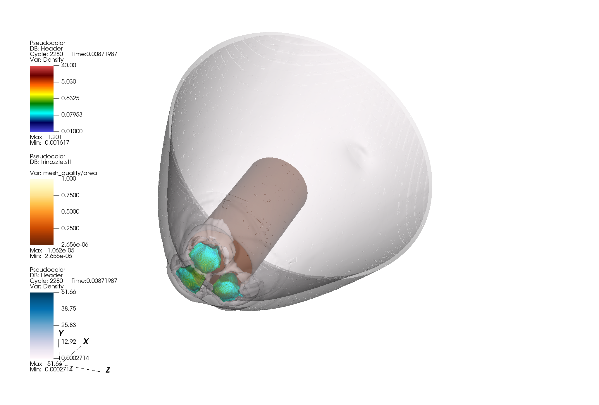

# 3-D

## MMS

Similar to the [1D case](onedim.md#mms), there are several examples, located under `exm/mms`

### Subsonic Euler

Located in `exm/mms/euler3d`. The selected solution is steady and does not depend on time.\
The selected solution is sub-sonic with small pressure variations. The average Mach number is **0.51** and with maximum fluctuations of density and pressure of 0.228 and 0.003. The exact solution is:

$$
\rho = 0.1 \sin{\left(2 \pi x \right)} + 0.2 \sin{\left(6 \pi z \right)} + 0.15 \cos{\left(2 \pi y \right)} + 1.16
$$

$$
u = 27.0 \sin{\left(4 \pi x \right)} - 17.0 \cos{\left(2 \pi y \right)} + 152
$$

$$
v= 69 \sin{\left(4 \pi x \right)} + 100
$$

$$
w=0
$$

$$
p = - 350 \sin{\left(2 \pi x \right)} + 25 \sin{\left(6 \pi z \right)} + 60 \cos{\left(4 \pi y \right)} + 100000
$$

The respective forcing source terms are obtained by executing

```bash
$ python generate_force.py
```

which computes the analytic derivatives using [sympy](https://www.sympy.org/en/index.html) for symbolic mathematics.\
The script creates a C++ header `mms.h` file that is linked to generate the solution and source terms.\
For example in the `src( ..)` function:

```cpp
    amrex::ParallelFor(bx,
      [=] AMREX_GPU_DEVICE (int i, int j, int k) noexcept
      {

        Real x = prob_lo[0] + (i + Real(0.5)) * dx[0];
        Real y = prob_lo[1] + (j + Real(0.5)) * dx[1];
        Real z = prob_lo[2] + (k + Real(0.5)) * dx[2];

        // source terms from mms
        Real Srho,Srhou,Srhov,Srhow,Srhoe;
        mms_source(x, y, z, Srho,Srhou,Srhov,Srhow,Srhoe);
      
        //  MMS Source           
        rhs(i,j,k,cls_t::URHO) += Srho;
        rhs(i,j,k,cls_t::UMX)  += Srhou;
        rhs(i,j,k,cls_t::UMY)  += Srhov;
        rhs(i,j,k,cls_t::UMZ)  += Srhow;
        rhs(i,j,k,cls_t::UET)  += Srhoe;
       });
```

The numerical solution is compared after a single time step using a small CFL number of 0.01 to minimize temporal errors. Since the exact solution is time-independent, any observed error arises solely from the spatial discretization.

The L2 error in the density field is used to assess the accuracy of each scheme. A local script, `checkorder.sh`, is provided to automate the generation of solution directories and convergence plots. It runs simulations on meshes with 16, 32, 64, and 128 grid points. The estimated order of convergence can be obtained by

```bash
$ python python checkorder.py
```

The order of 14 different numerical schemes in Cerisse is shown in Table 1

| Scheme    | Order | Absolute L2 Error (coarsest mesh) |
| --------- | ----- | --------------------------------- |
| Riemann   | 2.550 | 7.62365e-05                       |
| Skew 2    | 2.988 | 2.80296e-05                       |
| Skew 4    | 3.932 | 3.42864e-06                       |
| Skew 6    | -     | (under construction)              |
| Rusanov   | 1.966 | 5.12657e-04                       |
| Central 2 | 2.998 | 2.81674e-05                       |
| Central 4 | 4.965 | 3.42617e-06                       |
| Central 6 | 6.926 | 4.89130e-07                       |
| WenoZ5 5  | 5.520 | 2.73535e-05                       |
| TENO 5    | 5.298 | 2.68980e-05 (\*)                  |
| TENO 6    | 4.636 | 9.31208e-06 (\*)                  |
| KEEP 2    | 2.988 | 2.80296e-05                       |
| KEEP 4    | 4.967 | 3.33370e-06                       |
| KEEP 6    | 6.940 | 4.37193e-07                       |

When the forcing term is not included, the convergence rate appears to be first-order. This is because only a single time step is executed, and the time step size ( $$\Delta t$$ ) is proportional to ( $$\Delta x$$ ) due to a constant CFL condition. As a rough approximation, the observed order matches the values listed in the **Table** minus 1. For example, Rusanov is first order (2-1) , second order central schemes appear as 1.998, six-order as 5.987, etc.

(\*) The TENO schemes do not perform as well as expected, given the relatively smooth conditions,\
The flow, albeit simple, has density and pressure variation in three directions.


<figure><figcaption><p>Exact solution with 16 x 16 x 16</p></figcaption></figure>

<figure><figcaption><p>Exact solution with 128 x 128 x 128</p></figcaption></figure>

### Taylor Green Vortex

The Taylor-Green vortex is a classical benchmark problem used to test and validate numerical methods for simulating turbulent flows. Basically to study vortex dynamics, turbulent transition, turbulent decay and the energy dissipation process (proposed AIAA First International Workshop on High-Order Methods in Computational Fluid Dynamics.)\
The simulations are performed in a cube of non-dimensional length $$2 \pi$$, with periodic boundary conditions in all The Mach number, Prandtl number and Reynolds number of the flow are set  as **0.1**, **0.71** and **1600** based on data from [ Jammy et al. (2016)](http://dx.doi.org/10.5258/SOTON/401892)

The initial conditions are

$$
u = V_0 \sin\left(\frac{x}{L}\right) \cos\left(\frac{y}{L}\right) \cos\left(\frac{z}{L}\right)
$$

$$
v = -V_0 \cos\left(\frac{x}{L}\right) \sin\left(\frac{y}{L}\right) \cos\left(\frac{z}{L}\right)
$$

$$
w =0
$$

$$
p = p_0 + \frac{\rho_0 V_0^2}{16} \left( \cos\left(\frac{2x}{L}\right) + \cos\left(\frac{2y}{L}\right) \right) \left( \cos\left(\frac{2z}{L}\right) + 2 \right)
$$

The enstrophy and kinetic energy data are compared to reference simulations.

FIG


In progress, check cerisse1 docs


## Homogenous Isotropic Turbulence

The freely decaying homogeneous isotropic turbulence test case is a classical benchmark for compressible code performance evaluation. The test case is quasi-incompressible with $$\mbox{Ma}_{rms} = 0.2$$ to compare with reference data and between numerical methods and LES models. The Reynolds number is infinite (Euler , or inviscid Navier-Stokes) and dissipation is only due to numerical dissipation\
and  LES sub-grid models. An initial incompressible velocity field with spectra is fitted

$$
E(k) \propto k^{4} exp(-2 k/k_0)
$$

with $$k_0=2$$, following [Garnier et al](https://doi.org/10.1006/jcph.1999.6268) This  ensures a large scale turbulence with most energy in the large scales around wavenumber 2. The solution will decay into homogeneous isotropic turbulence, increasing enstropy and then followed a conventional decay. The domain is a cube of size  $$2 \pi$$, velocity   $$2 \phi$ , with reference values of$$$$u_0 = u_{rms} = 1$$ and $$T_0=1$$, with $$\gamma=1.4$$ and a reference pressure of $$p_0=17.86$$. The simulations are run until non-dimensional time of $$t^\ast=10$$

To generate the initial turbulent spectra, the provided python script can be used

```bash
$ python hit.py
```

You will need to specify the mesh N and size of fluctuations in the script

```python
N = 64
L = 2 * np.pi
L_int0 = 0.3*L/10 
u_rms0 = 1
Re = 40   #  
```

The Reynolds number is just a marker to estimate Kolomogorov length scale and does not affect\
the flow field. This script will fit a energy spectrum to the require profile (other spectra can be fitted) a generate a `velocity_field.bin` $$N^3$$ datafile with the initial turbulent velocity field.\
This file can  read by adding the following lines to the input file (and setiing  `USE_UTILITIES = TRUE`)

```cpp
# Turbulence initialisation
util.use_turb_file = 1
util.turb_file = velocity_field.bin
```

and the following lines in `prob.h`, in the **prob\_initdata** function

```cpp
  // read velocity field from datafile
  Real ut,vt,wt;
  util->get_velocity(i,j,k,ut,vt,wt);
```

A snapshot in the mid-plane on z direction can be obtained by:

```bash
$ python plot3d.py
```

The spectra can be obtained by

```bash
$ python spectra.py
```

and the time history by

```bash
$ python plot_time.py field
```

where field is one of _kinetic/ensthropy/density/pressure_

## Supersonic Retropropulsion

An example of Martian re-entry with supersonic retropropulsion can be found in `exm/ibm/srp`. This case demonstrates the capabilities of the IBM framework, including support for user-defined boundary conditions and a custom chemistry model not available in PelePhysics.

#### **User-specific chemistry**&#x20;

The chemistry is specified in `GNUMakefile`:

```
# PelePhysics
USE_PELEPHYSICS = TRUE
EOS_MODEL := FUEGO
TRANSPORT_MODEL := SIMPLE
CHEMISTRY_MODEL := MartianAtmos
USE_LOCALCHEM = TRUE
LOCALCHEM_PATH = $(abspath ./)
```

In this case a made-up chemistry "MartianAtmos" has been selected. Additional optiosn are required, such as specify that is a "local" nom-stadard chemistry and that its path is in `LOCALCHEM_PATH` . A directory `MartianAtmos` is required. This directory needs to contain ultimately a `Make.package` file plus the chemsiutry itself a `mechanism.H` and `mechanism.cpp` These file are automatically generated by **Python/Cantera** scripts (see [Chemistry](chemistry.md#generate-a-new-mechanism)) and contain all the infomation to integrate teh chemistry and evaluate its properties. To generate the scripst the most common is to start with a CHEMKIN mechanism. For example:

```
ELEMENTS
O N C AR
END

SPECIES
N2 CO2 AR
END

REACTIONS
END
```

This is a very simple chemistry, where no chemical reactions are present and only three species are considered.  The process is to convert **CHEMKIN** to **Cantera** and then to **PelePhysics** format (see [mechanism conversion](chemistry.md#generate-a-new-mechanism)).  Once the files are generated and placed under `MartianAtmos` its use is very simple. For example, the Martian Atmosphere is approximately

```cpp
  static constexpr Real  Yco2_oo = 0.96; // 96% CO2
  static constexpr Real  Yar_oo  = 0.04; //  4% Argon
```

and an array can be generated that stored CO2 and Ar composition in the correct places in the array through identifiers CO2\_ID, AR\_ID, etc.

```cpp
    Real Yt[NUM_SPECIES] ={0.0};
    Yt[CO2_ID]   = pparm.Yco2_oo;
    Yt[AR_ID]    = pparm.Yar_oo;
```

For example to set, the composition of the SRP jet

```cpp
    // SRP-jet composition  (pure Nitrogen)
    Real Yjet[NUM_SPECIES] ={0.0};
    Yjet[N2_ID] = 1.0; 
    for (int n = 0; n < NUM_SPECIES; ++n) {
        q(1,cls_t::QFS+n) = Yjet[n];
    }
```

#### &#x20;**User-specific boundary**

This example has a user-specific IBM class, that specifies the BC in the surface of the solid. The function `compute_surfIB` takes the position in the surface as inoiut and applies different boundarry condition based on it.

For example:

<pre class="language-cpp"><code class="lang-cpp">// coordinates relative to centre of nozzle
<strong>      const Real xjet = xyz(0) - param::xsrp;
</strong>      const Real yjet = xyz(1) - param::ysrp;
      const Real zjet = xyz(2) - param::zsrp;
      const Real Rjet=sqrt(yjet*yjet + zjet*zjet);
      bool isjet = (std::fabs(xjet) &#x3C; 0.01) &#x26;&#x26; (Rjet &#x3C; param::Rsrp);
      if (isjet)
      {
        q(1,cls_t::QU)    = param::u_srp; 
        q(1,cls_t::QPRES) = param::Pt; 
        q(1,cls_t::QT)    = param::Tt;         
        // SRP-jet composition  (pure Nitrogen)
        Real Yjet[NUM_SPECIES] ={0.0};
        Yjet[N2_ID] = 1.0; 
        for (int n = 0; n &#x3C; NUM_SPECIES; ++n) {
          q(1,cls_t::QFS+n) = Yjet[n];         
        }
      }
</code></pre>

The above code applies BC  at the surface (specifies velocity, pressure, composition and temperature) if the surface coordinates are within certain tolerance of the nozzle (passed as parameters to the class)

<figure><figcaption><p>Nitrogen supersonic jet issuing into a Mach=2  CO/Ar flow.</p></figcaption></figure>

## Supersonic Retropropulsion (tri-nozzle)

In `exm/ibm/srp_tri`

<figure><figcaption></figcaption></figure>

## Turbulent Channel


In progress , check cerisse1 docs

