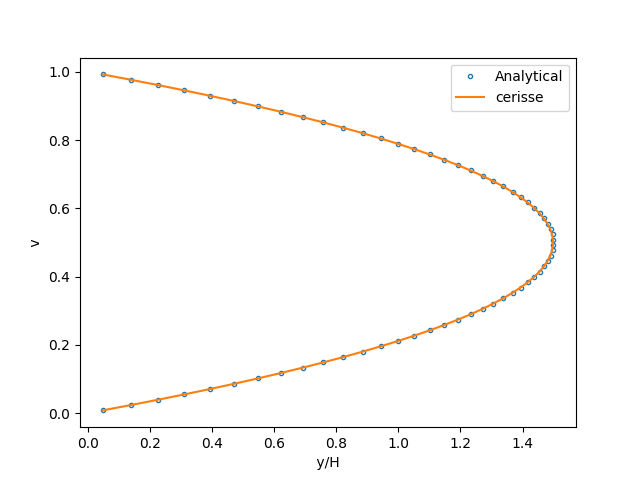
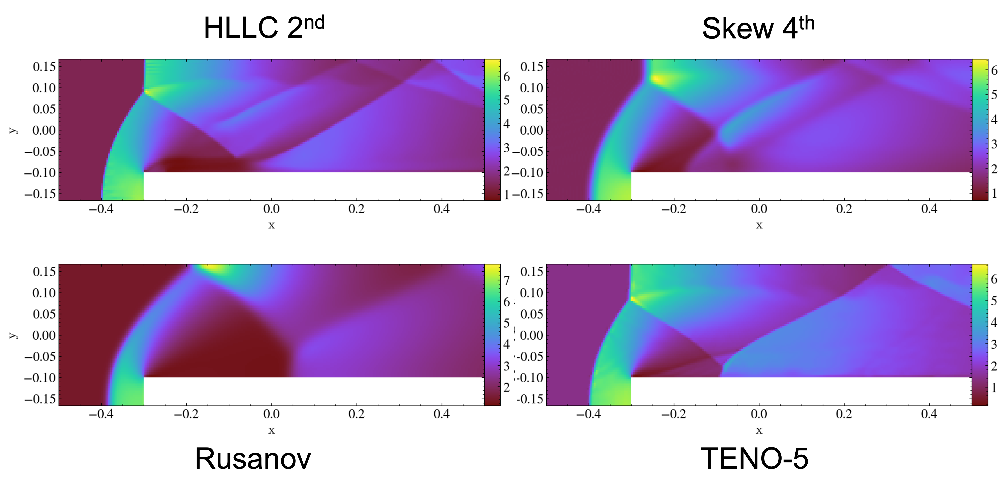
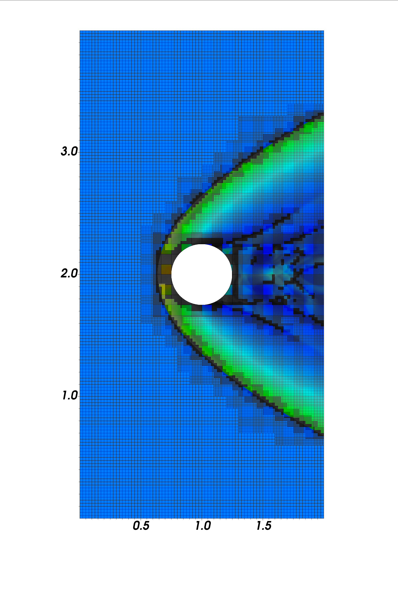
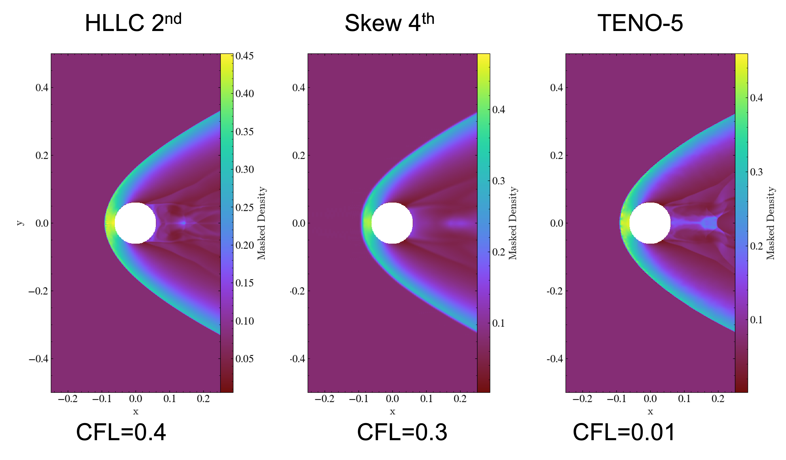

# 2-D

## Convection vortex

This test (located in `exm/numerics/covo`) consist of the convection of a two-dimensional vortex in an ideal gas under **Mach = 0.1** using Euler equations. The physical parameters are defined following Onera’s original definition.

The vortex in the centre of the domain is defined by the stream function

$$
\Psi =  \Gamma \exp(-r/R)^2
$$

where _r_ is relative to the initial position of the vortex  $$(x_0, y_0 )$$. The velocity is therefore

$$
u = U_0 + \frac{\partial \Psi}{\partial y}   \; \; \; \; \; \; \; \;  v = -\frac{\partial \Psi}{\partial x}
$$

and the pressure

$$
p =  p_0 - \frac{2 \Gamma^2 }{ R^2} \exp(-r/R)^2
$$

The solution is the actual vortex propagated in _x_ and the solution repeats itself every flow-through time  $$L/U_0$$ .

The analytical solution can be obtained by differentiating the stream function:

$$
u = U_0  -  \frac{2 \Gamma }{ R^2} \exp(-r/R)^2 (y-y_0)
$$

and

$$
v =   \frac{2 \Gamma }{ R^2} \exp(-r/R)^2 (x-x_0)
$$

The parameters are:

| parameter   | value           |
| ----------- | --------------- |
|  $$p_0$$    | 101300 Pa       |
|  $$\rho_0$$ | 1.1717047 kg/m3 |
|  $$U_0$$    | 35 m/s          |
|  $$L$$      | 0.3112 m        |
|  $$R$$      |  $$L/20$$       |
| $$\beta$$   | 0.04            |

where $$\beta$$ represents the strength of the vortex such that:

$$
\Gamma =  \beta U_0 R \sqrt{ \exp(1)}
$$

<table><thead><tr><th>tested</th><th width="112" align="center">grid</th><th align="right">comment</th></tr></thead><tbody><tr><td>gcc 13.x (Mac)</td><td align="center"><strong>128 x 128</strong></td><td align="right">Euler, CFL=0.5, no-AMR, MPI</td></tr></tbody></table>

To run (with 2 MPI ranks)

```bash
$ mpirun -np 2 ./main2d.gnu.MPI.ex inputs
```

Two prob.h files exist in the folder, the second order MUSCL Riemann solver (`prob.h_riemann`) and the skew-symmetric central difference . Overwrite `prob.h` to run the relevant scheme (before compiling).

### Results

The results and comparison with theory can be seen by

```bash
$ python plot.py
```

All the results are presented after **five** flow through times

<figure><figcaption><p>Vertical velocity, HLLC Riemann Solver with 2nd order reconstruction</p></figcaption></figure>

The Riemann solvers shows strong dissipation. Using the skew-symmetric 4th-order central scheme (without any high-frequency damping), the results exhibit less dissipation and are very clsoe to the exact solution.

<figure><figcaption><p>Vertical velocity, skew-symmetric 4th order, without damping</p></figcaption></figure>

The distribution of vertical velocity can be seeen

<figure><figcaption><p>Evolution of vertical velocity over five flow through times</p></figcaption></figure>

## Shock Reflection

This test ins a **Mach 10** shock wave incident at 30 degrees (with adiabatic ratio of 1.4). The initial conditions are given in [Berger & Colella (1989)](https://doi.org/10.1016/0021-9991\(89\)90035-1). The top boundary condition varies with time to follow the shock following the unshocked speed. This test uses a tilted domain without EB.

| Tested   |         grid        |                           comment |
| -------- | :-----------------: | --------------------------------: |
| gcc 11.4 | **56x16**(3 levels) | Euler,MUSCL 200 teps (t=0.2), AMR |

### Boundary Condition Implementation

This test case is an example on how to incorporate complex boundary conditions using the `bcnormal` function. For example, to define manually the south boundary condition in `prob.h`

```cpp
    case  2:  // SOUTH
     if (x[0] < 1. / 6.) {
      // post-shock conditions
      s_ext[URHO] = prob_parm.rho_l;
      s_ext[UMX]  = prob_parm.rho_l * prob_parm.u_l;
      s_ext[UMY]  = prob_parm.rho_l * prob_parm.v_l;
      s_ext[UMZ]  = 0.0;
      s_ext[UET]  =   prob_parm.eint_l + 0.5 *prob_parm.rho_l*
      (prob_parm.u_l * prob_parm.u_l + prob_parm.v_l * prob_parm.v_l);
      }
      else {
      // slip wall
      s_ext[URHO] = s_int[URHO];
      s_ext[UMX]  = s_int[UMX];
      s_ext[UMY]  = -s_int[UMY];
      s_ext[UMZ]  = s_int[UMZ];
      s_ext[UET]  = s_int[UET];
      }
      break;
```

### Results

The density iso-contours and mesh refinement looks like:

<figure><figcaption><p>Grid refinement for the Shock reflection case, with denisty iso-controus in red</p></figcaption></figure>

Comparing 3 and 6 refinement levels. Detail Due to the increased resolution, a Kelvin-Helmholtz rollup can be seen along the principal slip line

<figure><figcaption><p>Three refinement levels</p></figcaption></figure>

<figure><figcaption><p>Six refinement levels</p></figcaption></figure>

## Heat Diffusion

This test examines AMR behavior in a temperature diffusion problem with an initial condition defined as:

$$
T =  T_0 + \Delta T  \exp(-r/\delta)^2
$$

with  $$T_0 = 300$$  and  $$\Delta T = 100$$ ,  $$\delta$$ somehow determines the "width" of the initial pulse in temperature. The set-up is based on [HAMISH validation case](https://www.ukctrf.com/index.php/benchmarking-of-the-new-software/) using periodic boundary conditions.

| Tested   |         grid        |                 comment |
| -------- | :-----------------: | ----------------------: |
| gcc 14.2 | **64x64**(2 levels) | 200 steps (t=0.02), AMR |

This test case includes only a diffusion term and, as a result, does not conserve mass, momentum, or energy. The initial temperature pulse generates a non-periodic velocity field. This example is designed to assess the performance of the diffusion and heat flux modeling, rather than to represent a real-world scenario. It is important to note that the simulation will fail if heat is allowed to reach the boundaries.

### Results

The Initial conditions in temperature is

<figure><figcaption><p>Initial condition wuth a Gaussian hot spot</p></figcaption></figure>

At t=0.02 and with 2 AMR levels, refining on density fluctuations

<figure><figcaption></figcaption></figure>

The Temperature distribution at x=0, using `$ python ./plot.py`

<figure><figcaption><p>Temperature evolution after t=0.02</p></figcaption></figure>

## Periodic channel laminar flow

The test is located in `exm/viscwall` and is used to validate the implementation of the viscous terms and follows (approximately)  the [HAMISH validation](https://www.ukctrf.com/index.php/benchmarking-of-the-new-software/). A pressure drop is imposed given a volumetric flow rate and Reynolds number

$$
\frac{\partial p}{\partial x} = 12 \frac{Q^2}{L^3 \mbox{Re}}
$$

The implementation is

```cpp
typedef rhs_dt<no_euler_t, viscous_t<methodparm_t, ProbClosures>, user_source_t<ProbClosures> > ProbRHS;
```

The results are compared to the analytical solution for a bulk **Reynolds number of 50**, a volumetric flow rate of 1 cubic meter per second, and a channel width of 1. This example also demonstrates the use of non-dimensional units by relating viscosity to the Reynolds number.

<figure><figcaption><p>Axial velocity calculated with Cerisse compared to analtycal expression</p></figcaption></figure>


## Supersonic flow Forward Step

This example examines the behaviour of EBM in simple canonical case (located in `exm/forward_step`) The test consists of a supersonic flow in a channel at **Mach 3** , with facing a step of height **0.2 h**, where h is the channel height. The flow configuration is the same used by [Woodward and Collela (1984)](https://www.sciencedirect.com/science/article/abs/pii/0021999184901426) and the main parameters are summarised below (using non-dimensional units)

| parameter   | value |
| ----------- | ----- |
| $$p_0$$     | 1     |
| $$\rho_0$$  | 1.4   |
| $$U_0$$     | 3     |

where a perfect gas with $$\gamma=1.4$$  is used. The simulation runs until time equals 4. The case is simulated with Skew, Rusanov and WENO schemes at different meshes. A constant time step is used, based on an initial Courant Number (CFL) of 0.32. See Figures 2-3  with density iso-contours (30 contours, linearly spaced between 0.46 and 6.8). A quick png image of the final result  can be extracted using python and yt can be extracted by using (see  Figure 1)

```sh
$ python ./plot.py
```

<figure><figcaption><p>Figure 1:  Composite image of four method son the 240 x 80 mesh using the plot.py script. Resukst shown at t=4</p></figcaption></figure>

<figure><figcaption><p>Figure 2: Three different meshes using Skew-symmetrtic 4th order methods with dissipation. Results shown at t=4.</p></figcaption></figure>

<figure><figcaption><p>Figure 3: Three different methods with a mesh 480 x 160. Skew 4th order, Rusanov first order and the HLLC Riemann Solver with 2n order reconstruction</p></figcaption></figure>

## Hypersonic flow over a cylinder

&#x20;This setup consists of a perfect gas flowing over a cylinder at Mach 6. The high-speed nature of the flow makes it a strong test case for [Embedded Boundaries](code/ebm.md) and [Flux Redistribution](https://amrex-codes.github.io/amrex/docs_html/EB.html#small-cell-problem-and-redistribution) algorithms.

As mesh refinement increases, cells that are partially covered by the solid boundary contain progressively less fluid volume, leading to a tighter CFL constraint. When using the HLLC/MUSCL Riemann solver _without_ any flux redistribution, the maximum stable CFL number decreases significantly:

* **0.1** for one level of refinement
* **0.05** for two levels
* **0.025** for three levels

However, with flux redistribution enabled, the CFL number can be maintained as high as **0.4**, even with multiple levels of refinement.

The main parameters are summarised below&#x20;

| parameter | value   |
| --------- | ------- |
| $$p_0$$   | 5000 Pa |
| $$T_0$$   | 223 K   |
| Mach      | 6       |

where a perfect gas with $$\gamma=1.4$$   and molecular weight of  28.96 kg/kmol,  is used. The cylinder has 0.5 m in diameter. The simulation runs until time equals **3 ms** . The case is run fixing the CFL number and the total number of steps is around 640 with largest CFL.&#x20;

<figure><figcaption><p>Figure 4: Density distribution around a cylinder in Mach 6 flow, shown with overlaid computational mesh. Base mesh 80 x 160 with 3 levels of refinement next to cylinder and density gradients </p></figcaption></figure>

This test is highly sensitive to the flux redistribution algorithm (see [available options](input.md) in the input file). With two levels of mesh refinement, cells with fluid fractions as low as approximately 0.006 can appear, _i.e_ less than 1% of the cell volume contains fluid.

This implies that, without any form of redistribution, the CFL number may need to be reduced to below **0.006** to maintain stability. The exact threshold is strongly dependent on the numerical scheme being used. High-order schemes—such as TENO—are particularly susceptible to instabilities in the presence of very small fluid volumes.

<figure><figcaption><p>Figure 5: Snaphost using dofferent nuemrical methods. Base mesh 80 x 160 using 2 levels of refinement next to cylinder and density gradients </p></figcaption></figure>

## Planar Flame

The set-up (located in `exm/planar_flame`)  corresponds to a freely propagating two-dimensional hydrogen/aire premixed flame at **0.5** equivalence ratio.

The unburn parameters are (1 atm at 298 K):

| parameter   | value     |
| ----------- | --------- |
| $$p_0$$     | 101300 Pa |
| $$T_u$$     | 298 K     |
| $$u_{in}$$  | 0.686 m/s |
| $$l_f$$     | 0.423 mm  |

The domain is approximately 200 x 200 flame thickness (85 x 85 mm). At these conditions the laminar burning velocity is 0.49 m/s.&#x20;



Plots to add, soon ...

