# 2-D

## Convection vortex

This test (located in `exm/numerics/covo`) consist of the convection of a two-dimensional vortex in an ideal gas under Mach = 0.1 using Euler equations. The physical parameters are defined following Onera’s original definition.

The vortex in the centre of the domain is defined by the stream function

$$
\Psi =  \Gamma \exp(-r/R)^2
$$

where _r_ is relative to the initial position of the vortex (x0,y0). The velocity is therefore

$$
u = U_0 + \frac{\partial \Psi}{\partial y}   \; \; \; \; \; \; \; \;  v = -\frac{\partial \Psi}{\partial x}
$$

and the pressure

$$
p =  p_0 - \frac{2 \Gamma^2 }{ R^2} \exp(-r/R)^2
$$

The solution is the actual vortex propagated in _x_ and the solution repeats itself every flow-through time L/U0 .

The analytical solution can be obtained by differentiating the stream function:

$$
u = U_0  -  \frac{2 \Gamma }{ R^2} \exp(-r/R)^2 (y-y_0)
$$

and

$$
v =   \frac{2 \Gamma }{ R^2} \exp(-r/R)^2 (x-x_0)
$$

The parameters are:

| parameter | value           |
| --------- | --------------- |
| p0        | 101300 Pa       |
| rho0      | 1.1717047 kg/m3 |
| U0        | 35 m/s          |
| L         | 0.3112 m        |
| R         | L/20            |
| $$\beta$$ | 0.04            |

where $$\beta$$ represents the strength of the vortex such that:

$$
\Gamma =  \beta U_0 R \sqrt{ \exp(1)}
$$

<table><thead><tr><th>tested</th><th width="112" align="center">grid</th><th align="right">comment</th></tr></thead><tbody><tr><td>gcc 13.x (Mac)</td><td align="center"><strong>128 x 128</strong></td><td align="right">Euler, CFL=0.5, no-AMR, MPI</td></tr></tbody></table>

To run (with 2 MPI ranks)

```bash
$ mpirun -np 2 ./main2d.gnu.MPI.ex inputs
```

Two prob.h files exist in the folder, the second order MUSCL Riemann solver (`prob.h_riemann`) and the skew-symmetric central difference . Overwrite `prob.h` to run the relevant scheme (before compiling).

### Results

The results and comparison with theory can be seen by

```bash
$ python plot.py
```

All the results are presented after **five** flow through times

<figure>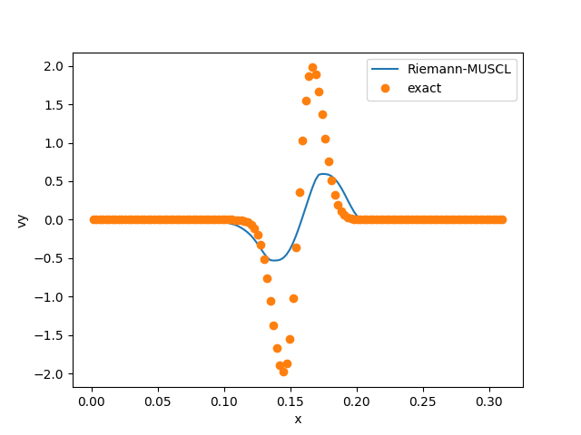<figcaption><p>Vertical velocity, HLLC Riemann Solver with 2nd order reconstruction</p></figcaption></figure>

The Riemann solvers shows strong dissipation. Using the skew-symmetric 4th-order central scheme (without any high-frequency damping), the results exhibit less dissipation and are very clsoe to the exact solution.

<figure>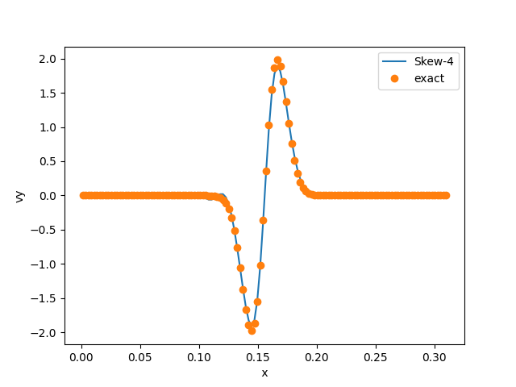<figcaption><p>Vertical velocity, skew-symmetric 4th order, without damping</p></figcaption></figure>

The distribution of vertical velocity can be seeen

<figure>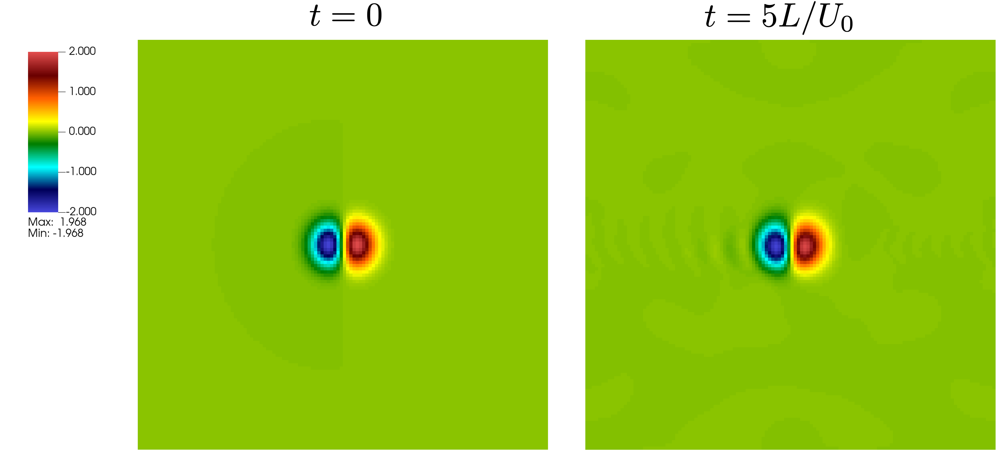<figcaption><p>Evolution of vertical velocity over five flow through times</p></figcaption></figure>

## Shock Reflection

This test ins a Mach 10 shock wave incident at 30 degrees (with adiabatic ratio of 1.4). The initial conditions are given in [Berger & Colella (1989)](https://doi.org/10.1016/0021-9991\(89\)90035-1). The top boundary condition varies with time to follow the shock following the unshocked speed. This test uses a tilted domain without EB.

| Tested   |         grid        |                           comment |
| -------- | :-----------------: | --------------------------------: |
| gcc 11.4 | **56x16**(3 levels) | Euler,MUSCL 200 teps (t=0.2), AMR |

### Boundary Condition Implementation

This test case is an example on how to incorporate complex boundary conditions using the `bcnormal` function. For example, to define manually the south boundary condition in `prob.h`

```cpp
    case  2:  // SOUTH
     if (x[0] < 1. / 6.) {
      // post-shock conditions
      s_ext[URHO] = prob_parm.rho_l;
      s_ext[UMX]  = prob_parm.rho_l * prob_parm.u_l;
      s_ext[UMY]  = prob_parm.rho_l * prob_parm.v_l;
      s_ext[UMZ]  = 0.0;
      s_ext[UET]  =   prob_parm.eint_l + 0.5 *prob_parm.rho_l*
      (prob_parm.u_l * prob_parm.u_l + prob_parm.v_l * prob_parm.v_l);
      }
      else {
      // slip wall
      s_ext[URHO] = s_int[URHO];
      s_ext[UMX]  = s_int[UMX];
      s_ext[UMY]  = -s_int[UMY];
      s_ext[UMZ]  = s_int[UMZ];
      s_ext[UET]  = s_int[UET];
      }
      break;
```

### Results

The density iso-contours and mesh refinement looks like:

<figure>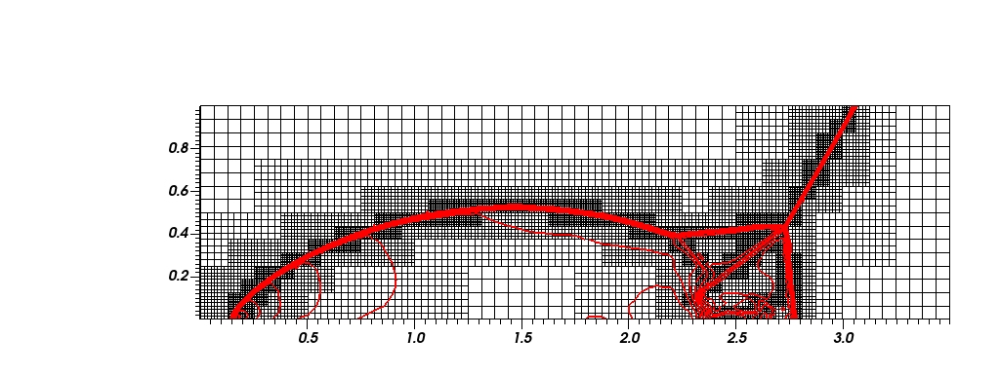<figcaption><p>Grid refinement for the Shock reflection case, with denisty iso-controus in red</p></figcaption></figure>

Comparing 3 and 6 refinement levels. Detail Due to the increased resolution, a Kelvin-Helmholtz rollup can be seen along the principal slip line

<figure>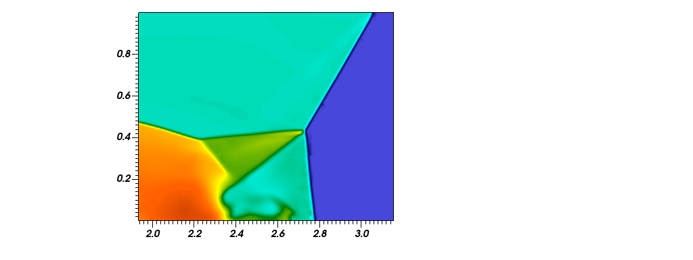<figcaption><p>Three refinement levels</p></figcaption></figure>

<figure>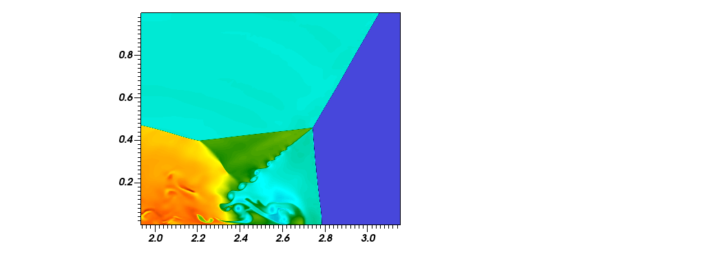<figcaption><p>Six refinement levels</p></figcaption></figure>

## Heat Diffusion

This test examines AMR behavior in a temperature diffusion problem with an initial condition defined as :

$$
T =  T_0 + \Delta T  \exp(-r/\delta)^2
$$

with T0=300 and DT=100. $$\Delta$$ somehow determines the width of initial pulse and periodic boundary conditions.

The set-up is based on HAMISH validation case

https://www.ukctrf.com/index.php/benchmarking-of-the-new-software/

| Tested   |         grid        |                 comment |
| -------- | :-----------------: | ----------------------: |
| gcc 14.2 | **64x64**(2 levels) | 200 steps (t=0.02), AMR |

This test case includes only a diffusion term and, as a result, does not conserve mass, momentum, or energy. The initial temperature pulse generates a non-periodic velocity field. This example is designed to assess the performance of the diffusion and heat flux modeling, rather than to represent a real-world scenario. It is important to note that the simulation will fail if heat is allowed to reach the boundaries.

### Results

The Initial conditions in temperature is

<figure>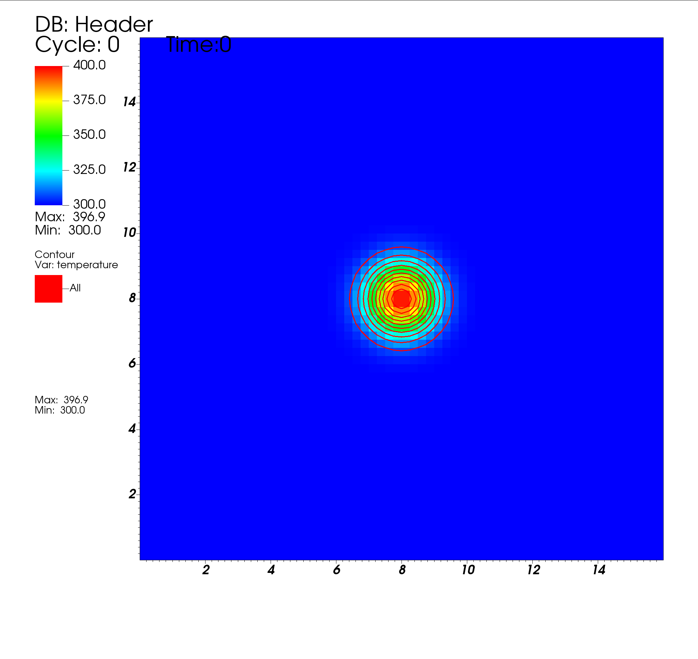<figcaption><p>Initial condition wuth a Gaussian hot spot</p></figcaption></figure>

At t=0.02 and with 2 AMR levels, refining on density fluctuations

<figure>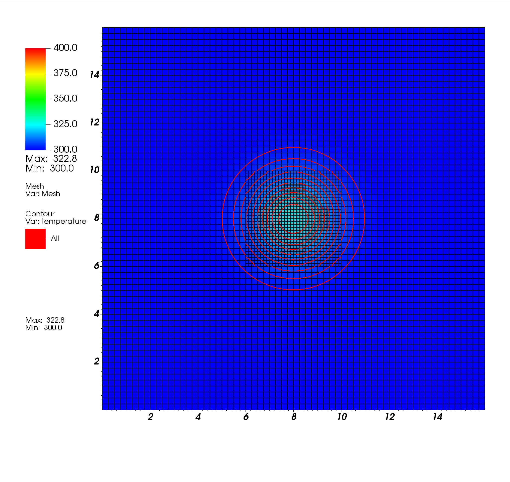<figcaption></figcaption></figure>

The Temperature distribution at x=0, using `$ python ./plot.py`

<figure>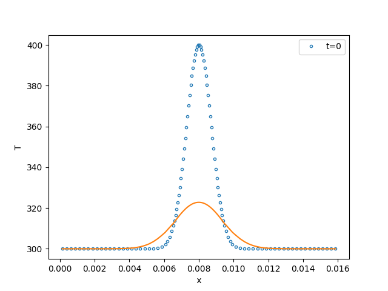<figcaption><p>Temperature evolution after t=0.02</p></figcaption></figure>

## Supersonic flow Forward Step

This example examines the behaviour of EBM in simple canonical case (located in `exm/forward_step`) The test consists of a supersonic flow in a channel at Mach 3 , with facing a step of height 0.2 h, where h is the channel height. The flow configuration is the same used by [Woodward and Collela (1984)](https://www.sciencedirect.com/science/article/abs/pii/0021999184901426) and the main parameters are summarised below (using non-dimensional units)

| parameter | value |
| --------- | ----- |
| p0        | 1     |
| rho0      | 1.4   |
| U0        | 3     |

where a perfect gas with gamma = 1.4 is used. The simulation runs until time equals 4. The case is simulated with Skew, Rusanov and WENO schemes at different meshes. A constant time step is used,based on an initial Courant Number (CFL) of 0.32. Figure of density iso-contours (30 contours, linearly spaced between 0.46 and 6.8)

<figure>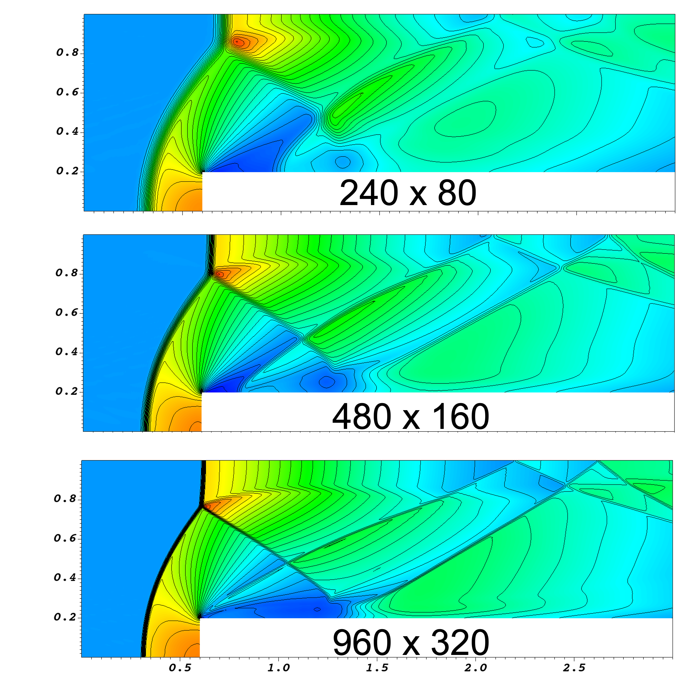<figcaption><p>Three different meshes using Skew-symmetrtic 4th order methods with dissipation. Results shown at t=4. </p></figcaption></figure>

<figure>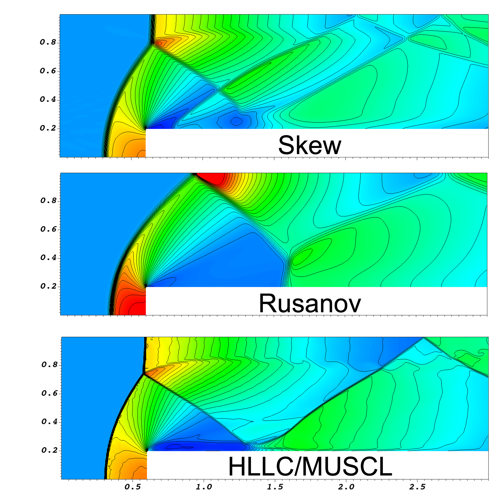<figcaption><p>Three different methods with a mesh 480 x 160. Skew 4th order, Rusanov first order and the HLLC Riemann Solver with 2n order reconstruction</p></figcaption></figure>

