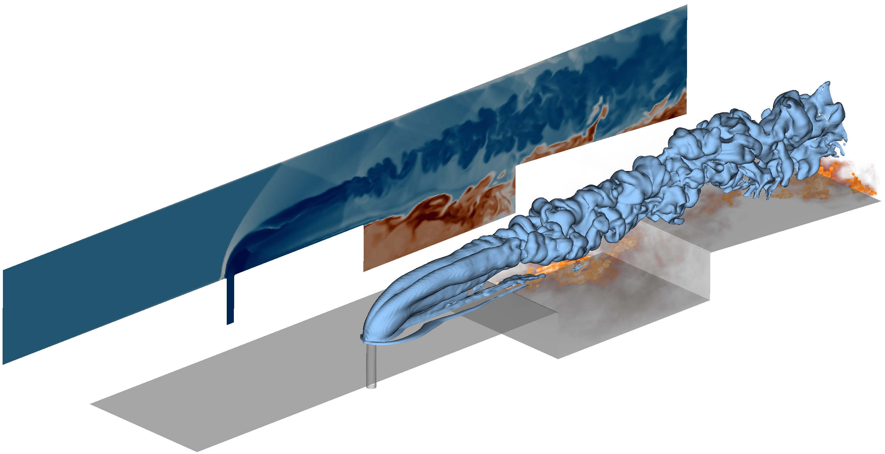

# Dual-model Scramjet Experiment in University of Michigan

| Parameter                | Case 1           | Case 2            |
| ------------------------ | ---------------- | ----------------- |
| Total pressure $p_0$     | 590 kPa                              |
| Total temperature $T_0$  | 1130 K           | 1370 K            |
| Inflow Mach number       | 2.2                                  |
| Equivalence ratio $\phi$ | 0.27                                 |
| Fuel $T_0$               | 290 K                                |
| Fuel Mach number         | 1.0                                  |

*Inflow boundary layer is not applied because it is too thin to be resolved 

Reference: 
- [D. J. Micka, *Combustion Stabilization, Structure, and Spreading in a Laboratory Dual-Mode Scramjet Combustor*, PhD Thesis, 2010.](https://deepblue.lib.umich.edu/handle/2027.42/76012)
- [F. H. E. Ribeiro, *Numerical Simulation of Turbulent Combustion in Situations Relevant to Scramjet Engine Propulsion*, PhD Thesis, 2019.](https://theses.hal.science/tel-02082214)

<!-- 
| Parameter                | Case 1C          | Case 2C           |
| ------------------------ | ---------------- | ----------------- |
| Total pressure $p_0$     | 590 kPa                              |
| Total temperature $T_0$  | 1100 K           | 1400 K            |
| Equivalence ratio $\phi$ | 0.25                                 |
| Fuel $p_0$               | 845 kPa          | 755 kPa           |
| Fuel $T_0$               | 288 K                                |
| Fuel Mach number         | 1.0                                  | 
-->